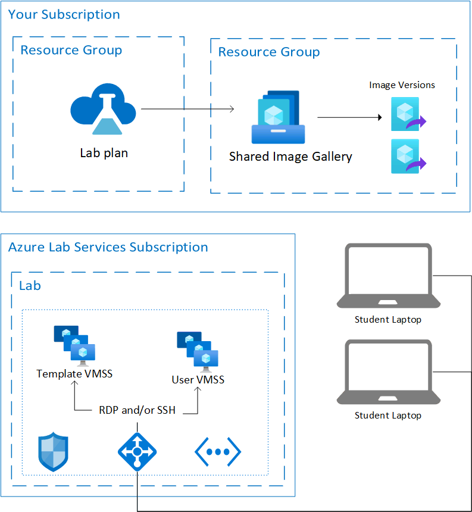

# Architecture Fundamentals in Azure Lab Services

Azure Lab Services is a SaaS (software as a service) solution, which means that the resources needed by Lab Services are handled for you. This article will cover the fundamental resources used by Lab Services and basic architecture of a lab.  

Azure Lab Services does provide a couple areas that allow you to use your own resources in conjunction with Lab Services.  For more information about using VMs on your own network, see how to [peer a virtual network](how-to-connect-peer-virtual-network.md).  To reuse images from a Shared Image Gallery, see how to [attach a Shared Image Gallery](how-to-attach-detach-shared-image-gallery.md).

Below is the basic architecture of a classroom lab.  The lab account is hosted in your subscription. The student VMs, along with the resources needed to support the VMs are hosted in a subscription owned by Lab Services. Let’s talk about what is in Lab Service's subscriptions in more detail.

## Hosted Resources

The resources required to run a classroom lab are hosted in one of the Microsoft-managed Azure subscriptions.  Resources include a template virtual machine for the instructor, virtual machine for each student, and network-related items such as a load balancer, virtual network, and network security group.  These subscriptions are monitored for suspicious activity.  It is important to note that this monitoring is done externally to the virtual machines through VM extension or network pattern monitoring.  If [shutdown on disconnect](how-to-enable-shutdown-disconnect.md) is enabled, a diagnostic extension is enabled on the virtual machine. The extension allows Lab Services to be informed of the remote desktop protocol (RDP) session disconnect event.

## Virtual Network

Each lab is isolated by its own virtual network.  If the lab has a [peered virtual network](how-to-connect-peer-virtual-network.md), then each lab is isolated by its own subnet.  Students connect to their virtual machine through a load balancer.  No student virtual machines have a public IP address; they only have a private ip address.  The connection string for the student will be the public IP address of the load balancer and a random port between 49152 and 65535.  Inbound rules on the load balancer forward the connection, depending on the operating system, to either port 22 (SSH) or port 3389 (RDP) of the appropriate virtual machine. An NSG prevents outside traffic on any other ports.

## Access control to the virtual machines

Lab Services handles the student’s ability to perform actions like start and stop on their virtual machines.  It also controls access to their VM connection information.

Lab Services also handles the registration of students to the service. There are currently two different access settings: restricted and nonrestricted. For more information, see the [manage lab users](how-to-configure-student-usage.md#send-invitations-to-users) article. Restricted access means Lab Services  verifies that the students are added as user before allowing access. Nonrestricted means any user can register as long as they have the registration link and there is capacity in the lab. Nonrestricted can be useful for hackathon events.

Student VMs that are hosted in the classroom lab have a username and password set by the creator of the lab.  Alternately, the creator of the lab can allow registered students to choose their own password on first sign-in.  

## Next steps

To learn more about features available in Lab Services, see [Azure Lab Services concepts](classroom-labs-concepts.md) and [Azure Lab Services overview](classroom-labs-overview.md).
