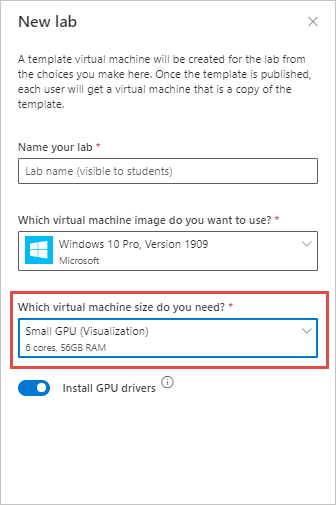
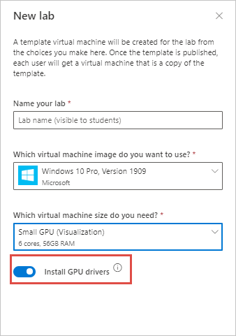
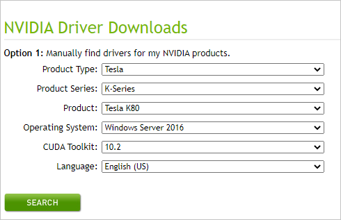
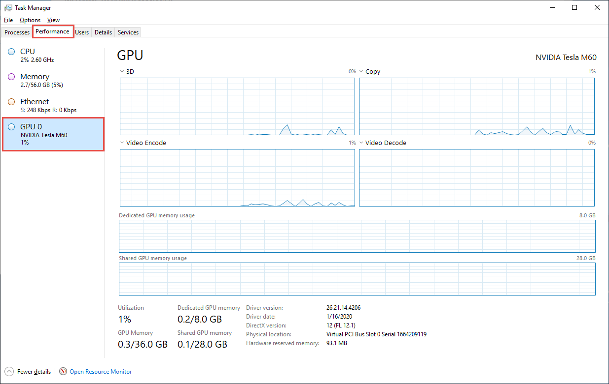

# Set up GPU virtual machines in labs contained within lab accounts

[!INCLUDE [preview note](./includes/lab-services-new-update-note.md)]

This article shows you how to do the following tasks:

- Choose between *visualization* and *compute* graphics processing units (GPUs).
- Ensure that the appropriate GPU drivers are installed.

## Choose between visualization and compute GPU sizes

On the first page of the lab creation wizard, in the **Which virtual machine size do you need?** drop-down list, you select the size of the VMs that are needed for your class.  

In this process, you have the option of selecting either **Visualization** or **Compute** GPUs.  It's important to choose the type of GPU that's based on the software that your students will use.  

As described in the following table, the *compute* GPU size is intended for compute-intensive applications.  For example, the [Deep Learning in Natural Language Processing class type](./class-type-deep-learning-natural-language-processing.md) uses the **Small GPU (Compute)** size.  The compute GPU is suitable for this type of class, because students use deep learning frameworks and tools that are provided by the [Data Science Virtual Machine image](https://azuremarketplace.microsoft.com/marketplace/apps/microsoft-dsvm.ubuntu-1804) to train deep learning models with large sets of data.

| Size | vCPUs | RAM | Description |
| ---- | ----- | --- | ----------- |
| Small GPU (Compute) | 6  vCPUs | 56 GB RAM  | [Standard_NC6](../virtual-machines/nc-series.md). This size is best suited for compute-intensive applications such as artificial intelligence (AI) and deep learning. |

The *visualization* GPU sizes are intended for graphics-intensive applications.  For example, the [SOLIDWORKS engineering class type](./class-type-solidworks.md) shows using the **Small GPU (Visualization)** size.  The visualization GPU is suitable for this type of class, because students interact with the SOLIDWORKS 3D computer-aided design (CAD) environment for modeling and visualizing solid objects.

| Size | vCPUs | RAM | Description |
| ---- | ----- | --- | ----------- |
| Small GPU (Visualization) | 6 vCPUs | 56 GB RAM  | [Standard_NV6](../virtual-machines/nv-series.md).  This size is best suited for remote visualization, streaming, gaming, and encoding that use frameworks such as OpenGL and DirectX. |
| Medium GPU (Visualization) | 12 vCPUs  | 112 GB RAM  | [Standard_NV12](../virtual-machines/nv-series.md?bc=%2fazure%2fvirtual-machines%2flinux%2fbreadcrumb%2ftoc.json&toc=%2fazure%2fvirtual-machines%2flinux%2ftoc.json).  This size is best suited for remote visualization, streaming, gaming, and encoding that use frameworks such as OpenGL and DirectX. |

> [!NOTE]
> You may not see some of these VM sizes in the list when creating a lab. The list is populated based on the current capacity of the lab's location. For availability of VMs, see [Products available by region](https://azure.microsoft.com/regions/services/?products=virtual-machines).

## Ensure that the appropriate GPU drivers are installed

To take advantage of the GPU capabilities of your lab VMs, ensure that the appropriate GPU drivers are installed.  In the lab creation wizard, when you select a GPU VM size, you can select the **Install GPU drivers** option.  

As shown in the preceding image, this option is enabled by default, which ensures that recently released drivers are installed for the type of GPU and image that you selected:

- When you select a *compute* GPU size, your lab VMs are powered by the [NVIDIA Tesla K80](https://www.nvidia.com/content/dam/en-zz/Solutions/Data-Center/tesla-product-literature/Tesla-K80-BoardSpec-07317-001-v05.pdf) GPU.  In this case, recent [Compute Unified Device Architecture (CUDA)](http://developer.download.nvidia.com/compute/cuda/2_0/docs/CudaReferenceManual_2.0.pdf) drivers are installed, which enables high-performance computing.
- When you select a *visualization* GPU size, your lab VMs are powered by the [NVIDIA Tesla M60](https://images.nvidia.com/content/tesla/pdf/188417-Tesla-M60-DS-A4-fnl-Web.pdf) GPU and [GRID technology](https://www.nvidia.com/content/dam/en-zz/Solutions/design-visualization/solutions/resources/documents1/NVIDIA_GRID_vPC_Solution_Overview.pdf).  In this case, recent GRID drivers are installed, which enables the use of graphics-intensive applications.

> [!IMPORTANT]
> The **Install GPU drivers** option only installs the drivers when they aren't present on your lab's image.  For example, the GPU drivers are already installed on the Azure marketplace's [Data Science image](../machine-learning/data-science-virtual-machine/overview.md#whats-included-on-the-dsvm).  If you create a lab using the Data Science image and choose to **Install GPU drivers**, the drivers won't be updated to a more recent version.  To update the drivers, you will need to manually install them as explained in the next section.  

### Install the drivers manually

You might need to install a different version of the drivers than the version that Azure Lab Services installs for you.  This section shows how to manually install the appropriate drivers, depending on whether you're using a *compute* GPU or a *visualization* GPU.

#### Install the compute GPU drivers

To manually install drivers for the *compute* GPU size, by doing the following steps:

1. In the lab creation wizard, when you're [creating your lab](./how-to-manage-labs.md), disable the **Install GPU drivers** setting.

1. After your lab is created, connect to the template VM to install the appropriate drivers.

   

   a. In a browser, go to the [NVIDIA Driver Downloads page](https://www.nvidia.com/Download/index.aspx).  
   b. Set the **Product Type** to **Tesla**.  
   c. Set the **Product Series** to **K-Series**.  
   d. Set the **Operating System** according to the type of base image you selected when you created your lab.  
   e. Set the **CUDA Toolkit** to the version of CUDA driver that you need.  
   f. Select **Search** to look for your drivers.  
   g. Select **Download** to download the installer.  
   h. Run the installer so that the drivers are installed on the template VM.  
1. Validate that the drivers are installed correctly by following the instructions in the [Validate the installed drivers](how-to-setup-lab-gpu.md#validate-the-installed-drivers) section.
1. After you've installed the drivers and other software that are required for your class, select **Publish** to create your students' VMs.

> [!NOTE]
> If you're using a Linux image, after you've downloaded the installer, install the drivers by following the instructions in [Install CUDA drivers on Linux](../virtual-machines/linux/n-series-driver-setup.md?toc=%2fazure%2fvirtual-machines%2flinux%2ftoc.json#install-cuda-drivers-on-n-series-vms).

#### Install the visualization GPU drivers

To manually install drivers for the *visualization* GPU sizes, follow these steps:

1. In the lab creation wizard, when you're [creating your lab](./how-to-manage-labs.md), disable the **Install GPU drivers** setting.
1. After your lab is created, connect to the template VM to install the appropriate drivers.
1. Install the GRID drivers that are provided by Microsoft on the template VM by following the instructions for your operating system:
   - [Windows NVIDIA GRID drivers](../virtual-machines/windows/n-series-driver-setup.md#nvidia-grid-drivers)
   - [Linux NVIDIA GRID drivers](../virtual-machines/linux/n-series-driver-setup.md?toc=%2fazure%2fvirtual-machines%2flinux%2ftoc.json#nvidia-grid-drivers)
  
1. Restart the template VM.
1. Validate that the drivers are installed correctly by following the instructions in the [Validate the installed drivers](how-to-setup-lab-gpu.md#validate-the-installed-drivers) section.
1. After you've installed the drivers and other software that are required for your class, select **Publish** to create your students' VMs.

### Validate the installed drivers

This section describes how to validate that your GPU drivers are properly installed.

#### Windows images

1. Follow the instructions in the "Verify driver installation" section of [Install NVIDIA GPU drivers on N-series VMs running Windows](../virtual-machines/windows/n-series-driver-setup.md#verify-driver-installation).
1. If you're using a *visualization* GPU, you can also:
    - View and adjust your GPU settings in the NVIDIA Control Panel. To do so, in **Windows Control Panel**, select **Hardware**, and then select **NVIDIA Control Panel**.

      

    - View your GPU performance by using **Task Manager**.  To do so, select the **Performance** tab, and then select the **GPU** option.

       

      > [!IMPORTANT]
      > The NVIDIA Control Panel settings can be accessed only for *visualization* GPUs.  If you attempt to open the NVIDIA Control Panel for a compute GPU, you'll get the following error: "NVIDIA Display settings are not available.  You are not currently using a display attached to an NVIDIA GPU."  Similarly, the GPU performance information in Task Manager is provided only for visualization GPUs.

 Depending on your scenario, you may also need to do additional validation to ensure the GPU is properly configured.  Read the class type about [Python and Jupyter Notebooks](class-type-jupyter-notebook.md#template-machine-configuration) that explains an example where specific versions of drivers are needed.

#### Linux images

Follow the instructions in the "Verify driver installation" section of [Install NVIDIA GPU drivers on N-series VMs running Linux](../virtual-machines/linux/n-series-driver-setup.md#verify-driver-installation).

## Next steps

See the following articles:

- [Create and manage labs](how-to-manage-labs.md)
- [SOLIDWORKS computer-aided design (CAD) class type](class-type-solidworks.md)
- [MATLAB (matrix laboratory) class type](class-type-matlab.md)
