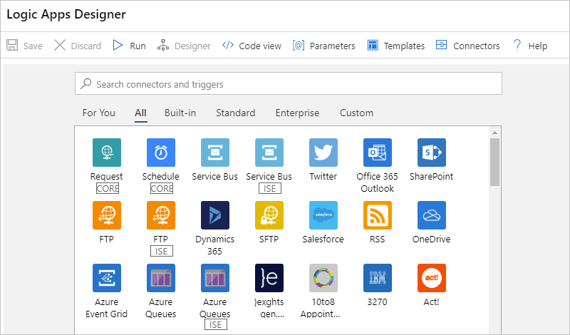
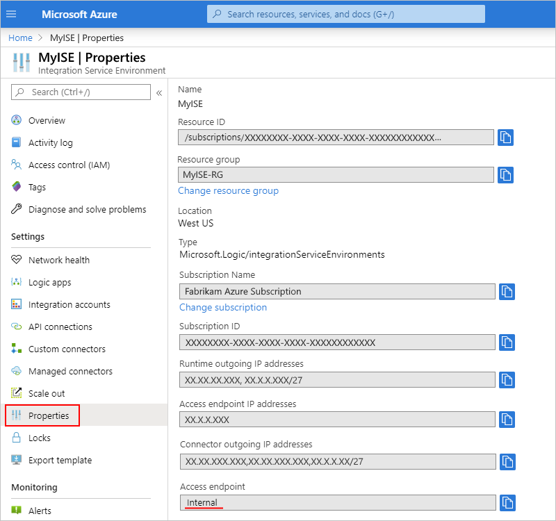

# Access to Azure Virtual Network resources from Azure Logic Apps by using integration service environments (ISEs)

Sometimes, your logic apps need access to secured resources, such as virtual machines (VMs) and other systems or services, that are inside or connected to an [Azure virtual network](../virtual-network/virtual-networks-overview.md). To set up this access, you can [create an *integration service environment* (ISE)](../logic-apps/connect-virtual-network-vnet-isolated-environment.md). An ISE is an instance of the Logic Apps service that uses dedicated resources and runs separately from the "global" multi-tenant Logic Apps service.

For example, some Azure virtual network use private endpoints, which you can set up through [Azure Private Link](../private-link/private-link-overview.md), to provide access to Azure PaaS services, such as Azure Storage, Azure Cosmos DB, or Azure SQL Database, partner services, or customer services that are hosted on Azure. If your logic apps need access to virtual networks that use private endpoints, you must create, deploy, and run those logic apps inside an ISE.

When you create an ISE, Azure *injects* or deploys that ISE into your Azure virtual network. You can then use this ISE as the location for the logic apps and integration accounts that need access.

This overview provides more information about [why you'd want to use an ISE](#benefits), the [differences between the dedicated and multi-tenant Logic Apps service](#difference), and how you can directly access resources that are inside or connected your Azure virtual network.

## Why use an ISE?

Running logic apps in your own separate dedicated instance helps reduce the impact that other Azure tenants might have on your apps' performance, also known as the ["noisy neighbors" effect](https://en.wikipedia.org/wiki/Cloud_computing_issues#Performance_interference_and_noisy_neighbors). An ISE also provides these benefits:

* Direct access to resources that are inside or connected to your virtual network

  Logic apps that you create and run in an ISE can use [specifically-designed connectors that run in your ISE](../connectors/apis-list.md#ise-connectors). If an ISE connector exists for an on-premises system or data source, you can connect directly without having to use the [on-premises data gateway](../logic-apps/logic-apps-gateway-connection.md). For more information, see [Dedicated versus multi-tenant](#difference) and [Access to on-premises systems](#on-premises) later in this topic.

* Continued access to resources that are outside or not connected to your virtual network

  Logic apps that you create and run in an ISE can still use connectors that run in the multi-tenant Logic Apps service when an ISE-specific connector isn't available. For more information, see [Dedicated versus multi-tenant](#difference).

* Your own static IP addresses, which are separate from the static IP addresses that are shared by the logic apps in the multi-tenant service. You can also set up a single public, static, and predictable outbound IP address to communicate with destination systems. That way, you don't have to set up additional firewall openings at those destination systems for each ISE.

* Increased limits on run duration, storage retention, throughput, HTTP request and response timeouts, message sizes, and custom connector requests. For more information, see [Limits and configuration for Azure Logic Apps](logic-apps-limits-and-config.md).

## Dedicated versus multi-tenant

When you create and run logic apps in an ISE, you get the same user experiences and similar capabilities as the multi-tenant Logic Apps service. You can use all the same built-in triggers, actions, and managed connectors that are available in the multi-tenant Logic Apps service. Some managed connectors offer additional ISE versions. The difference between ISE connectors and non-ISE connectors exist in where they run and the labels that they have in the Logic App Designer when you work within an ISE.

* Built-in triggers and actions, such as HTTP, display the **CORE** label and run in the same ISE as your logic app.

* Managed connectors that display the **ISE** label are specially designed for ISEs and *always run in the same ISE as your logic app*. For example, here are some [connectors that offer ISE versions](../connectors/apis-list.md#ise-connectors):

  * Azure Blob Storage, File Storage, and Table Storage
  * Azure Service Bus, Azure Queues, Azure Event Hubs
  * Azure Automation, Azure Key Vault, Azure Event Grid, and Azure Monitor Logs
  * FTP, SFTP-SSH, File System, and SMTP
  * SAP, IBM MQ, IBM DB2, and IBM 3270
  * SQL Server, Azure SQL Data Warehouse, Azure Cosmos DB
  * AS2, X12, and EDIFACT

  With rare exceptions, if an ISE connector is available for an on-premises system or data source, you can connect directly without using the [on-premises data gateway](../logic-apps/logic-apps-gateway-connection.md). For more information, see [Access to on-premises systems](#on-premises) later in this topic.

* Managed connectors that don't display the **ISE** label continue to work for logic apps inside an ISE. These connectors *always run in the multi-tenant Logic Apps service*, not in the ISE.

* Custom connectors that you create *outside an ISE*, whether or not they require the [on-premises data gateway](../logic-apps/logic-apps-gateway-connection.md), continue to work for logic apps inside an ISE. However, custom connectors that you create *inside an ISE* won't work with the on-premises data gateway. For more information, see [Access to on-premises systems](#on-premises).

## Access to on-premises systems

Logic apps that run inside an ISE can directly access on-premises systems and data sources that are inside or connected to an Azure virtual network by using these items:

* The HTTP trigger or action, which displays the **CORE** label

* The **ISE** connector, if available, for an on-premises system or data source

  If an ISE connector is available, you can can directly access the system or data source without the [on-premises data gateway](../logic-apps/logic-apps-gateway-connection.md). However, if you need to access SQL Server from an ISE and use Windows authentication, you must use the connector's non-ISE version and the on-premises data gateway. The connector's ISE version doesn't support Windows authentication. For more information, see [ISE connectors](../connectors/apis-list.md#ise-connectors) and [Connect from an integration service environment](../connectors/apis-list.md#integration-service-environment).

* A custom connector

  * Custom connectors that you create *outside an ISE*, whether or not they require the [on-premises data gateway](../logic-apps/logic-apps-gateway-connection.md), continue to work for logic apps inside an ISE.

  * Custom connectors that you create *inside an ISE* don't work with the on-premises data gateway. However, these connectors can directly access on-premises systems and data sources that are inside or connected to the virtual network that hosts your ISE. So, logic apps that are inside an ISE usually don't need the data gateway when accessing those resources.

To access on-premises systems and data sources that don't have ISE connectors, are outside your virtual network, or aren't connected to your virtual network, you still have to use the on-premises data gateway. Logic apps within an ISE can continue using connectors that don't have the **CORE** or **ISE** label. Those connectors just run in the multi-tenant Logic Apps service, rather than in your ISE. 

## ISE SKUs

When you create your ISE, you can select the Developer SKU or Premium SKU. Here are the differences between these SKUs:

* **Developer**

  Provides a lower-cost ISE that you can use for experimentation, development, and testing, but not for production or performance testing. The Developer SKU includes built-in triggers and actions, Standard connectors, Enterprise connectors, and a single [Free tier](../logic-apps/logic-apps-limits-and-config.md#artifact-number-limits) integration account for a fixed monthly price. However, this SKU doesn't include any service-level agreement (SLA), options for scaling up capacity, or redundancy during recycling, which means that you might experience delays or downtime.

* **Premium**

  Provides an ISE that you can use for production and includes SLA support, built-in triggers and actions, Standard connectors, Enterprise connectors, a single [Standard tier](../logic-apps/logic-apps-limits-and-config.md#artifact-number-limits) integration account, options for scaling up capacity, and redundancy during recycling for a fixed monthly price.

> [!IMPORTANT]
> The SKU option is available only at ISE creation and can't be changed later.

For pricing rates, see [Logic Apps pricing](https://azure.microsoft.com/pricing/details/logic-apps/). To learn how pricing and billing work for ISEs, see the [Logic Apps pricing model](../logic-apps/logic-apps-pricing.md#fixed-pricing).

## ISE endpoint access

When you create your ISE, you can choose to use either internal or external access endpoints. Your selection determines whether request or webhook triggers on logic apps in your ISE can receive calls from outside your virtual network. These endpoints also affect the way that you can access the inputs and outputs from your logic apps' runs history.

> [!IMPORTANT]
> You can select the access endpoint only during ISE creation and can't change this option later.

* **Internal**: Private endpoints permit calls to logic apps in your ISE where you can view and access inputs and outputs from logic apps' runs history *only from inside your virtual network*.

  > [!IMPORTANT]
  > Make sure that you have network connectivity between the private endpoints and the computer from 
  > where you want to access the run history. Otherwise, when you try to view your logic app's run history, 
  > you get an error that says "Unexpected error. Failed to fetch".
  >
  > 
  >
  > For example, your client computer can exist inside the ISE's virtual network or inside a virtual network that's connected to the ISE's virtual network through peering or a virtual private network. 

* **External**: Public endpoints permit calls to logic apps in your ISE where you can view and access inputs and outputs from logic apps' runs history *from outside your virtual network*. If you use network security groups (NSGs), make sure they're set up with inbound rules to allow access to the run history's inputs and outputs. For more information, see [Enable access for ISE](../logic-apps/connect-virtual-network-vnet-isolated-environment.md#enable-access).

To determine whether your ISE uses an internal or external access endpoint, on your ISE's menu, under **Settings**, select **Properties**, and find the **Access endpoint** property:

## Pricing model

Logic apps, built-in triggers, built-in actions, and connectors that run in your ISE use a fixed pricing plan that differs from the consumption-based pricing plan. For more information, see [Logic Apps pricing model](../logic-apps/logic-apps-pricing.md#fixed-pricing). For pricing rates, see [Logic Apps pricing](https://azure.microsoft.com/pricing/details/logic-apps/).

## Integration accounts with ISE

You can use integration accounts with logic apps inside an integration service environment (ISE). However, those integration accounts must use the *same ISE* as the linked logic apps. Logic apps in an ISE can reference only those integration accounts that are in the same ISE. When you create an integration account, you can select your ISE as the location for your integration account. To learn how pricing and billing work for integration accounts with an ISE, see the [Logic Apps pricing model](../logic-apps/logic-apps-pricing.md#fixed-pricing). For pricing rates, see [Logic Apps pricing](https://azure.microsoft.com/pricing/details/logic-apps/).

## Next steps

* [Connect to Azure virtual networks from Azure Logic Apps](../logic-apps/connect-virtual-network-vnet-isolated-environment.md)
* Learn more about [Azure Virtual Network](../virtual-network/virtual-networks-overview.md)
* Learn about [virtual network integration for Azure services](../virtual-network/virtual-network-for-azure-services.md)