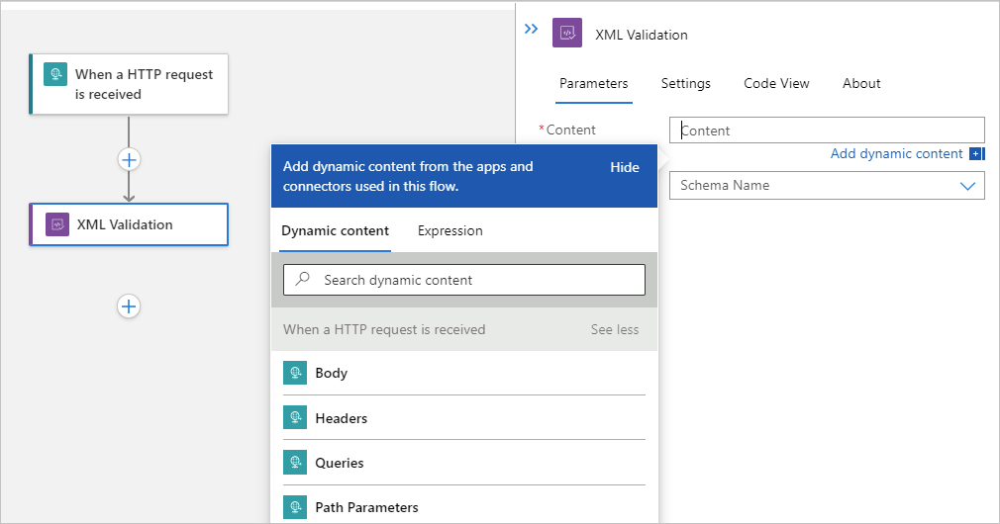

# Validate XML for workflows in Azure Logic Apps

In enterprise integration business-to-business (B2B) scenarios, the trading partners in an agreement often have to make sure that the messages they exchange are valid before any data processing can start. Your logic app workflow can validate XML messages and documents by using the **XML Validation** action and a predefined [schema](logic-apps-enterprise-integration-schemas.md).

If you're new to logic apps, review [What is Azure Logic Apps](logic-apps-overview.md)? For more information about B2B enterprise integration, review [B2B enterprise integration workflows with Azure Logic Apps and Enterprise Integration Pack](logic-apps-enterprise-integration-overview.md).

## Prerequisites

* An Azure account and subscription. If you don't have a subscription yet, [sign up for a free Azure account](https://azure.microsoft.com/free/?WT.mc_id=A261C142F).

* The logic app workflow, blank or existing, where you want to use the **XML Validation** action.

  If you have a blank workflow, use any trigger you want. This example uses the Request trigger.

* An [integration account resource](logic-apps-enterprise-integration-create-integration-account.md) where you define and store artifacts, such as trading partners, agreements, certificates, and so on, for use in your enterprise integration and B2B workflows. This resource has to meet the following requirements:

  * Is associated with the same Azure subscription as your logic app resource.

  * Exists in the same location or Azure region as your logic app resource where you plan to use the **XML Validation*** action.

  * If you're using the [**Logic App (Consumption)** resource type](logic-apps-overview.md#resource-type-and-host-environment-differences), your integration account requires the following items:

    * The [schema](logic-apps-enterprise-integration-schemas.md) to use for validating XML content.

    * A [link to your logic app resource](logic-apps-enterprise-integration-create-integration-account.md#link-account).

  * If you're using use the [**Logic App (Standard)** resource type](logic-apps-overview.md#resource-type-and-host-environment-differences), you don't store schemas in your integration account. Instead, you can [directly add schemas to your logic app resource](logic-apps-enterprise-integration-schemas.md) using either the Azure portal or Visual Studio Code. You can then use these schemas across multiple workflows within the *same logic app resource*.

    You still need an integration account to store other artifacts, such as partners, agreements, and certificates, along with using the [AS2](logic-apps-enterprise-integration-as2.md), [X12](logic-apps-enterprise-integration-x12.md), [EDIFACT](logic-apps-enterprise-integration-edifact.md), and [RosettaNet](logic-apps-enterprise-integration-rosettanet.md) operations. However, you don't need to link your logic app resource to your integration account, so the linking capability doesn't exist. Your integration account still has to meet other requirements, such as using the same Azure subscription and existing in the same location as your logic app.

## Add XML validation action

1. In the [Azure portal](https://portal.azure.com), open your logic app and workflow in designer view.

1. If you have a blank logic app that doesn't have a trigger, add any trigger you want. This example uses the Request trigger. Otherwise, continue to the next step.

   To add the Request trigger, in the designer search box, enter `HTTP request`, and select the Request trigger named **When an HTTP request is received**.

1. Under the step in your workflow where you want to add the **XML Validation** action, choose one of the following steps:

   For a Consumption or ISE plan-based logic app, choose a step:

   * To add the **XML Validation** action at the end of your workflow, select **New step**.

   * To add the **XML Validation** action between existing steps, move your pointer over the arrow that connects those steps so that the plus sign (**+**) appears. Select that plus sign, and then select **Add an action**.

   For a Standard plan-based logic app, choose a step:

   * To add the **XML Validation** action at the end of your workflow, select the plus sign (**+**), and then select **Add an action**.

   * To add the **XML Validation** action between existing steps, select the plus sign (**+**) that appears between those steps, and then select **Add an action**.

1. Under **Choose an operation**, select **Built-in**. In the search box, enter `xml validation`. From the actions list, select **XML Validation**.

1. To specify the XML content for validation, click inside the **Content** box so that the dynamic content list appears.

   The dynamic content list shows property tokens that represent the outputs from the previous steps in the workflow. If the list doesn't show an expected property, check the trigger or action heading in the list and whether you can select **See more**.

   For a Consumption or ISE plan-based logic app, the designer looks like this example:

   

   For a Standard plan-based logic app, the designer looks like this example:

   

1. From the dynamic content list, select the property token for the content you want to validate.

   This example selects the **Body** token from the trigger.

1. To specify the schema to use for validation, open the **Schema Name** list, and select the schema that you previously added.

1. When you're done, make sure to save your logic app workflow.

   You're now finished setting up your **XML Validation** action. In a real world app, you might want to store the validated data in a line-of-business (LOB) app such as SalesForce. To send the validated output to Salesforce, add a Salesforce action.

1. To test your validation action, trigger and run your workflow. For example, for the Request trigger, send a request to the trigger's endpoint URL.

   The **XML Validation** action runs after your workflow is triggered and when XML content is available for validation.

## Next steps

* [Add schemas for XML validation in Azure Logic Apps](logic-apps-enterprise-integration-schemas.md)
* [Transform XML for workflows in Azure Logic Apps](logic-apps-enterprise-integration-transform.md)