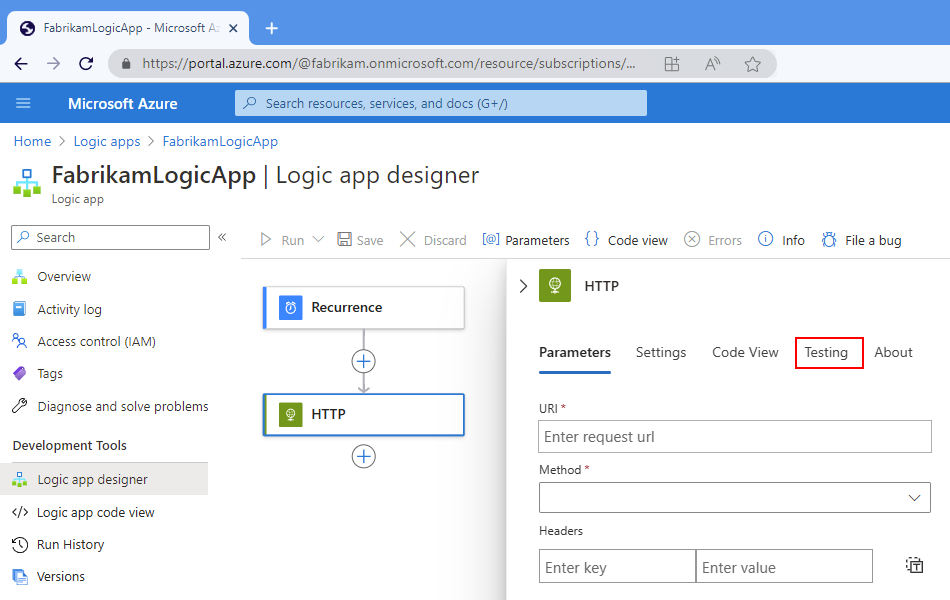
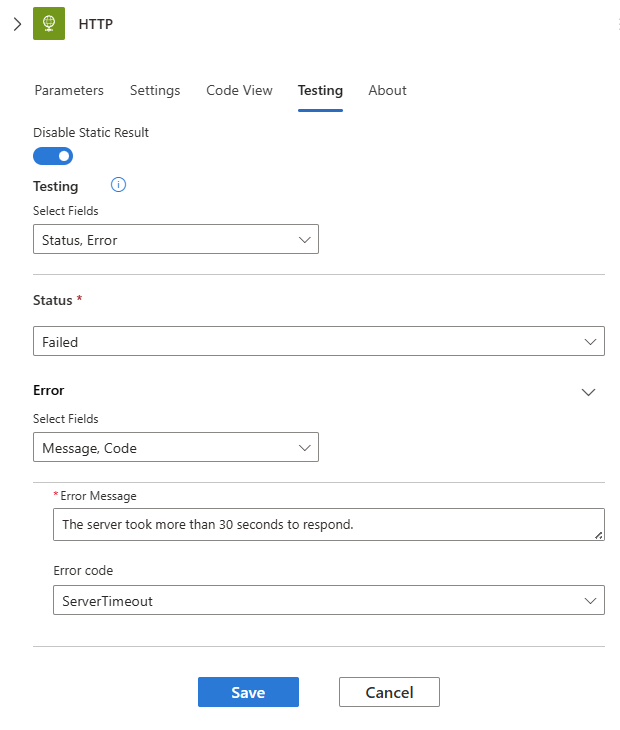
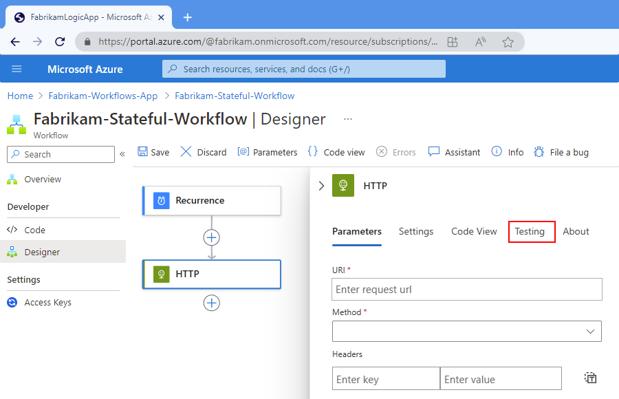

# Test workflows with mock data in Azure Logic Apps (Preview)

[!INCLUDE [logic-apps-sku-consumption](../../includes/logic-apps-sku-consumption.md)]

> [!NOTE]
> This capability is in preview and is subject to the 
> [Supplemental Terms of Use for Microsoft Azure Previews](https://azure.microsoft.com/support/legal/preview-supplemental-terms/).

To test your workflows without actually calling or accessing live apps, data, services, or systems, you can set up and return mock values from actions. For example, you might want to test different action paths based on various conditions, force errors, provide specific message response bodies, or even try skipping some steps. Setting up mock data testing on an action doesn't run the action, but returns the mock data instead.

For example, if you set up mock data for the Outlook 365 send mail action, Azure Logic Apps just returns the mock data that you provided, rather than call Outlook and send an email.

This article shows how to set up mock data on an action in a workflow for the [**Logic App (Consumption)** and the **Logic App (Standard)** resource type](logic-apps-overview.md#resource-environment-differences). You can find previous workflow runs that use these mock data and reuse existing action outputs as mock data.

## Prerequisites

* An Azure account and subscription. If you don't have a subscription, <a href="https://azure.microsoft.com/free/?WT.mc_id=A261C142F" target="_blank">sign up for a free Azure account</a>.

* The logic app resource and workflow where you want to set up mock data. This article uses a **Recurrence** trigger and **HTTP** action as an example workflow.

  If you're new to logic apps, review [What is Azure Logic Apps](logic-apps-overview.md) and [Quickstart: Create your first logic app workflow](quickstart-create-first-logic-app-workflow.md).

## Enable mock data output

### [Consumption](#tab/consumption)

1. In the [Azure portal](https://portal.azure.com), open your logic app workflow in the designer.

1. On the action where you want to return mock data, follow these steps:

   1. In the action's upper-right corner, select the ellipses (*...*) button, and then select **Testing**, for example:

      

   1. On the **Testing** pane, select **Enable Static Result (Preview)**. When the action's required (*) properties appear, specify the mock output values that you want to return as the action's response.

      The properties differ based on the selected action type. For example, the HTTP action has the following required properties:

      | Property | Description |
      |----------|-------------|
      | **Status** | The action's status to return |
      | **Status Code** | The specific status code to return as output |
      | **Headers** | The header content to return |
      |||

      

      > [!TIP]
      > To enter the values in JavaScript Object Notation (JSON) format, 
      > select **Switch to JSON Mode** ().

   1. For optional properties, open the **Select optional fields** list, and select the properties that you want to mock.

      

1. When you're ready, select **Done**.

   In the action's upper-right corner, the title bar now shows a test beaker icon (), which indicates that you've enabled static results.

   

   To find workflow runs that use mock data, review [Find runs that use static results](#find-runs-mock-data) later in this topic.

### [Standard](#tab/standard)

1. In the [Azure portal](https://portal.azure.com), open your logic app workflow in the designer.

1. On the designer, select the action where you want to return mock data so that the action details pane appears.

1. After the action details pane opens to the right side, select **Testing**.

   

1. On the **Testing** tab, select **Enable Static Result (Preview)**. When the action's required (*) properties appear, specify the mock output values that you want to return as the action's response.

   The properties differ based on the selected action type. For example, the HTTP action has the following required properties:

   | Property | Description |
   |----------|-------------|
   | **Status** | The action's status to return |
   | **Status Code** | The specific status code to return as output |
   | **Headers** | The header content to return |
   |||

   

   > [!TIP]
   > To enter the values in JavaScript Object Notation (JSON) format, 
   > select **Switch to JSON Mode** ().

1. For optional properties, open the **Select optional fields** list, and select the properties that you want to mock.

   

1. When you're ready, select **Done**.

   The action's lower-right corner now shows a test beaker icon (), which indicates that you've enabled static results.

   

   To find workflow runs that use mock data, review [Find runs that use static results](#find-runs-mock-data) later in this topic.

---

## Find runs that use mock data

### [Consumption](#tab/consumption)

To find earlier workflow runs where the actions use mock data, review that workflow's run history.

1. In the [Azure portal](https://portal.azure.com), open your logic app workflow in the designer.

1. On your logic app resource menu, select **Overview**.

1. Under the **Essentials** section, select **Runs history**, if not already selected.

1. In the **Runs history** table, find the **Static Results** column.

   Any run that includes actions with mock data output has the **Static Results** column set to **Enabled**, for example:

   

1. To view that actions in a run that uses mock data, select the run that you want where the **Static Results** column is set to **Enabled**.

   Actions that use static results show the test beaker () icon, for example:

   

### [Standard](#tab/standard)

To find other workflow runs where the actions use mock data, you have to check each run.

1. In the [Azure portal](https://portal.azure.com), open your logic app workflow in the designer.

1. On the workflow menu, select **Overview**.

1. Under the **Essentials** section, select **Run History**, if not already selected.

1. In the **Run History** table, select the run that you want to review.

   

1. On the run details pane, check whether any actions show the test beaker () icon, for example:

   

---

## Reuse previous outputs as mock data

If you have a previous workflow run with outputs, you can reuse these outputs as mock data by copying and pasting those outputs from that run.

### [Consumption](#tab/consumption)

1. In the [Azure portal](https://portal.azure.com), open your logic app workflow in the designer.

1. On your logic app resource menu, select **Overview**.

1. Under the **Essentials** section, select **Runs history**, if not already selected. From the list that appears, select the workflow run that you want.

   

1. After the run details pane opens, expand the action that has the outputs that you want.

1. In the **Outputs** section, select **Show raw outputs**.

1. On the **Outputs** pane, copy either the complete JavaScript Object Notation (JSON) object or the specific subsection you want to use, for example, the outputs section, or even just the headers section.

1. Review the earlier section about how to [set up mock data](#enable-mock-data) for an action, and follow the steps to open the action's **Testing** pane.

1. After the **Testing** pane opens, choose either step:

   * To paste a complete JSON object, next to the **Testing** label, select **Switch to JSON Mode** ():

     

   * To paste just a JSON section, next to that section's label, such as **Output** or **Headers**, select **Switch to JSON Mode**, for example:

     

1. In the JSON editor, paste your previously copied JSON.

   

1. When you're finished, select **Done**. Or, to return to the designer, select **Switch Editor Mode** ().

### [Standard](#tab/standard)

1. In the [Azure portal](https://portal.azure.com), open your logic app workflow in the designer.

1. On the workflow menu, select **Overview**.

1. Under the **Essentials** section, select **Run History**, if not already selected.

1. In the **Run History** table, select the run that you want to review.

   

1. After the run details pane opens, select the action that has the outputs that you want.

1. In the **Outputs** section, select **Show raw outputs**.

1. On the **Outputs** pane, copy either the complete JavaScript Object Notation (JSON) object or the specific subsection you want to use, for example, the outputs section, or even just the headers section.

1. Review the earlier section about how to [set up mock data](#enable-mock-data) for an action, and follow the steps to open the action's **Testing** tab.

1. After the **Testing** tab opens, choose either step:

   * To paste a complete JSON object, next to the **Testing** label, select **Switch to JSON Mode** ():

     

   * To paste just a JSON section, next to that section's label, such as **Output** or **Headers**, select **Switch to JSON Mode**, for example:

     

1. In the JSON editor, paste your previously copied JSON.

   

1. When you're finished, select **Done**. Or, to return to the designer, select **Switch Editor Mode** ().

---

## Disable mock data

Turning off static results on an action doesn't remove the values from your last setup. So, if you turn on static result again on the same action, you can continue using your previous values.

### [Consumption](#tab/consumption)

1. In the [Azure portal](https://portal.azure.com), open your logic app workflow in the designer. Find the action where you want to disable mock data.

1. In the action's upper-right corner, select the test beaker icon ().

   

1. Select **Disable Static Result** > **Done**.

   

### [Standard](#tab/standard)

1. In the [Azure portal](https://portal.azure.com), open your logic app workflow in the designer. Select the action where you want to disable mock data.

1. In the action details pane, select the **Testing** tab.

1. Select **Disable Static Result** > **Done**.

   

---

## Reference

For more information about this setting in your underlying workflow definitions, see [Static results - Schema reference for Workflow Definition Language](logic-apps-workflow-definition-language.md#static-results) and [runtimeConfiguration.staticResult - Runtime configuration settings](logic-apps-workflow-actions-triggers.md#runtime-configuration-settings)

## Next steps

* Learn more about [Azure Logic Apps](logic-apps-overview.md)