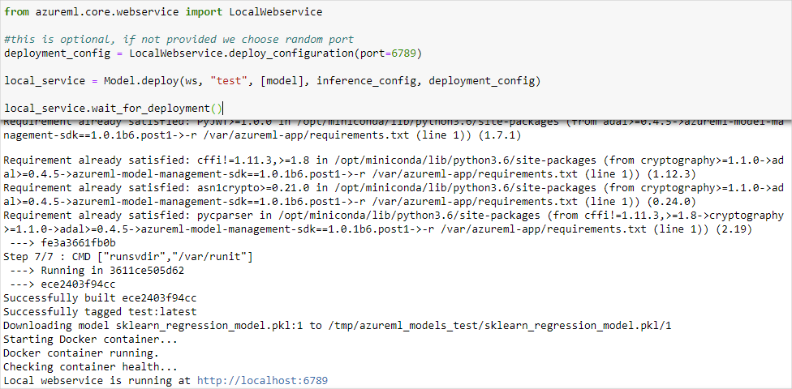

# Deploy a model locally

Learn how to use Azure Machine Learning to deploy a model as a web service on your Azure Machine Learning compute instance. Use compute instances if one of the following conditions is true:

- You need to quickly deploy and validate your model.
- You are testing a model that is under development.

> [!TIP]
> Deploying a model from a Jupyter Notebook on a compute instance, to a web service on the same VM is a _local deployment_. In this case, the 'local' computer is the compute instance. For more information on deployments, see [Deploy models with Azure Machine Learning](how-to-deploy-and-where.md).

## Prerequisites

- An Azure Machine Learning workspace with a compute instance running. For more information, see [Setup environment and workspace](tutorial-1st-experiment-sdk-setup.md).

## Deploy to the compute instances

An example notebook that demonstrates local deployments is included on your compute instance. Use the following steps to load the notebook and deploy the model as a web service on the VM:

1. From [Azure Machine Learning studio](https://ml.azure.com), select "Notebooks", and then select how-to-use-azureml/deployment/deploy-to-local/register-model-deploy-local.ipynb under "Sample notebooks". Clone this notebook to your user folder.

1. Find the notebook cloned in step 1, choose or create a Compute Instance to run the notebook.

    


1. The notebook displays the URL and port that the service is running on. For example, `https://localhost:6789`. You can also run the cell containing `print('Local service port: {}'.format(local_service.port))` to display the port.

    

1. To test the service from a compute instance, use the `https://localhost:<local_service.port>` URL. To test from a remote client, get the public URL of the service running on the compute instance. The public URL can be determined use the following formula; 
    * Notebook VM: `https://<vm_name>-<local_service_port>.<azure_region_of_workspace>.notebooks.azureml.net/score`. 
    * Compute instance: `https://<vm_name>-<local_service_port>.<azure_region_of_workspace>.instances.azureml.net/score`. 

    For example, 
    * Notebook VM: `https://vm-name-6789.northcentralus.notebooks.azureml.net/score` 
    * Compute instance: `https://vm-name-6789.northcentralus.instances.azureml.net/score`

## Test the service

To submit sample data to the running service, use the following code. Replace the value of `service_url` with the URL of from the previous step:

> [!NOTE]
> When authenticating to a deployment on the compute instance, the authentication is made using Azure Active Directory. The call to `interactive_auth.get_authentication_header()` in the example code authenticates you using AAD, and returns a header that can then be used to authenticate to the service on the compute instance. For more information, see [Set up authentication for Azure Machine Learning resources and workflows](how-to-setup-authentication.md#interactive-authentication).
>
> When authenticating to a deployment on Azure Kubernetes Service or Azure Container Instances, a different authentication method is used. For more information on, see [Configure authentication for Azure Machine models deployed as web services](how-to-authenticate-web-service.md).

```python
import requests
import json
from azureml.core.authentication import InteractiveLoginAuthentication

# Get a token to authenticate to the compute instance from remote
interactive_auth = InteractiveLoginAuthentication()
auth_header = interactive_auth.get_authentication_header()

# Create and submit a request using the auth header
headers = auth_header
# Add content type header
headers.update({'Content-Type':'application/json'})

# Sample data to send to the service
test_sample = json.dumps({'data': [
    [1,2,3,4,5,6,7,8,9,10],
    [10,9,8,7,6,5,4,3,2,1]
]})
test_sample = bytes(test_sample,encoding = 'utf8')

# Replace with the URL for your compute instance, as determined from the previous section
service_url = "https://vm-name-6789.northcentralus.notebooks.azureml.net/score"
# for a compute instance, the url would be https://vm-name-6789.northcentralus.instances.azureml.net/score
resp = requests.post(service_url, test_sample, headers=headers)
print("prediction:", resp.text)
```

## Next steps

* [How to deploy a model using a custom Docker image](how-to-deploy-custom-docker-image.md)
* [Deployment troubleshooting](how-to-troubleshoot-deployment.md)
* [Use TLS to secure a web service through Azure Machine Learning](how-to-secure-web-service.md)
* [Consume a ML Model deployed as a web service](how-to-consume-web-service.md)
* [Monitor your Azure Machine Learning models with Application Insights](how-to-enable-app-insights.md)
* [Collect data for models in production](how-to-enable-data-collection.md)
