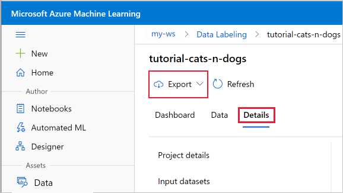

# Create and explore Azure Machine Learning dataset with labels

In this article, you'll learn how to export the data labels from an Azure Machine Learning data labeling project and load them into popular formats such as, a pandas dataframe for data exploration. 

## What are datasets with labels 

Azure Machine Learning datasets with labels are referred to as labeled datasets. These specific datasets are [TabularDatasets](/python/api/azureml-core/azureml.data.tabular_dataset.tabulardataset) with a dedicated label column and are only created as an output of Azure Machine Learning data labeling projects. Create a data labeling project [for image labeling](how-to-create-image-labeling-projects.md) or [text labeling](how-to-create-text-labeling-projects.md). Machine Learning supports data labeling projects for image classification, either multi-label or multi-class, and object identification together with bounded boxes.

## Prerequisites

* An Azure subscription. If you don’t have an Azure subscription, create a [free account](https://azure.microsoft.com/free/) before you begin.
* The [Azure Machine Learning SDK for Python](/python/api/overview/azure/ml/intro), or access to [Azure Machine Learning studio](https://ml.azure.com/).
* A Machine Learning workspace. See [Create workspace resources](quickstart-create-resources.md).
* Access to an Azure Machine Learning data labeling project. If you don't have a labeling project, first create one for [image labeling](how-to-create-image-labeling-projects.md) or [text labeling](how-to-create-text-labeling-projects.md).

## Export data labels 

When you complete a data labeling project, you can [export the label data from a labeling project](how-to-create-image-labeling-projects.md#export-the-labels). Doing so, allows you to capture both the reference to the data and its labels, and export them in [COCO format](http://cocodataset.org/#format-data) or as an Azure Machine Learning dataset. 

Use the **Export** button on the **Project details** page of your labeling project.



### COCO 

 The COCO file is created in the default blob store of the Azure Machine Learning workspace in a folder within *export/coco*. 
 
>[!NOTE]
>In object detection projects, the exported "bbox": [x,y,width,height]" values in COCO file are normalized. They are scaled to 1. Example : a bounding box at (10, 10) location, with 30 pixels width , 60 pixels height, in a 640x480 pixel image will be annotated as (0.015625. 0.02083, 0.046875, 0.125). Since the coordintes are normalized, it will show as '0.0' as "width" and "height" for all images. The actual width and height can be obtained using Python library like OpenCV  or Pillow(PIL).

### Azure Machine Learning dataset

You can access the exported Azure Machine Learning dataset in the **Datasets** section of your Azure Machine Learning studio. The dataset **Details** page also provides sample code to access your labels from Python.


> [!TIP]
> Once you have exported your labeled data to an Azure Machine Learning dataset, you can use AutoML to build computer vision models trained on your labeled data. Learn more at [Set up AutoML to train computer vision models with Python (preview)](how-to-auto-train-image-models.md)

## Explore labeled datasets via pandas dataframe

Load your labeled datasets into a pandas dataframe to leverage popular open-source libraries for data exploration with the [`to_pandas_dataframe()`](/python/api/azureml-core/azureml.data.tabulardataset#to-pandas-dataframe-on-error--null---out-of-range-datetime--null--) method from the `azureml-dataprep` class. 

Install the class with the following shell command: 

```shell
pip install azureml-dataprep
```

In the following code, the `animal_labels` dataset is the output from a labeling project previously saved to the workspace.
The exported dataset is a [TabularDataset](/python/api/azureml-core/azureml.data.tabular_dataset.tabulardataset). If you plan to use [download()](/python/api/azureml-core/azureml.data.tabulardataset#azureml-data-tabulardataset-download) or [mount()](/python/api/azureml-core/azureml.data.tabulardataset#azureml-data-tabulardataset-mount) methods, be sure to set the parameter `stream column ='image_url'`. 

> [!NOTE]
> The public preview methods download() and mount() are [experimental](/python/api/overview/azure/ml/#stable-vs-experimental) preview features, and may change at any time.

[!INCLUDE [sdk v1](../../includes/machine-learning-sdk-v1.md)]

```Python
import azureml.core
from azureml.core import Dataset, Workspace

# get animal_labels dataset from the workspace
animal_labels = Dataset.get_by_name(workspace, 'animal_labels')
animal_pd = animal_labels.to_pandas_dataframe()

# download the images to local 
download_path = animal_labels.download(stream_column='image_url') 

import matplotlib.pyplot as plt
import matplotlib.image as mpimg

#read images from downloaded path
img = mpimg.imread(download_path[0])
imgplot = plt.imshow(img)
```

## Next steps

* Learn to [train image classification models in Azure](./tutorial-train-deploy-notebook.md)
* [Set up AutoML to train computer vision models with Python (preview)](how-to-auto-train-image-models.md)
