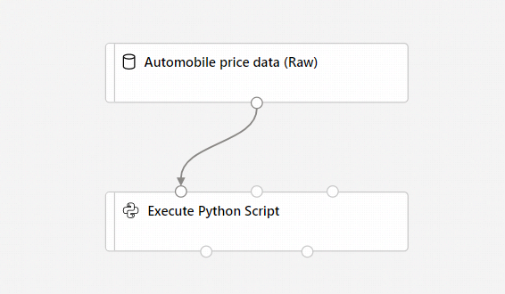
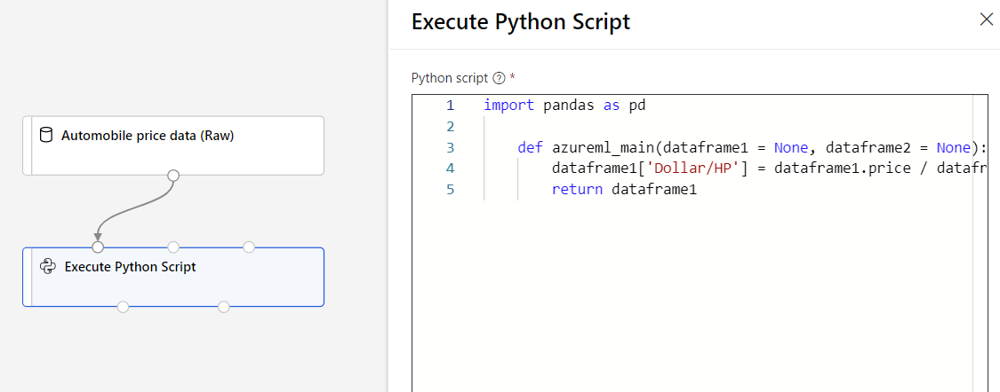

# Run Python code in Azure Machine Learning designer

In this article, you'll learn how to use the [Execute Python Script](../algorithm-module-reference/execute-python-script.md) component to add custom logic to the Azure Machine Learning designer. In this how-to, you use the Pandas library to do simple feature engineering.

You can use the in-built code editor to quickly add simple Python logic. You should use the zip file method to add more complex code, or to upload additional Python libraries.

The default execution environment uses the Anacondas distribution of Python. See the [Execute Python Script component reference](../algorithm-module-reference/execute-python-script.md) page for a complete list of pre-installed packages.


> [!IMPORTANT]
> If you do not see graphical elements mentioned in this document, such as buttons in studio or designer, you may not have the right level of permissions to the workspace. Please contact your Azure subscription administrator to verify that you have been granted the correct level of access. For more information, see [Manage users and roles](../how-to-assign-roles.md).

## Execute Python written in the designer

### Add the Execute Python Script component

1. Find the **Execute Python Script** component in the designer palette. It can be found in the **Python Language** section.

1. Drag and drop the component onto the pipeline canvas.

### Connect input datasets

This article uses the **Automobile price data (Raw)** sample dataset.

1. Drag and drop your dataset to the pipeline canvas.

1. Connect the output port of the dataset to the top-left input port of the **Execute Python Script** component. The designer exposes the input as a parameter to the entry point script.

    The right input port is reserved for zipped Python libraries.

    

1. Carefully note the specific input port you use. The designer assigns the left input port to the variable `dataset1`, and the middle input port to `dataset2`.

Input components are optional, since you can generate or import data directly in the **Execute Python Script** component.

### Write your Python code

The designer provides an initial entry point script for you to edit and enter your own Python code.

In this example, you use Pandas to combine two of the automobile dataset columns - **Price** and **Horsepower** - to create a new column, **Dollars per horsepower**. This column represents how much you pay for each horsepower unit, which could become a useful information point to decide if a specific car is a good deal for its price.

1. Select the **Execute Python Script** component.

1. In the pane that appears to the right of the canvas, select the **Python script** text box.

1. Copy and paste the following code into the text box:

    ```python
    import pandas as pd
    
    def azureml_main(dataframe1 = None, dataframe2 = None):
        dataframe1['Dollar/HP'] = dataframe1.price / dataframe1.horsepower
        return dataframe1
    ```
    Your pipeline should look like this image:
    
    

    The entry point script must contain the function `azureml_main`. The function has two function parameters that map to the two input ports for the **Execute Python Script** component.

    The return value must be a Pandas Dataframe. You can return at most two dataframes as component outputs.
    
1. Submit the pipeline.

Now you have a dataset, which has a new **Dollars/HP** feature. This new feature could help to train a car recommender. This example shows feature extraction and dimensionality reduction.

## Next steps

Learn how to [import your own data](how-to-designer-import-data.md) in Azure Machine Learning designer.
