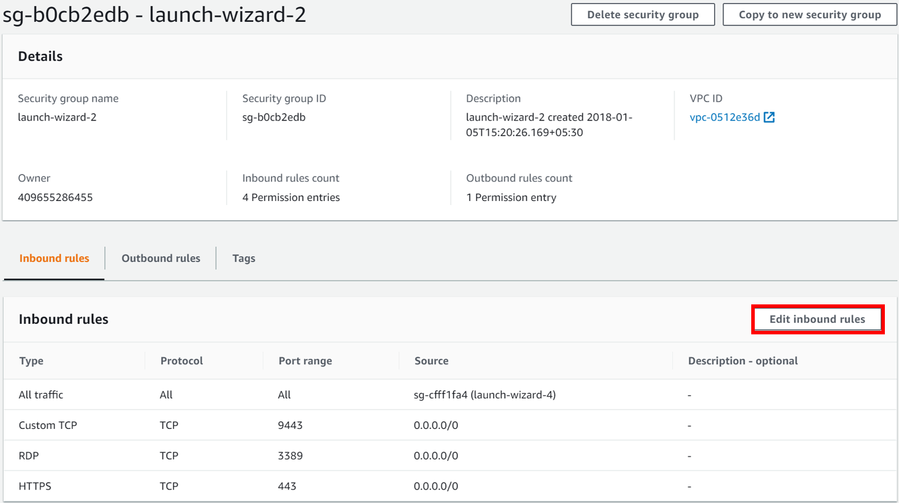
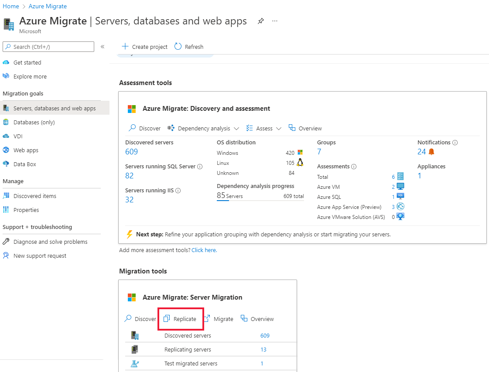
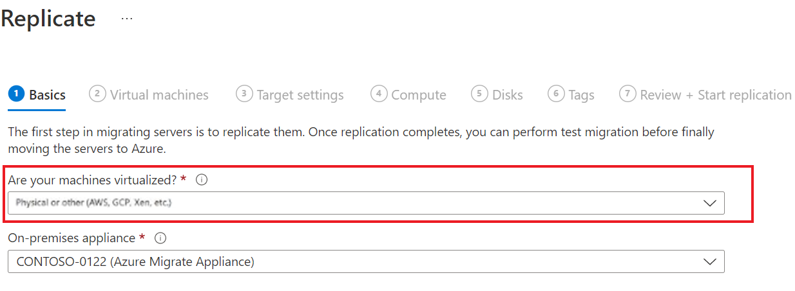
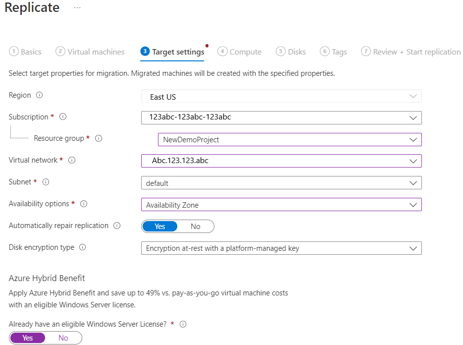
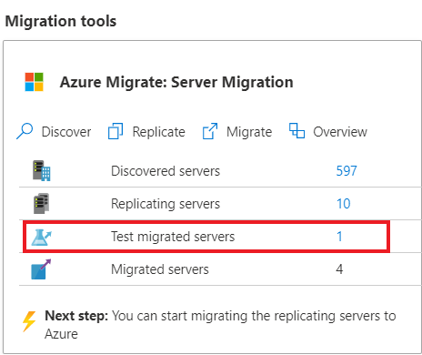

# Discover, assess, and migrate Amazon Web Services (AWS) VMs to Azure

This tutorial shows you how to discover, assess, and migrate Amazon Web Services (AWS) virtual machines (VMs) to Azure VMs, using Azure Migrate: Server Assessment and Azure Migrate: Server Migration tools.

> [!NOTE]
> You migrate AWS VMs to Azure by treating them as physical servers.

In this tutorial, you will learn how to:
> [!div class="checklist"]
>
> * Verify prerequisites for migration.
> * Prepare Azure resources with Azure Migrate: Server Migration. Set up permissions for your Azure account and resources to work with Azure Migrate.
> * Prepare AWS EC2 instances for migration.
> * Add the Azure Migrate: Server Migration tool in the Azure Migrate hub.
> * Set up the replication appliance and deploy the configuration server.
> * Install the Mobility service on AWS VMs you want to migrate.
> * Enable replication for VMs.
> * Track and monitor the replication status. 
> * Run a test migration to make sure everything's working as expected.
> * Run a full migration to Azure.

If you don't have an Azure subscription, create a [free account](https://azure.microsoft.com/pricing/free-trial/) before you begin.

## Discover and assess

Before you migrate to Azure, we recommend that you perform a VM discovery and migration assessment. This assessment helps right-size your AWS VMs for migration to Azure, and estimate potential Azure run costs.

Set up an assessment as follows:

1. Follow the [tutorial](./tutorial-prepare-physical.md) to set up Azure and prepare your AWS VMs for an assessment. Note that:

    - Azure Migrate uses password authentication when discovering AWS instances. AWS instances don't support password authentication by default. Before you can discover instance, you need to enable password authentication.
        - For Windows machines, allow WinRM port 5986 (HTTPS), and 5985 (HTTP). This allows remote WMI calls. If you set up the 
        - For Linux machines:
            1. Sign into each Linux  machine.
            2. Open the sshd_config file : vi /etc/ssh/sshd_config
            3. In the file, locate the **PasswordAuthentication** line, and change the value to **yes**.
            4. Save the file and close it. Restart the ssh service.

2. Then, follow this [tutorial](./tutorial-assess-physical.md) to set up an Azure Migrate project and appliance to discover and assess your AWS VMs.

Although we recommend that you try out an assessment, performing an assessment isn’t a mandatory step to be able to migrate VMs.


## Prerequisites 

- Ensure that the AWS VMs you want to migrate are running a supported OS version. AWS VMs are treated like physical machines for the purpose of the migration. Review the [supported operating systems and kernel versions](../site-recovery/vmware-physical-azure-support-matrix.md#replicated-machines) for the physical server migration workflow. You can use standard commands like *hostnamectl* or *uname -a* to check the OS and kernel versions for your Linux VMs.  We recommend you perform a test migration (test failover) to validate if the VM works as expected before proceeding with the actual migration.
- Make sure your AWS VMs comply with the [supported configurations](./migrate-support-matrix-physical-migration.md#physical-server-requirements) for migration to Azure.
- Verify that the AWS VMs that you replicate to Azure comply with [Azure VM requirements.](./migrate-support-matrix-physical-migration.md#azure-vm-requirements)
- There are some changes needed on the VMs before you migrate them to Azure.
    - For some operating systems, Azure Migrate makes these changes automatically.
    - It's important to make these changes before you begin migration. If you migrate the VM before you make the change, the VM might not boot up in Azure.
Review [Windows](prepare-for-migration.md#windows-machines) and [Linux](prepare-for-migration.md#linux-machines) changes you need to make.

### Prepare Azure resources for migration

Prepare Azure for migration with Azure Migrate: Server Migration tool.

**Task** | **Details**
--- | ---
**Create an Azure Migrate project** | Your Azure account needs Contributer or Owner permissions to create a project.
**Verify permissions for your Azure account** | Your Azure account needs permissions to create a VM, and write to an Azure managed disk.

### Assign permissions to create project

1. In the Azure portal, open the subscription, and select **Access control (IAM)**.
2. In **Check access**, find the relevant account, and click it to view permissions.
3. You should have **Contributor** or **Owner** permissions.
    - If you just created a free Azure account, you're the owner of your subscription.
    - If you're not the subscription owner, work with the owner to assign the role.

### Assign Azure account permissions

Assign the Virtual Machine Contributor role to the Azure account. This provides permissions to:

- Create a VM in the selected resource group.
- Create a VM in the selected virtual network.
- Write to an Azure managed disk. 

### Create an Azure network

[Set up](../virtual-network/manage-virtual-network.md#create-a-virtual-network) an Azure virtual network (VNet). When you replicate to Azure, the Azure VMs that are created are joined to the Azure VNet that you specify when you set up migration.

## Prepare AWS instances for migration

To prepare for AWS to Azure migration, you need to prepare and deploy a replication appliance for migration.

### Prepare a machine for the replication appliance

Azure Migrate: Server Migration uses a replication appliance to replicate machines to Azure. The replication appliance runs the following components.

- **Configuration server**: The configuration server coordinates communications between the AWS environment and Azure, and manages data replication.
- **Process server**: The process server acts as a replication gateway. It receives replication data, optimizes it with caching, compression, and encryption, and sends it to a cache storage account in Azure.

Prepare for appliance deployment as follows:

- Set up a separate EC2 VM to host the replication appliance. This instance must be running Windows Server 2012 R2 or Windows Server 2016. [Review](./migrate-replication-appliance.md#appliance-requirements) the hardware, software, and networking requirements for the appliance.
- The appliance shouldn't be installed on a source VM that you want to replicate or on the Azure Migrate discovery and assessment appliance you may have installed before. It should be deployed on a different VM.
- The source AWS VMs to be migrated should have a network line of sight to the replication appliance. Configure necessary security group rules to enable this. It is recommended that the replication appliance is deployed in the same VPC as the source VMs to be migrated. If the replication appliance needs to be in a different VPC, the VPCs need to be connected through VPC peering.
- The source AWS VMs communicate with the replication appliance on ports HTTPS 443 (control channel orchestration) and TCP 9443 (data transport) inbound for replication management and replication data transfer. The replication appliance in turn orchestrates and sends replication data to Azure over port HTTPS 443 outbound. To configure these rules, edit the security group inbound/outbound rules with the appropriate ports and source IP information.

   
     
 
   

- The replication appliance uses MySQL. Review the [options](migrate-replication-appliance.md#mysql-installation) for installing MySQL on the appliance.
- Review the Azure URLs required for the replication appliance to access [public](migrate-replication-appliance.md#url-access) and [government](migrate-replication-appliance.md#azure-government-url-access) clouds.

## Add the Server Migration tool

Set up an Azure Migrate project, and then add the Server Migration tool to it.

1. In the Azure portal > **All services**, search for **Azure Migrate**.
2. Under **Services**, select **Azure Migrate**.
3. In **Overview**, click **Assess and migrate servers**.
4. Under **Discover, assess and migrate servers**, click **Assess and migrate servers**.

    

5. In **Discover, assess and migrate servers**, click **Add tools**.
6. In **Migrate project**, select your Azure subscription, and create a resource group if you don't have one.
7. In **Project Details**, specify the project name, and geography in which you want to create the project, and click **Next**. Review supported geographies for [public](migrate-support-matrix.md#supported-geographies-public-cloud) and [government clouds](migrate-support-matrix.md#supported-geographies-azure-government).
    - The project geography is used only to store the metadata gathered from AWS machines.
    - You can select any target region when you run a migration.

    

8. In **Select assessment tool**, select **Skip adding an assessment tool for now** > **Next**.
9. In **Select migration tool**, select **Azure Migrate: Server Migration** > **Next**.
10. In **Review + add tools**, review the settings, and click **Add tools**
11. After adding the tool, it appears in the Azure Migrate project > **Servers** > **Migration tools**.

## Set up the replication appliance

The first step of migration is to set up the replication appliance. To set up the appliance for AWS VMs migration, you must download the installer file for the appliance, and then run it on the [VM you prepared](#prepare-a-machine-for-the-replication-appliance).

### Download the replication appliance installer

1. In the Azure Migrate project > **Servers**, in **Azure Migrate: Server Migration**, click **Discover**.

    

2. In **Discover machines** > **Are your machines virtualized?**, click **Not virtualized/Other**.
3. In **Target region**, select the Azure region to which you want to migrate the machines.
4. Select **Confirm that the target region for migration is <region-name>**.
5. Click **Create resources**. This creates an Azure Site Recovery vault in the background.
    - If you've already set up migration with Azure Migrate Server Migration, the target option can't be configured, since resources were set up previously.
    - You can't change the target region for this project after clicking this button.
    - To migrate your VMs to a different region, you'll need to create a new/different Azure Migrate project.

6. In **Do you want to install a new replication appliance?**, select **Install a replication appliance**.
7. In **Download and install the replication appliance software**, download the appliance installer, and the registration key. You need to the key in order to register the appliance. The key is valid for five days after it's downloaded.

    

8. Copy the appliance setup file and key file to the Windows Server 2016 or Windows Server 2012 AWS VM you created for the replication appliance.
9. Run the replication appliance setup file, as described in the next procedure.  
    9.1. Under **Before You Begin**, select **Install the configuration server and process server**, and then select **Next**.   
    9.2 In **Third-Party Software License**, select **I accept the third-party license agreement**, and then select **Next**.   
    9.3 In **Registration**, select **Browse**, and then go to where you put the vault registration key file. Select **Next**.  
    9.4 In **Internet Settings**, select **Connect to Azure Site Recovery without a proxy server**, and then select **Next**.  
    9.5 The **Prerequisites Check** page runs checks for several items. When it's finished, select **Next**.  
    9.6 In **MySQL Configuration**, provide a password for the MySQL DB, and then select **Next**.  
    9.7 In **Environment Details**, select **No**. You don't need to protect your VMs. Then, select **Next**.  
    9.8 In **Install Location**, select **Next** to accept the default.  
    9.9 In **Network Selection**, select **Next** to accept the default.  
    9.10 In **Summary**, select **Install**.   
    9.11 **Installation Progress** shows you information about the installation process. When it's finished, select **Finish**. A window displays a message about a reboot. Select **OK**.   
    9.12 Next, a window displays a message about the configuration server connection passphrase. Copy the passphrase to your clipboard and save the passphrase in a temporary text file on the source VMs. You’ll need this passphrase later, during the mobility service installation process.
10. After the installation completes, the Appliance configuration wizard will be launched automatically (You can also launch the wizard manually by using the cspsconfigtool shortcut that is created on the desktop of the appliance). Use the Manage Accounts tab of the wizard to add account details to use for push installation of the Mobility service. In this tutorial, we'll be manually installing the Mobility Service on source VMs to be replicated, so create a dummy account in this step and proceed. You can provide the following details for creating the dummy account - "guest" as the friendly name, "username" as the username, and "password" as the password for the account. You will be using this dummy account in the Enable Replication stage. 
11. After the appliance has restarted after setup, in **Discover machines**, select the new appliance in **Select Configuration Server**, and click **Finalize registration**. Finalize registration performs a couple of final tasks to prepare the replication appliance.

    

## Install the Mobility service

A Mobility service agent must be installed on the source AWS VMs to be migrated. The agent installers are available on the replication appliance. You find the right installer, and install the agent on each machine you want to migrate. Do as follows:

1. Sign in to the replication appliance.
2. Navigate to **%ProgramData%\ASR\home\svsystems\pushinstallsvc\repository**.
3. Find the installer for the source AWS VMs operating system and version. Review [supported operating systems](../site-recovery/vmware-physical-azure-support-matrix.md#replicated-machines).
4. Copy the installer file to the source AWS VM you want to migrate.
5. Make sure that you have the saved passphrase text file that was created when you installed the replication appliance.
    - If you forgot to save the passphrase, you can view the passphrase on the replication appliance with this step. From the command line, run **C:\ProgramData\ASR\home\svsystems\bin\genpassphrase.exe -v** to view the current passphrase.
    - Now, copy this passphrase to your clipboard and save it in a temporary text file on the source VMs.

### Installation guide for Windows AWS VMs

1. Extract the contents of installer file to a local folder (for example C:\Temp) on the AWS VM, as follows:

    ```
    ren Microsoft-ASR_UA*Windows*release.exe MobilityServiceInstaller.exe
    MobilityServiceInstaller.exe /q /x:C:\Temp\Extracted
    cd C:\Temp\Extracted
    ```  

2. Run the Mobility Service Installer:
    ```
   UnifiedAgent.exe /Role "MS" /Silent
    ```  

3. Register the agent with the replication appliance:
    ```
    cd C:\Program Files (x86)\Microsoft Azure Site Recovery\agent
    UnifiedAgentConfigurator.exe  /CSEndPoint <replication appliance IP address> /PassphraseFilePath <Passphrase File Path>
    ```

### Installation guide for Linux AWS VMs

1. Extract the contents of the installer tarball to a local folder (for example /tmp/MobSvcInstaller) on the AWS VM, as follows:
    ```
    mkdir /tmp/MobSvcInstaller
    tar -C /tmp/MobSvcInstaller -xvf <Installer tarball>
    cd /tmp/MobSvcInstaller
    ```  

2. Run the installer script:
    ```
    sudo ./install -r MS -q
    ```  

3. Register the agent with the replication appliance:
    ```
    /usr/local/ASR/Vx/bin/UnifiedAgentConfigurator.sh -i <replication appliance IP address> -P <Passphrase File Path>
    ```

## Enable replication for AWS VMs

> [!NOTE]
> Through the portal, you can add up to 10 VMs for replication at once. To replicate more VMs simultaneously, you can add them in batches of 10.

1. In the Azure Migrate project > **Servers**, **Azure Migrate: Server Migration**, click **Replicate**.

    

2. In **Replicate**, > **Source settings** > **Are your machines virtualized?**, select **Not virtualized/Other**.
3. In **On-premises appliance**, select the name of the Azure Migrate appliance that you set up.
4. In **Process Server**, select the name of the replication appliance. 
5. In **Guest credentials**, please select the dummy account created previously during the [replication installer setup](#download-the-replication-appliance-installer) to install the Mobility service manually (push install is not supported). Then click **Next: Virtual machines**.   
 
    
6. In **Virtual Machines**, in **Import migration settings from an assessment?**, leave the default setting **No, I'll specify the migration settings manually**.
7. Check each VM you want to migrate. Then click **Next: Target settings**.

    

8. In **Target settings**, select the subscription, and target region to which you'll migrate, and specify the resource group in which the Azure VMs will reside after migration.
9. In **Virtual Network**, select the Azure VNet/subnet to which the Azure VMs will be joined after migration.
10. In **Azure Hybrid Benefit**:
    - Select **No** if you don't want to apply Azure Hybrid Benefit. Then click **Next**.
    - Select **Yes** if you have Windows Server machines that are covered with active Software Assurance or Windows Server subscriptions, and you want to apply the benefit to the machines you're migrating. Then click **Next**.

    

11. In **Compute**, review the VM name, size, OS disk type, and availability set. VMs must conform with [Azure requirements](migrate-support-matrix-physical-migration.md#azure-vm-requirements).

    - **VM size**: By default, Azure Migrate Server Migration picks a size based on the closest match in the Azure subscription. Alternatively, pick a manual size in **Azure VM size**.
    - **OS disk**: Specify the OS (boot) disk for the VM. The OS disk is the disk that has the operating system bootloader and installer. 
    - **Availability set**: If the VM should be in an Azure availability set after migration, specify the set. The set must be in the target resource group you specify for the migration.

    

12. In **Disks**, specify whether the VM disks should be replicated to Azure, and select the disk type (standard SSD/HDD or premium managed disks) in Azure. Then click **Next**.
    - You can exclude disks from replication.
    - If you exclude disks, won't be present on the Azure VM after migration. 

    

13. In **Review and start replication**, review the settings, and click **Replicate** to start the initial replication for the servers.

> [!NOTE]
> You can update replication settings any time before replication starts, **Manage** > **Replicating machines**. Settings can't be changed after replication starts.

## Track and monitor replication status

- When you click **Replicate** a Start Replication job begins.
- When the Start Replication job finishes successfully, the VMs begin their initial replication to Azure.
- After initial replication finishes, delta replication begins. Incremental changes to AWS VM disks are periodically replicated to the replica disks in Azure.

You can track job status in the portal notifications.

You can monitor replication status by clicking on **Replicating servers** in **Azure Migrate: Server Migration**.  


## Run a test migration

When delta replication begins, you can run a test migration for the VMs, before running a full migration to Azure. The test migration is highly recommended and provides an opportunity to discover any potential issues and fix them before you proceed with the actual migration. It is advised that you do this at least once for each VM before you migrate it.

- Running a test migration checks that migration will work as expected, without impacting the AWS VMs, which remain operational, and continue replicating.
- Test migration simulates the migration by creating an Azure VM using replicated data (usually migrating to a non-production VNet in your Azure subscription).
- You can use the replicated test Azure VM to validate the migration, perform app testing, and address any issues before full migration.

Do a test migration as follows:

1. In **Migration goals** > **Servers** > **Azure Migrate: Server Migration**, click **Test migrated servers**.

     

2. Right-click the VM to test, and click **Test migrate**.

    

3. In **Test Migration**, select the Azure VNet in which the Azure VM will be located after the migration. We recommend you use a non-production VNet.
4. The **Test migration** job starts. Monitor the job in the portal notifications.
5. After the migration finishes, view the migrated Azure VM in **Virtual Machines** in the Azure portal. The machine name has a suffix **-Test**.
6. After the test is done, right-click the Azure VM in **Replicating machines**, and click **Clean up test migration**.

    


## Migrate AWS VMs

After you've verified that the test migration works as expected, you can migrate the AWS VMs.

1. In the Azure Migrate project > **Servers** > **Azure Migrate: Server Migration**, click **Replicating servers**.

    

2. In **Replicating machines**, right-click the VM > **Migrate**.
3. In **Migrate** > **Shut down virtual machines and perform a planned migration with no data loss**, select **Yes** > **OK**.
    - If you don't want to shut down the VM, select **No**.
4. A migration job starts for the VM. You can view the job status by clicking the notification bell icon on the top right of the portal page or by going to the jobs page of the Server Migration tool (Click Overview on the tool tile > Select Jobs from the left menu).
5. After the job finishes, you can view and manage the VM from the Virtual Machines page.

### Complete the migration

1. After the migration is done, right-click the VM > **Stop migration**. This does the following:
    - Stops replication for the AWS VM.
    - Removes the AWS VM from the **Replicating servers** count in Azure Migrate: Server Migration.
    - Cleans up replication state information for the VM.
2. Install the [Linux](../virtual-machines/extensions/agent-linux.md) agent on the migrated machines. Azure VM Windows agent is pre-installed during the migration process.
3. Perform any post-migration app tweaks, such as updating database connection strings, and web server configurations.
4. Perform final application and migration acceptance testing on the migrated application now running in Azure.
5. Cut over traffic to the migrated Azure VM instance.
6. Update any internal documentation to show the new location and IP address of the Azure VMs. 


## Post-migration best practices

- For increased resilience:
    - Keep data secure by backing up Azure VMs using the Azure Backup service. [Learn more](../backup/quick-backup-vm-portal.md).
    - Keep workloads running and continuously available by replicating Azure VMs to a secondary region with Site Recovery. [Learn more](../site-recovery/azure-to-azure-tutorial-enable-replication.md).
- For increased security:
    - Lock down and limit inbound traffic access with [Azure Security Center - Just in time administration](../security-center/security-center-just-in-time.md).
    - Restrict network traffic to management endpoints with [Network Security Groups](../virtual-network/security-overview.md).
    - Deploy [Azure Disk Encryption](../security/fundamentals/azure-disk-encryption-vms-vmss.md) to help secure disks, and keep data safe from theft and unauthorized access.
    - Read more about [securing IaaS resources](https://azure.microsoft.com/services/virtual-machines/secure-well-managed-iaas/), and visit the [Azure Security Center](https://azure.microsoft.com/services/security-center/).
- For monitoring and management:
    - Consider deploying [Azure Cost Management](../cost-management-billing/cloudyn/overview.md) to monitor resource usage and spending.


## Troubleshooting / Tips

**Question:** I cannot see my AWS VM in the discovered list of servers for migration   
**Answer:** Check if your replication appliance meets the requirements. Make sure
Mobility Agent is installed on the source VM to be migrated and is registered the Configuration Server. Check the network setting and firewall rules to enable a network path between the replication appliance and source AWS VMs.  

**Question:** How do I know if my VM was successfully migrated   
**Answer:** Post-migration, you can view and manage the VM from the Virtual Machines page. Connect to the migrated VM to validate.  

**Question:** I am unable to import VMs for migration from my previously created Server Assessment results   
**Answer:** Currently, we do not support the import of assessment for this workflow. As a workaround, you can export the assessment and then manually select the VM recommendation during the Enable Replication step.
  
**Question:** I am getting the error “Failed to fetch BIOS GUID” while trying to discover my AWS VMs   
**Answer:** Always use root login for authentication and not any pseudo user. Also review supported operating systems for AWS VMs.  

**Question:** My replication status is not progressing   
**Answer:** Check if your replication appliance meets the requirements. Make sure you’ve enabled the required ports on your replication appliance TCP port 9443 and HTTPS 443 for data transport. Ensure that there are no stale duplicate versions of the replication appliance connected to the same project.   

**Question:** I am unable to Discover AWS Instances using Azure Migrate due to HTTP status code of 504 from the remote Windows management service    
**Answer:** Make sure to review the Azure migrate appliance requirements and URL access needs. Make sure no proxy settings are blocking the appliance registration.

**Question:** Do I have to make any changes before I migrate my AWS VMs to Azure   
**Answer:** You may have to make these changes before migrating your EC2 VMs to Azure:

- If you are using cloud-init for your VM provisioning, you may want to disable cloud-init on the VM before replicating it to Azure. The provisioning steps performed by cloud-init on the VM maybe AWS specific and won't be valid after the migration to Azure. ​
- If the VM is a PV VM (para-virtualized) and not HVM VM, you may not be able to run it as-is on Azure because para-virtualized VMs use a custom boot sequence in AWS. You may be able to get over this challenge by uninstalling PV drivers before you perform a migration to Azure.  
- We always recommend you run a test migration before the final migration.  


**Question:** Can I migrate AWS VMs running Amazon Linux Operating system  
**Answer:** VMs running Amazon Linux cannot be migrated as-is as Amazon Linux OS is only supported on AWS.
To migrate workloads running on Amazon Linux, you can spin up a CentOS/RHEL VM in Azure and migrate the workload running on the AWS Linux machine using a relevant workload migration approach. For example, depending on the workload, there may be workload-specific tools to aid the migration – such as for databases or deployment tools in case of web servers.

## Next steps

Investigate the [cloud migration journey](/azure/architecture/cloud-adoption/getting-started/migrate) in the Azure Cloud Adoption Framework.
