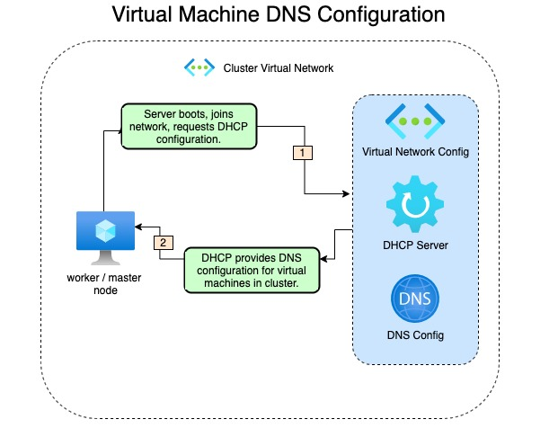
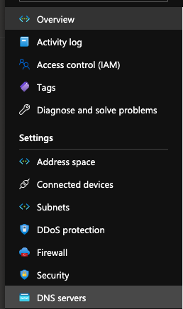

# Configure custom DNS for your Azure Red Hat OpenShift (ARO) cluster

This article provides the necessary details that allow you to configure your Azure Red Hat OpenShift cluster (ARO) to use a custom DNS server. It contains the cluster requirements for a basic ARO deployment.

## Before you begin

This article assumes that you're creating a new cluster or have an existing cluster with latest updates applied. If you need an ARO cluster, see the [ARO quickstart](./tutorial-create-cluster.md) for a public cluster, or the [private cluster tutorial](./howto-create-private-cluster-4x.md) for a private cluster. These steps to configure your cluster to use a custom DNS server are the same for both private and public clusters.

### Confirm cluster compatibility with custom DNS

Confirm your cluster is eligible to support this feature by validating the existence of the `99-master-aro-dns` and `99-worker-aro-dns` `machineconfigs`.

```
oc get machineconfig
```

If the results of the above command include the following machineconfigs, your cluster is eligible for custom DNS support.

```
NAME                 GENERATEDBYCONTROLLER                      IGNITIONVERSION   AGE
...
99-master-aro-dns                                               2.2.0             54d
99-worker-aro-dns                                               2.2.0             54d
...
```

## DNS architecture overview

As each node in the Azure Red Hat OpenShift cluster powers on and joins the network, DHCP configures the virtual machine with information such as IP address and which DNS server to use.

Below is the process flow overview of how the configuration is obtained:



An important trade-off of using your own DNS server instead of the default DNS server in the virtual network is that you lose the configuration that DNS server provided. The virtual machine names will no longer resolve through DNS on the network.

### Update process overview

Configuring a custom dns server for the cluster is broken down into two steps.

1. Modifying the Virtual Network DNS Servers configuration setting.
2. Restarting nodes in cluster to take changes.


## Configure a custom DNS server

The following steps can be performed through the command line as well, but this documentation will be walking through using the portal web interface.

### Update DNS configuration in virtual network

Log into the Azure portal and navigate to the desired virtual network you want to update. Select **DNS servers** from the virtual networks settings list.



Once you are at the DNS configuration screen, select **Custom** from the radial button configuration. Enter in the IP addresses for your DNS servers.

>[!IMPORTANT]
> If you choose to specify a custom DNS server, you will no longer be able to resolve node names in the virtual network via DNS. Nodes will only be reachable via IP address.


Select **Save**.

>[!NOTE]
> As shown in the portal interface, you must reboot all virtual machines for the changes to be in place.

You should receive a notification that your update was successful.


### Gracefully reboot your cluster

These steps require having a valid kubeconfig to your cluster, see [this tutorial](./tutorial-connect-cluster.md) for details on how to obtain a kubeconfig.

The following code snippets create noop `machineconfig`'s for master and worker nodes. This allows you to initiate rolling reboots for either the worker or master nodes. For more information about the Machine Config Operator (MCO), please see either [the source code](https://github.com/openshift/machine-config-operator) or the [OpenShift docs for MCO
](https://docs.openshift.com/container-platform/4.6/architecture/control-plane.html).
#### MachineConfig definitions

Worker restarts:

```
apiVersion: machineconfiguration.openshift.io/v1
kind: MachineConfig
metadata:
  labels:
    machineconfiguration.openshift.io/role: worker
  name: 25-machineconfig-worker-reboot
spec:
  config:
    ignition:
      version: 2.2.0
    storage:
      files:
      - contents:
          source: data:text/plain;charset=utf-8;base64,cmVzdGFydAo=
        filesystem: root
        mode: 0644
        path: /etc/mco-noop-worker-restart.txt
```

Master restarts:

```
apiVersion: machineconfiguration.openshift.io/v1
kind: MachineConfig
metadata:
  labels:
    machineconfiguration.openshift.io/role: master
  name: 25-machineconfig-master-reboot
spec:
  config:
    ignition:
      version: 2.2.0
    storage:
      files:
      - contents:
          source: data:text/plain;charset=utf-8;base64,cmVzdGFydAo=
        filesystem: root
        mode: 0644
        path: /etc/mco-master-noop-restart.txt
```

#### Reboot worker nodes

Create the worker restart file, this example calls the file `worker-restarts.yml`, and apply it.

```
[user@bastion ~]$ vim worker-restarts.yml
[user@bastion ~]$ oc apply -f worker-restarts.yml
machineconfig.machineconfiguration.openshift.io/25-machineconfig-worker-reboot created
```

The MCO will move workloads and then reboot each node one at a time. Once the workers have come back online, we will follow the same procedure to reboot the master nodes. You can verify the status of the workers by querying the nodes and validate they are all in the `Ready` state.

>[!NOTE]
> Depending on the size of the workload the cluster has, it can take several minutes for each node to reboot.


Example worker nodes not fully ready:

```
NAME                                  STATUS                     ROLES    AGE     VERSION
dns-docs-tm45t-master-0               Ready                      master   5h40m   v1.19.0+a5a0987
dns-docs-tm45t-master-1               Ready                      master   5h40m   v1.19.0+a5a0987
dns-docs-tm45t-master-2               Ready                      master   5h40m   v1.19.0+a5a0987
dns-docs-tm45t-worker-eastus1-8t6q8   Ready                      worker   5h35m   v1.19.0+a5a0987
dns-docs-tm45t-worker-eastus2-ln2kq   Ready,SchedulingDisabled   worker   5h34m   v1.19.0+a5a0987
dns-docs-tm45t-worker-eastus3-gg75h   Ready                      worker   5h35m   v1.19.0+a5a0987
```

As the node reboots, you'll see it change to the NotReady state:

```
dns-docs-tm45t-worker-eastus2-ln2kq   NotReady,SchedulingDisabled   worker   5h38m   v1.19.0+a5a0987
```

Fully ready:

```
[user@bastion ~]$ oc get nodes
NAME                                  STATUS   ROLES    AGE     VERSION
dns-docs-tm45t-master-0               Ready    master   5h45m   v1.19.0+a5a0987
dns-docs-tm45t-master-1               Ready    master   5h46m   v1.19.0+a5a0987
dns-docs-tm45t-master-2               Ready    master   5h46m   v1.19.0+a5a0987
dns-docs-tm45t-worker-eastus1-8t6q8   Ready    worker   5h41m   v1.19.0+a5a0987
dns-docs-tm45t-worker-eastus2-ln2kq   Ready    worker   5h40m   v1.19.0+a5a0987
dns-docs-tm45t-worker-eastus3-gg75h   Ready    worker   5h41m   v1.19.0+a5a0987
```

#### Reboot master nodes

Now, repeat the same process for the master nodes:

```
[user@bastion ~]$ vim master-restarts.yml
[user@bastion ~]$ oc apply -f master-restarts.yml
machineconfig.machineconfiguration.openshift.io/25-machineconfig-master-reboot created
```

Confirm all nodes have returned to the `Ready` state:

```
[user@bastion ~]$ oc get nodes
NAME                                  STATUS   ROLES    AGE    VERSION
dns-docs-tm45t-master-0               Ready    master   6h8m   v1.19.0+a5a0987
dns-docs-tm45t-master-1               Ready    master   6h8m   v1.19.0+a5a0987
dns-docs-tm45t-master-2               Ready    master   6h8m   v1.19.0+a5a0987
dns-docs-tm45t-worker-eastus1-8t6q8   Ready    worker   6h3m   v1.19.0+a5a0987
dns-docs-tm45t-worker-eastus2-ln2kq   Ready    worker   6h2m   v1.19.0+a5a0987
dns-docs-tm45t-worker-eastus3-gg75h   Ready    worker   6h3m   v1.19.0+a5a0987
```

#### Confirm changes on a node (optional)

To validate the new DNS server on a node, we will use the `oc debug` pod.

```
[user@bastion ~]$ oc debug node/dns-docs-tm45t-worker-eastus2-ln2kq
Starting pod/dns-docs-tm45t-worker-eastus2-ln2kq-debug ...
To use host binaries, run `chroot /host`
chroot Pod IP: 10.0.2.6
If you don't see a command prompt, try pressing enter.
sh-4.4# chroot /host
sh-4.4# uptime
 18:40:16 up 1 min,  0 users,  load average: 0.82, 0.32, 0.12
sh-4.4# cat /etc/resolv.conf.dnsmasq
# Generated by NetworkManager
search reddog.microsoft.com
nameserver 192.168.0.1
```
## Modifying the custom DNS server

The procedure for modifying the custom DNS on a cluster that already has custom DNS in place follows the same [process](#update-process-overview).

### Modify DNS

Follow the procedure outlined [here](#update-dns-configuration-in-virtual-network) to update the DNS configuration on the virtual network.

### Reboot nodes

Instead of creating the `machineconfig`, we will instead delete the `machineconfig`s we created the first time. We'll start with the worker nodes.

```
oc delete machineconfig 25-machineconfig-worker-reboot
```

The output:
```
machineconfig.machineconfiguration.openshift.io "25-machineconfig-worker-reboot" deleted
```

Wait for all of the worker nodes to reboot. This is similar to the the [reboot of worker nodes](#reboot-worker-nodes) above.

Now we'll reboot the master nodes.

```
oc delete machineconfig 25-machineconfig-master-reboot
```

The output:

```
machineconfig.machineconfiguration.openshift.io "25-machineconfig-master-reboot" deleted
```

Wait for all of the master nodes to reboot and return to a Ready state.
