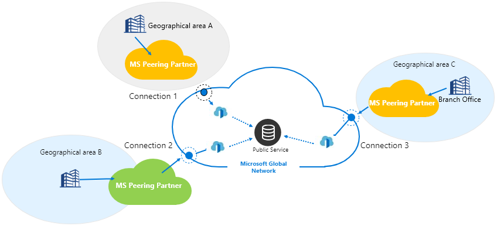

# Peering Service connection

A connection typically refers to a logical information set, identifying a Peering Service. It is defined by specifying the following attributes:

- Logical Name
- Connectivity partner
- Connectivity partner Primary service location
- Connectivity partner Backup service location
- Customer's physical location
- IP prefixes

Customer can establish a single connection or multiple connections as per the requirement. A connection is also used as a unit of telemetry collection. For instance, to opt for telemetry alerts, customer must define the connection that will be monitored.

> [!Note]
> When you sign up for Peering Service, we analyze your Windows and Microsoft 365 telemetry in order to provide you with latency measurements for your selected prefixes.Currently telemetry data is supported for /24 or bigger size prefixes only.
>For more information about connection telemetry, refer to the [Peering Service connection telemetry](connection-telemetry.md).
>

## How to create a peering service connection?

**Scenario** - Let's say a branch office is spread across different geographic locations as shown in the figure below. Here, the customer is required to provide a logical name, Service Provider(SP) name, customer's physical location, and IP prefixes that are (owned by the customer or allocated by the Service Provider) associated with a single connection.  The primary and backup service locations with partner help defining the preferred service location for customer. This process must be repeated to create Peering Service for other locations.

> [!Note]
> State level-filtration is considered for the customer's physical location when the connection is geo-located in the United States.
>

## Next steps

To learn step by step process on how to register Peering Service connection, see [Create Peering Service using the Azure portal](azure-portal.md).

To learn about Peering Service connection telemetry, see [Peering Service connection telemetry](connection-telemetry.md).

To access telemetry, see [Accessing connection telemetry](measure-connection-telemetry.md).
