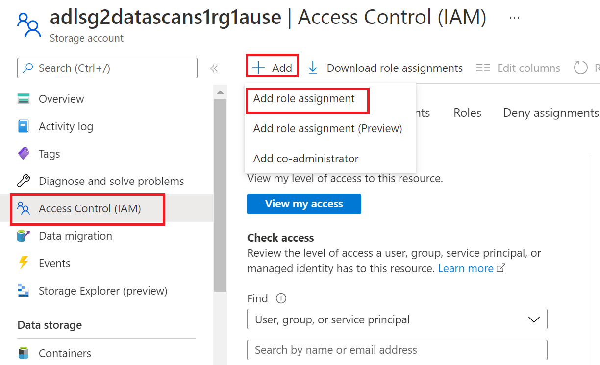
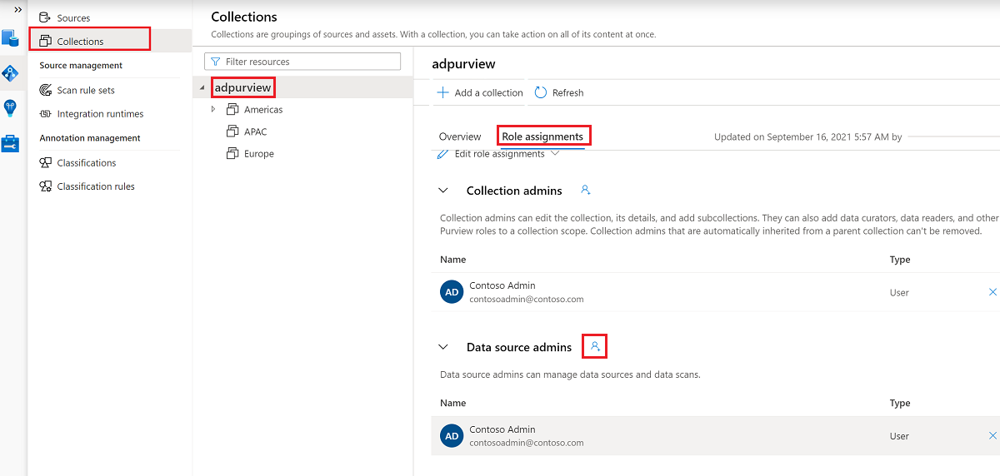

### Register Microsoft Purview as a resource provider in other subscriptions
Execute this step only if the data sources and the Microsoft Purview account are in different subscriptions. Register Microsoft Purview as a resource provider in each subscription where data sources reside by following this guide: [Register resource provider](../../azure-resource-manager/management/resource-providers-and-types.md#register-resource-provider).

The Microsoft Purview resource provider is:
```
Microsoft.Purview
```

### Configure permissions for policy management actions
This section discusses the permissions needed to:
- Make a data resource available for *Data Use Management*. This step is needed before a policy can be created in Microsoft Purview for that resource.
- Author and publish policies in Microsoft Purview.

>[!IMPORTANT]
> Currently, Microsoft Purview roles related to policy operations must be configured at **root collection level**.

#### Permissions to make a data resource available for *Data Use Management*
To enable the *Data Use Management* (DUM) toggle for a data source, resource group, or subscription, the same user needs to have both certain IAM privileges on the resource and certain Microsoft Purview privileges. 

1) User needs to have **either one of the following** IAM role combinations on the resource's ARM path or any parent of it (using inheritance).
   - IAM *Owner*
   - Both IAM *Contributor* + IAM *User Access Administrator*

   Follow this [guide to configure Azure RBAC role permissions](../../role-based-access-control/check-access.md). The following screenshot shows how to access the Access Control section in Azure portal experience for the data resource to add a role assignment:




2) In addition, the same user needs to have Microsoft Purview Data source administrator (DSA) role at the **root collection level**. See the guide on [managing Microsoft Purview role assignments](../catalog-permissions.md#assign-permissions-to-your-users). The following screenshot shows how to assign Data Source Admin at root collection level:




#### Permissions for policy authoring and publishing
The following permissions are needed in Microsoft Purview at the **root collection level**:
- *Policy authors* role can create or edit policies.
- *Data source administrator* role can publish a policy.

Check the section on managing Microsoft Purview role assignments in this [guide](../how-to-create-and-manage-collections.md#add-roles-and-restrict-access-through-collections).

>[!Note]
> **Known issues** related to permissions
> - In addition to Microsoft Purview *Policy authors* role, user may need *Directory Reader* permission in Azure Active Directory to create data owner policy. This is a common permission for users in an Azure tenant. You can check permissions for [Azure AD Directory Reader](../../active-directory/roles/permissions-reference.md#directory-readers)

#### Delegation of access control responsibility to Microsoft Purview

>[!WARNING]
> - IAM Owner role for a data source can be inherited from parent resource group, subscription or subscription Management Group. 
> - Once a resource has been enabled for *Data Use Management*, **any** Microsoft Purview root-collection *policy author* will be able to create access policies against it, and **any** Microsoft Purview root-collection *Data source admin* will be able to publish those policies at **any point afterwards**.
> - **Any** Microsoft Purview root *Collection admin* can assign **new** root-collection *Data Source Admin* and *Policy author* roles.
> - If the Microsoft Purview account is deleted then any published policies will stop being enforced within an amount of time that is dependent on the specific data source. This can have implications both on security and data access availability.

With these warnings in mind, here are some **suggested best practices for permissions:**
- Minimize the number of people that hold Microsoft Purview root *Collection admin*, root *Data Source Admin* or root *Policy author* roles.
- To ensure check and balances, assign the Microsoft Purview *Policy author* and *Data source admin* roles to different people in the organization. With this, before a data policy takes effect, a second person (the *Data source admin*) must review it and explicitly approve it by publishing it.
- A Microsoft Purview account can be deleted by Contributor and Owner roles in IAM. You can check these permissions by navigating to the Access control (IAM) section for your Microsoft Purview account and selecting **Role Assignments**. You can also place a lock to prevent the Microsoft Purview account from being deleted through [ARM locks](../../azure-resource-manager/management/lock-resources.md).
