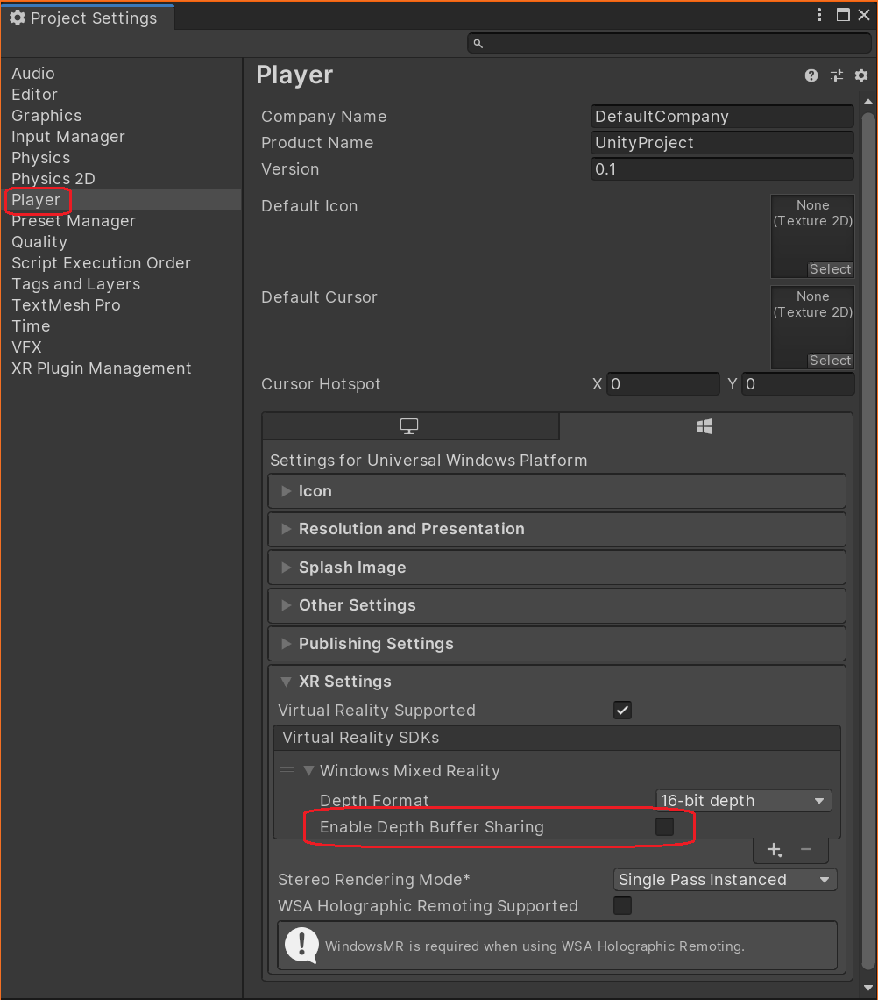
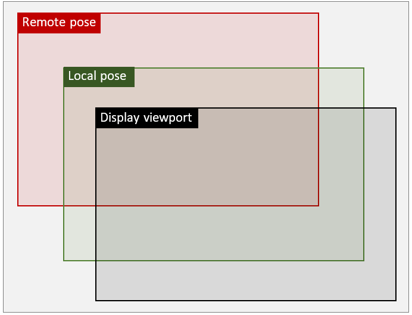
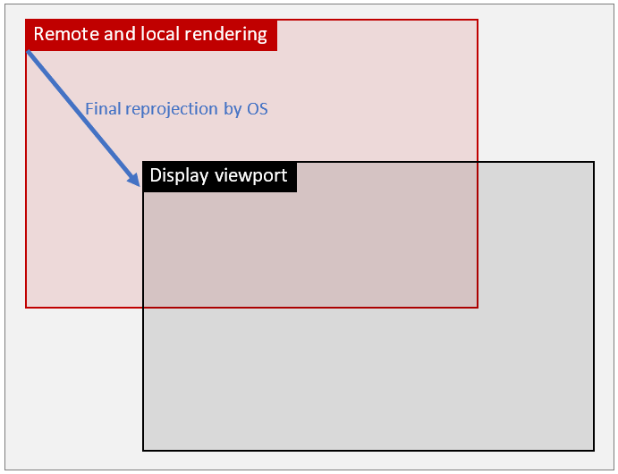
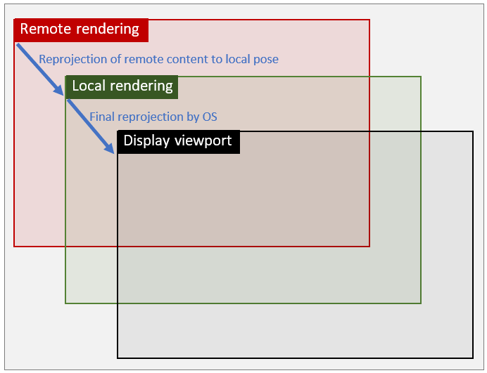

# Late stage reprojection

*Late Stage Reprojection* (LSR) is a hardware feature that helps stabilize holograms when the user moves.

Static models are expected to visually maintain their position when you move around them. If they appear to be unstable, this behavior may hint at LSR issues. Mind that extra dynamic transformations, like animations or explosion views, might mask this behavior.

You may choose between two different LSR modes, namely **Planar LSR** or **Depth LSR**. Both LSR modes improve hologram stability, although they have their distinct limitations. Start by trying Depth LSR, as it's arguably giving better results in most cases.

## How to set the LSR mode

Which of the LSR modes is used is determined by whether the client application submits a depth buffer. If the depth buffer is submitted, it uses **Depth LSR** and **Planar LSR** otherwise.

The following paragraphs explain how submitting the depth buffer is accomplished in Unity and native applications respectively.

### Unity

In the Unity editor, go to *:::no-loc text="File > Build Settings":::*. Select *:::no-loc text="Player Settings":::* in the lower left, then check under *:::no-loc text="Player > XR Settings > Virtual Reality SDKs > Windows Mixed Reality":::* whether **:::no-loc text="Enable Depth Buffer Sharing":::** is checked:



If it is, your app will use Depth LSR, otherwise it will use Planar LSR.

When using OpenXR, the depth buffer should always be submitted. The setting can be found in *:::no-loc text="XR Plug-in Management > OpenXR":::*. The reprojection mode can then be changed via an extension in the OpenXR plugin:

```cs
using Microsoft.MixedReality.OpenXR;

public class OverrideReprojection : MonoBehaviour
{
    void OnEnable()
    {
        RenderPipelineManager.endCameraRendering += RenderPipelineManager_endCameraRendering;
    }
    void OnDisable()
    {
        RenderPipelineManager.endCameraRendering -= RenderPipelineManager_endCameraRendering;
    }

    // When using the Universal Render Pipeline, OnPostRender has to be called manually.
    private void RenderPipelineManager_endCameraRendering(ScriptableRenderContext context, Camera camera)
    {
        OnPostRender();
    }

    // Called directly when using Unity's legacy renderer.
    private void OnPostRender()
    {
        ReprojectionSettings reprojectionSettings = default;
        reprojectionSettings.ReprojectionMode = ReprojectionMode.PlanarManual; // Or your favorite reprojection mode.
        
        // In case of PlanarManual you also need to provide a focus point here.
        reprojectionSettings.ReprojectionPlaneOverridePosition = ...;
        reprojectionSettings.ReprojectionPlaneOverrideNormal = ...;
        reprojectionSettings.ReprojectionPlaneOverrideVelocity = ...;

        foreach (ViewConfiguration viewConfiguration in ViewConfiguration.EnabledViewConfigurations)
        {
            if (viewConfiguration.IsActive && viewConfiguration.SupportedReprojectionModes.Contains(reprojectionSettings.ReprojectionMode))
            {
                viewConfiguration.SetReprojectionSettings(reprojectionSettings);
            }
        }
    }
}
```

### Native C++ applications

Submitting the depth buffer is fully under control of the native C++ binding code, independent of the WMR or OpenXR version. The only condition that needs to be met is that at the time that `GraphicsBinding::BlitRemoteFrame` is called, a depth buffer must be bound to the graphics API.

## Depth LSR

For Depth LSR to work, the client application must supply a valid depth buffer that contains all the relevant geometry to consider during LSR.

Depth LSR attempts to stabilize the video frame based on the contents of the supplied depth buffer. As a consequence, content that hasn't been rendered to it, such as transparent objects, can't be adjusted by LSR and may show instability and reprojection artifacts.

To mitigate reprojection instability for transparent objects, you can force depth buffer writing. See the material flag *TransparencyWritesDepth* for the [Color](color-materials.md) and [PBR](pbr-materials.md) materials. Note however, that visual quality of transparent/opaque object interaction may suffer when enabling this flag.

## Planar LSR

Planar LSR doesn't have per-pixel depth information, as Depth LSR does. Instead it reprojects all content based on a plane that you must provide each frame.

Planar LSR reprojects those objects best that lie close to the supplied plane. The further away an object is, the more unstable it will look. While Depth LSR is better at reprojecting objects at different depths, Planar LSR may work better for content aligning well with a plane.

### Configure Planar LSR in Unity

The plane parameters are derived from a so called *focus point*. When using WMR, the focus point has to be set every frame through `UnityEngine.XR.WSA.HolographicSettings.SetFocusPointForFrame`. See the [Unity Focus Point API](/windows/mixed-reality/focus-point-in-unity) for details. For OpenXR, the focus point needs to be set via the `ReprojectionSettings` shown in the previous section.
If you don't set a focus point, a fallback will be chosen for you. However that automatic fallback often leads to suboptimal results.

You can calculate the focus point yourself, though it might make sense to base it on the one calculated by the Remote Rendering host. Call `RemoteManagerUnity.CurrentSession.GraphicsBinding.GetRemoteFocusPoint` to obtain that.

Usually both the client and the host render content that the other side isn't aware of, such as UI elements on the client. Therefore, it might make sense to combine the remote focus point with a locally calculated one.

The focus points calculated in two successive frames can vary a lot. Simply using them as-is can lead to holograms appearing to be jumping around. To prevent this behavior, interpolating between the previous and current focus points is advisable.

## Reprojection pose modes

The general problem scope with hybrid rendering can be stated like this: Remote and local contents are within distinct poses (that is, coordinate spaces) because the remote pose is predicted by the server whereas the local pose is the actual current one. However, in the end of a rendering frame both remote and local content need to be aligned and brought to the display. The following illustration shows an example where local and remote poses are translated compared to the display viewport:



Depending on the `GraphicsBinding` used, ARR provides up to three reprojection modes that work orthogonally to the LSR mode discussed above. These modes are referred to as **:::no-loc text="Remote pose mode":::**, **:::no-loc text="Local pose mode":::**, and **:::no-loc text="Passthrough pose mode":::**. Unlike the LSR mode, the pose modes define how remote and local content is combined. The choice of the mode trades visual quality of local content for runtime performance, so applications should carefully consider which option is appropriate. See considerations below.

### :::no-loc text="Remote pose mode":::

:::no-loc text="Remote pose mode"::: is the default mode in ARR. In this mode, the local content is rendered on top of the incoming remote image stream using the remote pose from the remote frame. Then the combined result is forwarded to the OS for the final reprojection. While this approach uses only one reprojection, the final correction is based on the round-trip interval so the full reprojection error is applied to the local content as well. As a consequence, the large correction delta may result in significant distortions of local geometry including UI elements.

Using the illustration above, the following transform is applied in :::no-loc text="Remote pose mode"::::



### :::no-loc text="Local pose mode":::

In this mode, the reprojection is split into two distinct steps: In the first step, the remote content is reprojected into local pose space, that is, the space that the local content is rendered with on VR/AR devices by default. After that, the local content is rendered on top of this pre-transformed image using the usual local pose. In the second step, the combined result is forwarded to the OS for the final reprojection. Since this second reprojection incurs only a small delta - in fact the same delta that would be used if ARR was not present - the distortion artifacts on local content are mitigated significantly.

Accordingly, the illustration looks like this:



### :::no-loc text="Passthrough pose mode":::

This pose mode behaves essentially the same as **:::no-loc text="Remote pose mode":::**, meaning the local and remote content are combined in remote space. However, the content won't be reprojected after combination but remain in remote pose space. The main advantage of this mode is that the resulting image won't be affected by reprojection artifacts.

Conceptually, this mode can be compared to conventional cloud-streaming applications. Due to the high latency it incurs, it isn't suitable for head-mounted scenarios, but is a viable alternative for Desktop and other flat-screen applications where higher image quality is desired. It's therefore only available on `GraphicsBindingSimD3D11` for the time being.

### Performance and quality considerations

The choice of the pose mode has visual quality and performance implications. The additional runtime cost on the client side for doing the extra reprojection in :::no-loc text="Local pose mode"::: on a HoloLens 2 device amounts to about 1 millisecond per frame of GPU time. This extra cost needs to be put into consideration if the client application is already close to the frame budget of 16 milliseconds. On the other hand, there are types of applications with either no local content or local content that is not prone to distortion artifacts. In those cases :::no-loc text="Local pose mode"::: doesn't gain any visual benefit because the quality of the remote content reprojection is unaffected.

The general advice would thus be to test the modes on a per use case basis and see whether the gain in visual quality justifies the extra performance overhead. It's also possible to toggle the mode dynamically, for instance enable local mode only when important UIs are shown.

### How to change the :::no-loc text="Pose mode"::: at runtime

The following client API can be used to change the mode at runtime:

```cs
RenderingSession session = ...;
session.GraphicsBinding.SetPoseMode(PoseMode.Local); // set local pose mode
```
 
```cpp
ApiHandle<RenderingSession> session = ...;
session->GetGraphicsBinding()->SetPoseMode(PoseMode::Local); // set local pose mode
```

In general, the mode can be changed anytime the graphics binding object is available. There's an important distinction for `GraphicsBindingSimD3D11`: the pose mode can only be changed to `PoseMode.Remote`, if it has been initialized with proxy textures. If this isn't the case, the pose mode can only be toggled between `PoseMode.Local` and `PoseMode.Passthrough` until the graphics binding is reinitialized. See the two overloads of `GraphicsBindingSimD3d11.InitSimulation`, which take either native pointers to [ID3D11Texture2D](/windows/win32/api/d3d11/nn-d3d11-id3d11texture2d) objects (proxy path) or the `width` and `height` of the desired user viewport (non-proxy path).

### Desktop Unity runtime considerations

Due to the technical background of `GraphicsBindingSimD3D11` and the fact of how offscreen rendering works in Unity, the ARR Unity runtime requires the user to specify the desired pose mode on startup of `RemoteManagerUnity` as follows:

```cs
public static void InitRemoteManager(Camera camera)
{
    RemoteUnityClientInit clientInit = new RemoteUnityClientInit(camera, PoseMode.Remote);
    RemoteManagerUnity.InitializeManager(clientInit);
}
```

If `PoseMode.Remote` is specified, the graphics binding will be initialized with offscreen proxy textures and all rendering will be redirected from the Unity scene's main camera to a proxy camera. This code path is only recommended for usage if runtime pose mode changes to `PoseMode.Remote` are required. If no pose mode is specified, the ARR Unity runtime will select an appropriate default depending on the current platform.

> [!WARNING]
> The proxy camera redirection might be incompatible with other Unity extensions, which expect scene rendering to take place with the main camera. The proxy camera can be retrieved via the `RemoteManagerUnity.ProxyCamera` property if it needs to be queried or registered elsewhere.

If `PoseMode.Local` or `PoseMode.Passthrough` is used instead, the graphics binding won't be initialized with offscreen proxy textures and a fast path using the Unity scene's main camera to render will be used. If the respective use case requires remote pose mode at runtime, `PoseMode.Remote` should be specified on `RemoteManagerUnity` initialization. Directly rendering with Unity's main camera is more efficient and can prevent issues with other Unity extensions. Therefore, it's recommended to use the non-proxy rendering path.

## Next steps

* [Server-side performance queries](performance-queries.md)