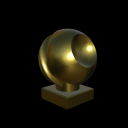
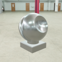
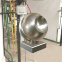
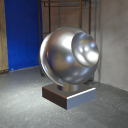
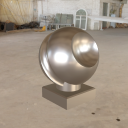
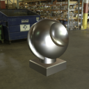
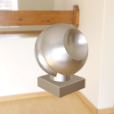
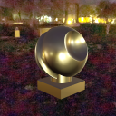
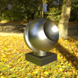
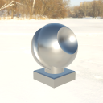

# Sky reflections

In Azure Remote Rendering, a sky texture is used to light objects realistically. For augmented reality applications, this texture should resemble your real-world surroundings, to make objects appear convincing. This article describes how to change the sky texture.

> [!NOTE]
> The sky texture is also referred to as an *environment map*. These terms are used interchangeably.

## Object lighting

Azure Remote Rendering employs *physically based rendering* (PBR) for realistic lighting computations. Although you can add [light sources](lights.md) to your scene, using a good sky texture has the greatest impact.

The images below show results of lighting different surfaces only with a sky texture:

| Roughness  | 0                                        | 0.25                                          | 0.5                                          | 0.75                                          | 1                                          |
|:----------:|:----------------------------------------:|:---------------------------------------------:|:--------------------------------------------:|:---------------------------------------------:|:------------------------------------------:|
| Non-Metal  |    |   |   |   |   |
| Metal      |   |     |     |     |     |

For more information on the lighting model, see the [materials](../../concepts/materials.md) chapter.

> [!IMPORTANT]
> Azure Remote Rendering uses the sky texture only for lighting models. It does not render the sky as a background, since Augmented Reality applications already have a proper background - the real world.

## Changing the sky texture

To change the environment map, all you need to do is [load a texture](../../concepts/textures.md) and change the session's `SkyReflectionSettings`:

```cs
LoadTextureAsync _skyTextureLoad = null;
void ChangeEnvironmentMap(AzureSession session)
{
    _skyTextureLoad = session.Actions.LoadTextureFromSASAsync(new LoadTextureFromSASParams("builtin://VeniceSunset", TextureType.CubeMap));

    _skyTextureLoad.Completed += (LoadTextureAsync res) =>
        {
            if (res.IsRanToCompletion)
            {
                try
                {
                    session.Actions.SkyReflectionSettings.SkyReflectionTexture = res.Result;
                }
                catch (RRException exception)
                {
                    System.Console.WriteLine($"Setting sky reflection failed: {exception.Message}");
                }
            }
            else
            {
                System.Console.WriteLine("Texture loading failed!");
            }
        };
}
```

```cpp
void ChangeEnvironmentMap(ApiHandle<AzureSession> session)
{
    LoadTextureFromSASParams params;
    params.TextureType = TextureType::CubeMap;
    params.TextureUrl = "builtin://VeniceSunset";
    ApiHandle<LoadTextureAsync> skyTextureLoad = *session->Actions()->LoadTextureFromSASAsync(params);

    skyTextureLoad->Completed([&](ApiHandle<LoadTextureAsync> res)
        {
            if (res->GetIsRanToCompletion())
            {
                ApiHandle<SkyReflectionSettings> settings = session->Actions()->GetSkyReflectionSettings();
                settings->SetSkyReflectionTexture(res->GetResult());
            }
            else
            {
                printf("Texture loading failed!");
            }
        });
}

```

Note that the `LoadTextureFromSASAsync` variant is used above because a built-in texture is loaded. In case of loading from [linked blob storages](../../how-tos/create-an-account.md#link-storage-accounts), use the `LoadTextureAsync` variant.

## Sky texture types

You can use both *[cubemaps](https://en.wikipedia.org/wiki/Cube_mapping)* and *2D textures* as environment maps.

All textures have to be in a [supported texture format](../../concepts/textures.md#supported-texture-formats). You don't need to provide mipmaps for sky textures.

### Cube environment maps

For reference, here is an unwrapped cubemap:


Use `AzureSession.Actions.LoadTextureAsync`/ `LoadTextureFromSASAsync` with `TextureType.CubeMap` to load cubemap textures.

### Sphere environment maps

When using a 2D texture as an environment map, the image has to be in [spherical coordinate space](https://en.wikipedia.org/wiki/Spherical_coordinate_system).


Use `AzureSession.Actions.LoadTextureAsync` with `TextureType.Texture2D` to load spherical environment maps.

## Built-in environment maps

Azure Remote Rendering provides a few built-in environment maps that are always available. All built-in environment maps are cubemaps.

|Identifier                         | Description                                              | Illustration                                                      |
|-----------------------------------|:---------------------------------------------------------|:-----------------------------------------------------------------:|
|builtin://Autoshop                 | Variety of stripe lights, bright indoor base lighting    | 
|builtin://BoilerRoom               | Bright indoor light setting, multiple window lights      | 
|builtin://ColorfulStudio           | Varyingly colored lights in medium light indoor setting  | 
|builtin://Hangar                   | Moderately bright ambient hall light                     | 
|builtin://IndustrialPipeAndValve   | Dim indoor setting with light-dark contrast              | 
|builtin://Lebombo                  | Daytime ambient room light, bright window area light     | 
|builtin://SataraNight              | Dark night sky and ground with many surrounding lights   | 
|builtin://SunnyVondelpark          | Bright sunlight and shadow contrast                      | 
|builtin://Syferfontein             | Clear sky light with moderate ground lighting            | 
|builtin://TearsOfSteelBridge       | Moderately varying sun and shade                         | 
|builtin://VeniceSunset             | Evening sunset light approaching dusk                    | 
|builtin://WhippleCreekRegionalPark | Bright, lush-green, and white light tones, dimmed ground | 
|builtin://WinterRiver              | Daytime with bright ambient ground light                 | 
|builtin://DefaultSky               | Same as TearsOfSteelBridge                               | 

## Next steps

* [Lights](../../overview/features/lights.md)
* [Materials](../../concepts/materials.md)
* [Textures](../../concepts/textures.md)
* [The TexConv command-line tool](../../resources/tools/tex-conv.md)
