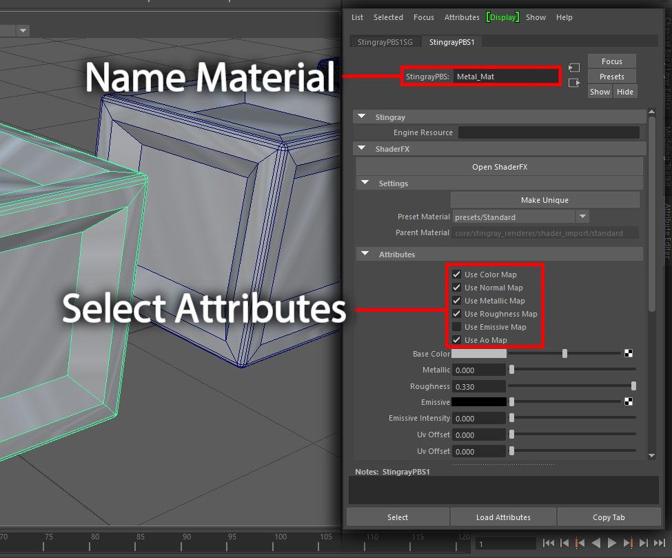
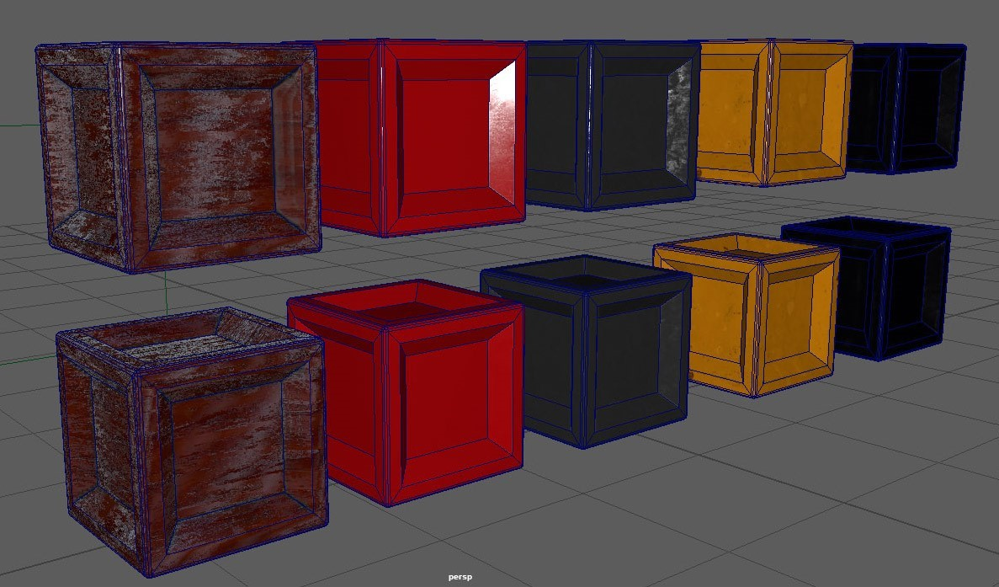

# Tutorial: Setting up Physically Based Rendering materials in Maya

## Overview
In this tutorial, you learn how to:

> [!div class="checklist"]
>
> * assign materials with advanced lighting model to objects in the scene.
> * handle instancing of objects and materials.
> * export a scene to FBX format and important options to select.

Creating [Physically Based Rendering (PBR) materials](../../overview/features/pbr-materials.md) in `Maya` are a relatively straight forward task, similar in many ways to PBR set-up in other content creation apps like `3DS Max`. The following tutorial is a guide to basic PBR shader set-up and FBX export for ARR projects. 

The sample scene in this tutorial contains a number of `Polygon Box` objects that have been assigned a number of different materials - wood, metal, painted metal, plastic, and rubber. Broadly speaking, each material contains all or most of the following textures 

* `Albedo`, is the materials color map, also called `Diffuse`, or `BaseColor`
* `Metalness`, which determines if a material is metallic and which parts are metallic. 
* `Roughness`, which determines how rough or smooth a surface is, affecting the sharpness or blurriness of the reflections and highlights on a surface.
* `Normals`, which adds detail to a surface, for example pitting and dents on a metal surface or grain in wood without having to add more polygons.
* `Ambient Occlusion`, which is used to add soft shading and contact shadows to a model. It is a greyscale map that indicates which areas of a model receive full lighting (white) or full shade (Black). 

## Prerequisites
* `Autodesk Maya 2017` or newer

## Setting up materials in the scene
In Maya, the process for setting up a PBR material is as follows:

To begin with, as you will see in the sample scene, we have created a number of Box objects, each of which represents a different type of material. Note, as shown in the image below, that each of these objects has been given its own appropriate name 

> It is worth noting before starting to create assets for Azure Remote Rendering (ARR) that it uses meters for measurement and the up-direction is Y-Axis. Therefore it is advisable to set your scene Units in Maya to meters. Furthermore, it is advisable when exporting to set Units to meters in the FBX Export settings. 

> [!TIP]
It is good practice to name your model assets appropriately, usually with the relevant part or material type, as names will make navigating object-heavy scenes easier.

Once you have created/acquired your textures - depending on your needs, you may want to create unique textures for a model in texturing apps like `Quixel Suite`, `Photoshop`, or `Substance Suite` or you may be using generic tiling textures from other sources, you can apply them to your model as follows:

* In your scene viewport, select your model/geometry and right-click on it. In the menu that appears click `Assign New Material`
* In the `Assign New Material` options, go to `Maya`>`Stingray PBS`. This action will assign a PBR material to your model. 

In `Maya 2020`, there are a number of different PBR shaders available - `Maya Standard Surface`, `Arnold Standard Surface`, and `Stingray PBR`. The `Maya Standard Surface Shader` is not yet exportable via the `FBX plugin 2020`, whereas the `Arnold Standard Surface Shader` can be exported with FBX files. In most other respects, it is identical to the `Maya Standard Surface Shader` and is analogous to the `Physical Material` in `3D Studio Max`.

**`The Stingray PBR Shader`** is compatible with many other applications and most closely matches the requirements of `ARR` and it's supported since `Maya 2017`. Also it is convenient that this type of materials visualized in viewport similar to what will be visualized later in ARR.

With your material assigned to your asset and named appropriately, you can now proceed to assigning your various textures. The following images detail where each texture type fits in to the PBR material. The `Stingray PBR` material allows you to select which attributes you can activate, so before you can `plug in` your texture maps you will need to activate the relevant attributes: 

> [!TIP]
It's good practice to name your materials appropriately, taking into account their use and/or type. A material that is to be used on a unique part might be named for that part while a material that can be used on a wider number of areas can be named for its properties or type.

Assign your textures as follows:

With your PBR Materials created and set up, it is worth thinking about [instancing objects](../../how-tos/conversion/configure-model-conversion.md#instancing) in your scene. Instancing similar objects in your scene - such as nuts, bolts, screws washers - essentially any objects that are the same can yield significant savings in terms of file size. Instances of a master object can have their own scale, rotation, and transforms so can be placed as required in your scene. In Maya, the process of Instancing is simple.

* In the `Edit` menu, go to `Duplicate Special` and open the `Options`, 
* In the `Duplicate Special` options switch `Geometry Type` from `Copy` to `Instance`, 
* Click `Duplicate Special`

This action will create an instance of your object that can be moved rotated or scaled independently of its parent and of other instances of that parent. 
>However - any changes you make to an instance while in component mode will be transmitted to all instances of your object, so if you are working with an instanced objects components - vertices, polygon faces etc be sure first that you want any changes you make to affect all of these instances.

In the sample scene, each individual box object has been instanced. This action will have relevance when we export the scene to FBX format.

>Best Practice regarding instancing in your scene is to create them as you go along, as replacing 'Copies' with Instanced objects later is extremely difficult. 

## FBX Export process

We can now move on to the FBX export of your scene or scene assets. Generally speaking, it makes sense when exporting assets to only select for export those objects/assets from your scene that you want. If you have 100 objects in a scene but you only want to use 30 of them, there is no point in exporting the whole scene. So unless you are happy to export the entire scene, make your selection and go to:

* `File` > `Export Selection` and in the export dialog go to the bottom and set `Files of Type` to `FBX Export`. This window will expose the FBX Export settings. The primary settings for FBX Export are highlighted in red in the image below.

Depending on your requirements - for example, you may want to send an asset to a client, but don't want to send large numbers of texture files with the asset, you can choose to embed the textures within the exported FBX file. This option means that you only have one file to package, but it will significantly increase the size of that FBX asset. You can enable the option to embed textures by switching on the `Embed Media` option as shown below.

> [!TIP]
> Notice that the file in this case has been named to reflect this condition. This is a good practice means of keeping track of your assets. 

Once you have finished setting your configuration for Export, click 'Export Selection' button in the bottom right.

## Conclusion

In general, this type of materials looks more realistic as it is based on real world physics of light. It creates an additional immersive effect that the scene exists in the real world.

## Next steps

You now know the most important functionality for setting up materials with advanced lighting to objects in a scene and exporting it to FBX format that is supported by ARR. Next step would be to convert FBX file and visualize in ARR.

> [!div class="nextstepaction"]
> [Quickstart: Convert a model for rendering](../../quickstarts\convert-model.md)