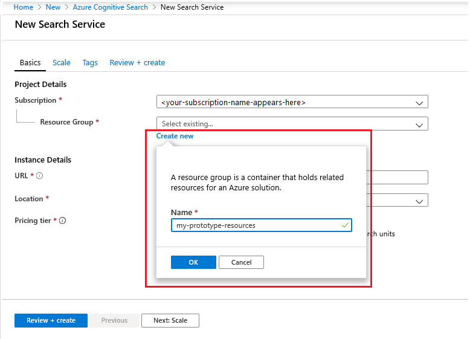
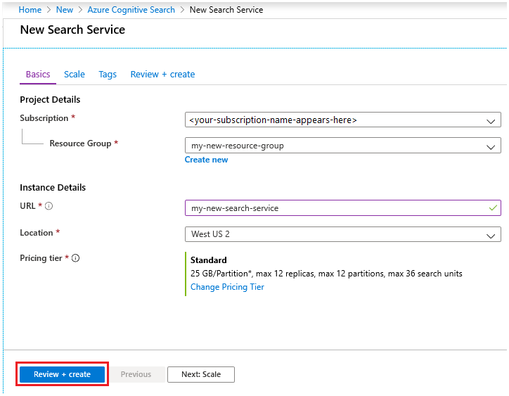
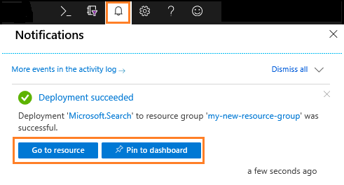
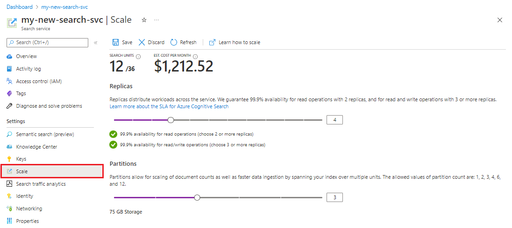

# Quickstart: Create an Azure Cognitive Search service in the portal

Azure Cognitive Search is a standalone resource used to plug a search experience into custom apps. Cognitive Search integrates easily with other Azure services, with apps on network servers, or with software running on other cloud platforms.

In this article, learn how to create a resource in the [Azure portal](https://portal.azure.com/).

Prefer PowerShell? Use the Azure Resource Manager [service template](https://azure.microsoft.com/resources/templates/101-azure-search-create/). For help with getting started, see [Manage Azure Cognitive Search with PowerShell](search-manage-powershell.md).

## Before you start

The following service properties are fixed for the lifetime of the service and changing them requires a new service. As you create a service, think about how you will use it:

* name (review [these suggestions](#name-the-service) for service names)
* tier (Free, Basic, Standard [affects billing](search-sku-tier.md) and sets an upward limit on capacity)
* region (choose a location that has related services. For integration with Cognitive Services or Azure Machine Learning, co-locating services in the same region is a requirement)

## Subscribe (free or paid)

[Open a free Azure account](https://azure.microsoft.com/pricing/free-trial/?WT.mc_id=A261C142F) and use free credits to try out paid Azure services. After credits are used up, keep the account and continue to use free Azure services, such as Websites. Your credit card is never charged unless you explicitly change your settings and ask to be charged.

Alternatively, [activate MSDN subscriber benefits](https://azure.microsoft.com/pricing/member-offers/msdn-benefits-details/?WT.mc_id=A261C142F). An MSDN subscription gives you credits every month you can use for paid Azure services. 

## Find Azure Cognitive Search

1. Sign in to the [Azure portal](https://portal.azure.com/).

1. Click the plus sign ("+ Create Resource") in the top-left corner.

1. Use the search bar to find "Azure Cognitive Search" or navigate to the resource through **Web** > **Azure Cognitive Search**.

## Choose a subscription

If you have more than one subscription, choose one for your search service.

## Set a resource group

A resource group is a container that holds related resources for your Azure solution. It is required for the search service. It is also useful for managing resources all-up, including costs. A resource group can consist of one service, or multiple services used together. For example, if you are using Azure Cognitive Search to index an Azure Cosmos DB database, you could make both services part of the same resource group for management purposes. 

If you aren't combining resources into a single group, or if existing resource groups are filled with resources used in unrelated solutions, create a new resource group just for your Azure Cognitive Search resource. 

Over time, you can track current and projected costs all-up or you can view charges for individual resources. The following screenshot shows the kind of cost information you can expect to see when you combine multiple resources into one group.

> [!TIP]
> Resource groups simplify cleanup because deleting a group deletes all of the services within it. For prototype projects utilizing multiple services, putting all of them in the same resource group makes cleanup easier after the project is over.

## Name the service

In Instance Details, provide a service name in the **URL** field. The name is part of the URL endpoint against which API calls are issued: `https://your-service-name.search.windows.net`. For example, if you want the endpoint to be `https://myservice.search.windows.net`, you would enter `myservice`.

Service name requirements:

* It must be unique within the search.windows.net namespace
* It must be between 2 and 60 characters in length
* You must use lowercase letters, digits, or dashes ("-")
* Do not use dashes ("-") in the first 2 characters or as the last single character
* You may not use consecutive dashes ("--") anywhere

> [!TIP]
> If you think you'll be using multiple services, we recommend including the region (or location) in the service name as a naming convention. Services within the same region can exchange data at no charge, so if Azure Cognitive Search is in West US, and you have other services also in West US, a name like `mysearchservice-westus` can save you a trip to the properties page when deciding how to combine or attach resources.

## Choose a location

Azure Cognitive Search is available in most regions. The list of supported regions can be found in the [pricing page](https://azure.microsoft.com/pricing/details/search/).

> [!Note]
> Central India and UAE North are currently unavailable for new services. For services already in those regions, you can scale up with no restrictions, and your service is fully supported in that region. The restrictions are temporary and limited to new services only. We will remove this note when the restrictions no longer apply.

### Requirements

 If you are using AI enrichment, create your search service in the same region as Cognitive Services. *Co-location of Azure Cognitive Search and Cognitive Services in the same region is a requirement for AI enrichment*.

 Customers with business continuity and disaster recovery (BCDR) requirements should create their services in [regional pairs](https://docs.microsoft.com/azure/best-practices-availability-paired-regions#azure-regional-pairs). For example, if you are operating in North America, you might choose East US and West US, or North Central US and South Centra US, for each service.

### Recommendations

If you are using multiple Azure services, choose a region that is also hosting your data or application service. Doing so minimizes or voids bandwidth charges for outbound data (there are no charges for outbound data when services are in the same region).

## Choose a pricing tier (SKU)

[Azure Cognitive Search is currently offered in multiple pricing tiers](https://azure.microsoft.com/pricing/details/search/): Free, Basic, or Standard. Each tier has its own [capacity and limits](search-limits-quotas-capacity.md). See [Choose a pricing tier or SKU](search-sku-tier.md) for guidance.

Basic and Standard are the most common choices for production workloads, but most customers start with the Free service. Key differences among tiers are partition size and speed, and limits on the number of objects you can create.

Remember, a pricing tier cannot be changed once the service is created. If you need a higher or lower tier, you will have to re-create the service.

## Create your service

After you've provided the necessary inputs, go ahead and create the service. 

Your service is deployed within minutes. You can monitor progress through Azure notifications. Consider pinning the service to your dashboard for easy access in the future.

## Get a key and URL endpoint

Unless you are using the portal, programmatic access to your new service requires that you provide the URL endpoint and an authentication api-key.

1. On the **Overview** page, locate and copy the URL endpoint on the right side of the page.

2. On the **Keys** page, copy either one of the admin keys (they are equivalent). Admin api-keys are required for creating, updating, and deleting objects on your service. In contrast, query keys provide read-access to index content.

   

An endpoint and key are not needed for portal-based tasks. The portal is already linked to your Azure Cognitive Search resource with admin rights. For a portal walkthrough, start with [Quickstart: Create an Azure Cognitive Search index in the portal](search-get-started-portal.md).

## Scale your service

After your service is provisioned, you can scale it to meet your needs. If you chose the Standard tier for your Azure Cognitive Search service, you can scale your service in two dimensions: replicas and partitions. Had you chosen the Basic tier, you can only add replicas. If you provisioned the free service, scale is not available.

***Partitions*** allow your service to store and search through more documents.

***Replicas*** allow your service to handle a higher load of search queries.

Adding resources increases your monthly bill. The [pricing calculator](https://azure.microsoft.com/pricing/calculator/) can help you understand the billing ramifications of adding resources. Remember that you can adjust resources based on load. For example, you might increase resources to create a full initial index, and then reduce resources later to a level more appropriate for incremental indexing.

> [!Important]
> A service must have [2 replicas for read-only SLA and 3 replicas for read/write SLA](https://azure.microsoft.com/support/legal/sla/search/v1_0/).

1. Go to your search service page in the Azure portal.
2. In the left-navigation pane, select **Settings** > **Scale**.
3. Use the slidebar to add resources of either type.

> [!Note]
> Per-partition storage and speed increases at higher tiers. For more information, see [capacity and limits](search-limits-quotas-capacity.md).

## When to add a second service

Most customers use just one service provisioned at a tier providing the [right balance of resources](search-sku-tier.md). One service can host multiple indexes, subject to the [maximum limits of the tier you select](search-capacity-planning.md), with each index isolated from another. In Azure Cognitive Search, requests can only be directed to one index, minimizing the chance of accidental or intentional data retrieval from other indexes in the same service.

Although most customers use just one service, service redundancy might be necessary if operational requirements include the following:

+ [Business continuity and disaster recovery (BCDR)](https://docs.microsoft.com/azure/best-practices-availability-paired-regions). Azure Cognitive Search does not provide instant failover in the event of an outage.

+ [Multi-tenant architectures](search-modeling-multitenant-saas-applications.md) sometimes call for two or more services.

+ Globally deployed applications might require search services in each geography to minimize latency.

> [!NOTE]
> In Azure Cognitive Search, you cannot segregate indexing and querying operations; thus, you would never create multiple services for segregated workloads. An index is always queried on the service in which it was created (you cannot create an index in one service and copy it to another).

A second service is not required for high availability. High availability for queries is achieved when you use 2 or more replicas in the same service. Replica updates are sequential, which means at least one is operational when a service update is rolled out. For more information about uptime, see [Service Level Agreements](https://azure.microsoft.com/support/legal/sla/search/v1_0/).

## Next steps

After provisioning a service, you can continue in the portal to create your first index.

> [!div class="nextstepaction"]
> [Quickstart: Create an Azure Cognitive Search index in the portal](search-get-started-portal.md)
