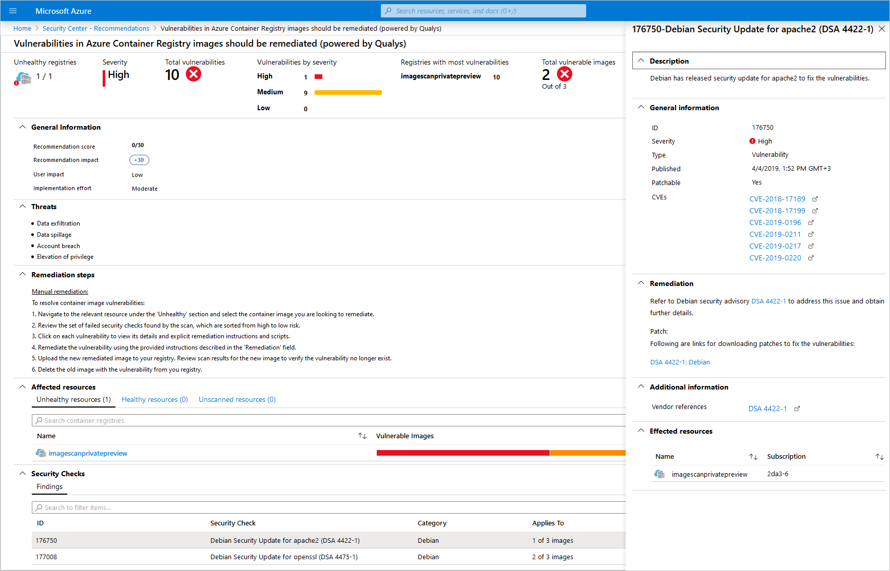

# Azure Container Registry integration with Security Center

Azure Container Registry (ACR) is a managed, private Docker registry service that stores and manages your container images for Azure deployments in a central registry. It's based on the open-source Docker Registry 2.0.

If you're on Azure Security Center's standard tier, you can add the Container Registries bundle. This optional feature brings deeper visibility into the vulnerabilities of the images in your ARM-based registries. Enable or disable the bundle at the subscription level to cover all registries in a subscription. This feature is charged per image, as shown on the [pricing page](security-center-pricing.md). Enabling the Container Registries bundle, ensures that Security Center is ready to scan images that get pushed to the registry. 

## Availability

- Release state: **General availability**
- Required roles: **Security reader** and [Azure Container Registry reader role](https://docs.microsoft.com/azure/container-registry/container-registry-roles)
- Clouds: 
    - ✔ Commercial clouds
    - ✘ US Government cloud
    - ✘ China Government cloud, other gov clouds

## When are images scanned?

Whenever an image is pushed to your registry, Security Center automatically scans that image. To trigger the scan of an image, push it to your repository.

When the scan completes (typically after approximately 10 minutes, but can be up to 40 minutes), findings are available as Security Center recommendations like this:

## Benefits of integration

Security Center identifies ARM-based ACR registries in your subscription and seamlessly provides:

* **Azure-native vulnerability scanning** for all pushed Linux images. Security Center scans the image using a scanner from the industry-leading vulnerability scanning vendor, Qualys. This native solution is seamlessly integrated by default.

* **Security recommendations** for Linux images with known vulnerabilities. Security Center provides details of each reported vulnerability and a  severity classification. Additionally, it gives guidance for how to  remediate the specific vulnerabilities found on each image pushed to registry.

## ACR with Security Center FAQ

### What types of images can Azure Security Center scan?
Security Center scans Linux OS based images that provide shell access. 

The Qualys scanner doesn't support super minimalist images such as [Docker scratch](https://hub.docker.com/_/scratch/) images, or "Distroless" images that only contain your application and its runtime dependencies without a package manager, shell, or OS.

### How does Azure Security Center scan an image?
The image is pulled from the registry. It's then run in an isolated sandbox with the Qualys scanner that extracts a list of known vulnerabilities.

Security Center filters and classifies findings from the scanner. When an image is healthy, Security Center marks it as such. Security Center generates security recommendations only for images that have issues to be resolved. By only notifying when there are problems, Security Center reduces the potential for unwanted informational alerts.

### How often does Azure Security Center scan my images?
Image scans are triggered on every push.

### Can I get the scan results via REST API?
Yes. The results are under [Sub-Assessments Rest API](/rest/api/securitycenter/subassessments/list/). Also, you can use Azure Resource Graph (ARG), the Kusto-like API for all of your resources: a query can fetch a specific scan.
 

## Next steps

To learn more about Security Center's container security features, see:

* [Azure Security Center and container security](container-security.md)

* [Integration with Azure Kubernetes Service](azure-kubernetes-service-integration.md)

* [Virtual Machine protection](security-center-virtual-machine-protection.md) - Describes Security Center's recommendations
