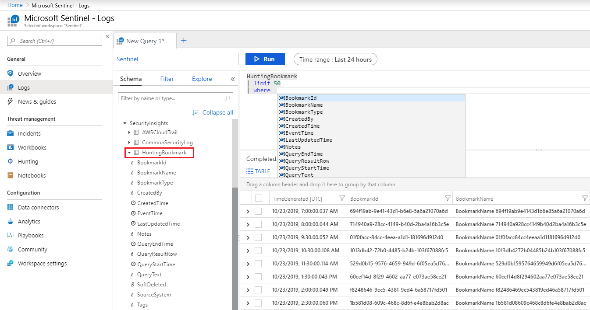
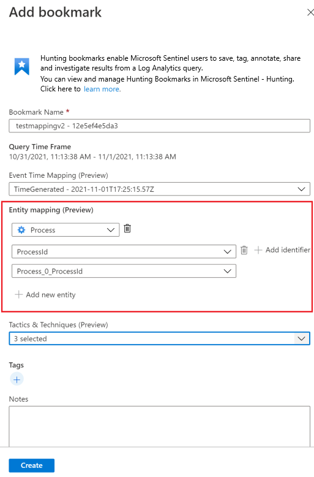
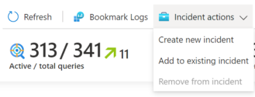

# Keep track of data during hunting with Azure Sentinel

Threat hunting typically requires reviewing mountains of log data looking for evidence of malicious behavior. During this process, investigators find events that they want to remember, revisit, and analyze as part of validating potential hypotheses and understanding the full story of a compromise.

Hunting bookmarks in Azure Sentinel help you do this, by preserving the queries you ran in **Azure Sentinel - Logs**, along with the query results that you deem relevant. You can also record your contextual observations and reference your findings by adding notes and tags. Bookmarked data is visible to you and your teammates for easy collaboration.

You can revisit your bookmarked data at any time on the **Bookmarks** tab of the **Hunting** pane. You can use filtering and search options to quickly find specific data for your current investigation. Alternatively, you can view your bookmarked data directly in the **HuntingBookmark** table in your Log Analytics workspace. For example:

> [!div class="mx-imgBorder"]
> 

Viewing bookmarks from the table enables you to filter, summarize, and join bookmarked data with other data sources, making it easy to look for corroborating evidence.

Currently in preview, if you find something that urgently needs to be addressed while hunting in your logs, in a couple of clicks, you can create a bookmark and promote it to an incident, or add the bookmark to an existing incident. For more information about incidents, see [Tutorial: Investigate incidents with Azure Sentinel](investigate-cases.md). 

Also in preview, you can visualize your bookmarked data, by clicking **Investigate** from the bookmark details. This launches the investigation experience in which you can view, investigate, and visually communicate your findings using an interactive entity-graph diagram and timeline.

## Add a bookmark

1. In the Azure portal, navigate to **Sentinel** > **Threat management** > **Hunting** to run queries for suspicious and anomalous behavior.

2. Select one of the hunting queries and on the right, in the hunting query details, select **Run Query**. 

3. Select **View query results**. For example:
    
    > [!div class="mx-imgBorder"]
    > 
    
    This action opens the query results in the **Logs** pane.

4. From the log query results list, use the checkboxes to select one or more rows that contain the information you find interesting.

5. Select **Add bookmark**:
    
    > [!div class="mx-imgBorder"]
    > 

6. On the right, in the **Add bookmark** pane, optionally, update the bookmark name, add tags, and notes to help you identify what was interesting about the item.

7. In the **Query Information** section, use the drop-down boxes to extract information from the query results for the **Account**, **Host**, and **IP address** entity types. This action maps the selected entity type to a specific column from the query result. For example:
    
    > [!div class="mx-imgBorder"]
    > 
    
    To view the bookmark in the investigation graph (currently in preview), you must map at least one entity type that is either **Account**, **Host**, or **IP address**. 

5. Click **Save** to commit your changes and add the bookmark. All bookmarked data is shared with other investigators, and is a first step toward a collaborative investigation experience.

 
> [!NOTE]
> The log query results support bookmarks whenever this pane is opened from Azure Sentinel. For example, you select **General** > **Logs** from the navigation bar, select event links in the investigations graph, or select an alert ID from the full details of an incident (currently in preview). You can't create bookmarks when the **Logs** pane is opened from other locations, such as directly from Azure Monitor.

## View and update bookmarks 

1. In the Azure portal, navigate to **Sentinel** > **Threat management** > **Hunting**. 

2. Select the **Bookmarks** tab to view the list of bookmarks.

3. To help you find a specific bookmark, use the search box or filter options.

4. Select individual bookmarks and view the bookmark details in the right-hand details pane.

5. Make your changes as needed, which are automatically saved.

## Exploring bookmarks in the investigation graph

> [!IMPORTANT]
> Exploring bookmarks in the investigation graph and the investigation graph itself are currently in public preview.
> These features are provided without a service level agreement, and not recommended for production workloads.
> For more information, see [Supplemental Terms of Use for Microsoft Azure Previews](https://azure.microsoft.com/support/legal/preview-supplemental-terms/).

1. In the Azure portal, navigate to **Sentinel** > **Threat management** > **Hunting** > **Bookmarks** tab, and select the bookmark or bookmarks you want to investigate.

2. In the bookmark details, ensure that at least one entity is mapped. For example, for **ENTITIES**, you see entries for **IP**, **Machine**, or **Account**.

3. Click **Investigate** to view the bookmark in the investigation graph.

For instructions to use the investigation graph, see [Use the investigation graph to deep dive](investigate-cases.md#use-the-investigation-graph-to-deep-dive).

## Add bookmarks to a new or existing incident

> [!IMPORTANT]
> Adding bookmarks to a new or existing incident is currently in public preview.
> This feature is provided without a service level agreement, and it's not recommended for production workloads.
> For more information, see [Supplemental Terms of Use for Microsoft Azure Previews](https://azure.microsoft.com/support/legal/preview-supplemental-terms/).

1. In the Azure portal, navigate to **Sentinel** > **Threat management** > **Hunting** > **Bookmarks** tab, and select the bookmark or bookmarks you want to add to an incident.

2. Select **Incident actions (Preview)** from the command bar:
    
    > [!div class="mx-imgBorder"]
    > 

3. Select either **Create new incident** or **Add to existing incident**, as required. Then:
    
    - For a new incident: Optionally update the details for the incident, and then select **Create**.
    - For adding a bookmark to an existing incident: Select one incident, and then select **Add**. 

To view the bookmark within the incident: Navigate to **Sentinel** > **Threat management** > **Incidents** and select the incident with your bookmark. Select **View full details**, and then select the **Bookmarks** tab.

> [!TIP]
> As an alternative to the **Incident actions (Preview)** option on the command bar, you can use the context menu (**...**) for one or more bookmarks to select options to **Create new incident**, **Add to existing incident**, and **Remove from incident**. 

## View bookmarked data in logs

To view bookmarked queries, results, or their history, select the bookmark from the **Hunting** > **Bookmarks** tab, and use the links provided in the details pane: 

- **View source query** to view the source query in the **Logs** pane.

- **View bookmark logs** to see all bookmark metadata, which includes who made the update, the updated values, and the time the update occurred.

You can also view the raw bookmark data for all bookmarks by selecting **Bookmark Logs** from the command bar on the **Hunting** > **Bookmarks** tab:

> [!div class="mx-imgBorder"]
> 

This view shows all your bookmarks with associated metadata. You can use [Keyword Query Language](/sharepoint/dev/general-development/keyword-query-language-kql-syntax-reference) (KQL) queries to filter down to the latest version of the specific bookmark you are looking for.

> [!NOTE]
> There can be a significant delay (measured in minutes) between the time you create a bookmark and when it is displayed in the **Bookmarks** tab.

## Delete a bookmark
 
1.	In the Azure portal, navigate to **Sentinel** > **Threat management** > **Hunting** > **Bookmarks** tab, and select the bookmark or bookmarks you want to delete. 

2. Right-click your selections, and select the option to delete the bookmark or bookmarks. For example, **Delete bookmark** if you selected just one bookmark, and **Delete 2 bookmarks** if you selected two bookmarks.
	
Deleting the bookmark removes the bookmark from the list in the **Bookmark** tab. The **HuntingBookmark** table for your Log Analytics workspace will continue to contain previous bookmark entries, but the latest entry will change the **SoftDelete** value to true, making it easy to filter out old bookmarks. Deleting a bookmark does not remove any entities from the investigation experience that are associated with other bookmarks or alerts. 

## Next steps

In this article, you learned how to run a hunting investigation using bookmarks in Azure Sentinel. To learn more about Azure Sentinel, see the following articles:

- [Proactively hunt for threats](hunting.md)
- [Use notebooks to run automated hunting campaigns](notebooks.md)