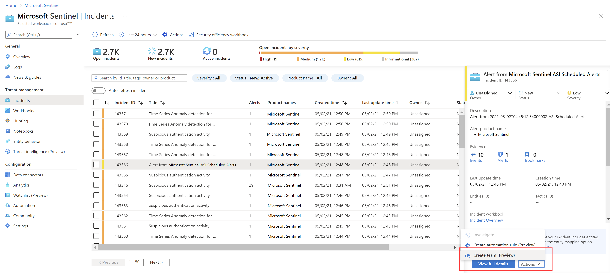

# Collaborate in Microsoft Teams (Public preview)

Azure Sentinel supports a direct integration with [Microsoft Teams](/microsoftteams/), enabling you to jump directly into teamwork on specific incidents.

> [!IMPORTANT]
> Integration with Microsoft Teams is is currently in **PREVIEW**. See the [Supplemental Terms of Use for Microsoft Azure Previews](https://azure.microsoft.com/support/legal/preview-supplemental-terms/) for additional legal terms that apply to Azure features that are in beta, preview, or otherwise not yet released into general availability.

## Overview

Integrating with Microsoft Teams directly from Azure Sentinel enables your teams to collaborate seamlessly across the organization, and with external stakeholders.

Use Microsoft Teams with an Azure Sentinel *incident team* to centralize your communication and coordination across the relevant personnel. Incident teams are especially helpful when used as a dedicated conference bridge for high-severity, ongoing incidents.

Organizations that already use Microsoft Teams for communication and collaboration can use the Azure Sentinel integration to bring security data directly into their conversations and daily work. 

An Azure Sentinel incident team always has the most updated and recent data from Azure Sentinel, ensuring that your teams have the most relevant data right at hand.

## Use an incident team to investigate

Investigate together with an *incident team* by integrating Microsoft Teams directly from your incident.

**To create your incident team**:

1. In Azure Sentinel, in the **Threat management** > **Incidents** grid, select the incident you're currently investigating.

1. At the bottom of the incident pane that appears on the right, select **Actions** > **Create team**.

    

    The **New team** pane opens on the right. Define the following settings for your incident team:

    - **Team name**: Automatically defined as the name of your incident. Modify the name as needed so that it's easily identifiable to you.
    - **Description**: Enter a meaningful description for your incident team.
    - **Add groups**: Select one or more Azure AD groups to add to your incident team. Individual users aren't supported.

        > [!TIP]
        > If you regularly work with the same teams, you may want to select the star :::image type="icon" source="media/collaborate-in-microsoft-teams/save-as-favorite.png" border="false"::: to save them as favorites.
        >
        > Favorites are automatically selected the next time you create a team. If you want to remove it from the next team you create, either select **Delete** :::image type="icon" source="media/collaborate-in-microsoft-teams/delete-user-group.png" border="false":::, or select the star :::image type="icon" source="media/collaborate-in-microsoft-teams/save-as-favorite.png" border="false"::: again to remove the team from your favorites altogether.
        >

1. When you're done adding groups, select **Create** to create your incident team.

    The incident pane refreshes, with a link to your new incident team under the **Team name** title.

    

1. Select your **Teams integration** link to switch into Microsoft Teams, where all of the data about your incident is listed on the **Incident page** tab.

    

Continue the conversation about the investigation in Teams for as long as needed. You have the full incident details directly in teams.

> [!TIP]
> When you [close an incident](tutorial-investigate-cases.md#closing-an-incident), the related incident team you've created in Microsoft Teams is archived.
>
> If the incident is ever re-opened, the related incident team is also re-opened in Microsoft Teams so that you can continue your conversation, right where you left off.
>

## Next steps

For more information, see:

- [Tutorial: Investigate incidents with Azure Sentinel](tutorial-investigate-cases.md)
- [Overview of teams and channels in Microsoft Teams](/microsoftteams/teams-channels-overview/)