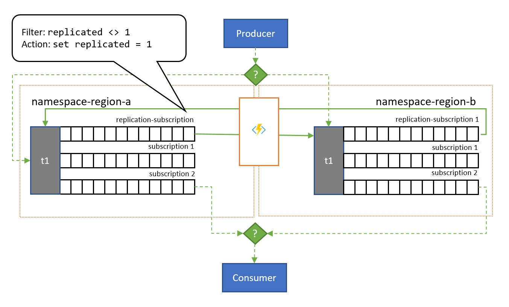
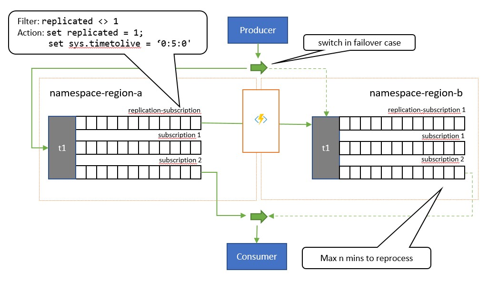
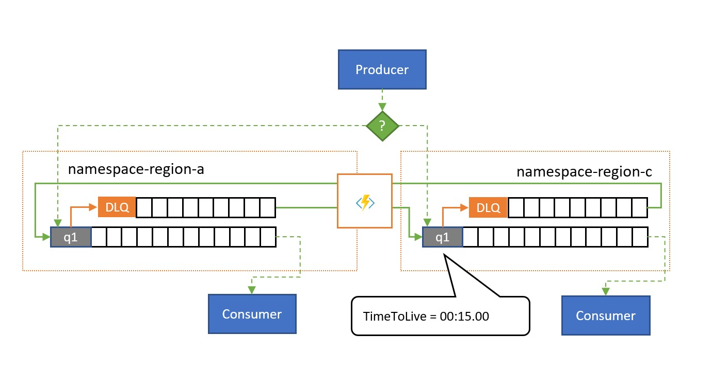
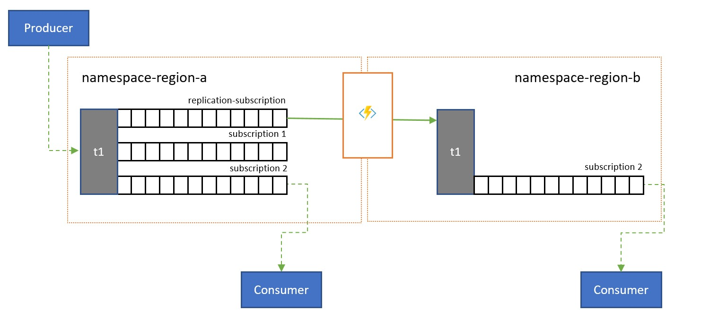
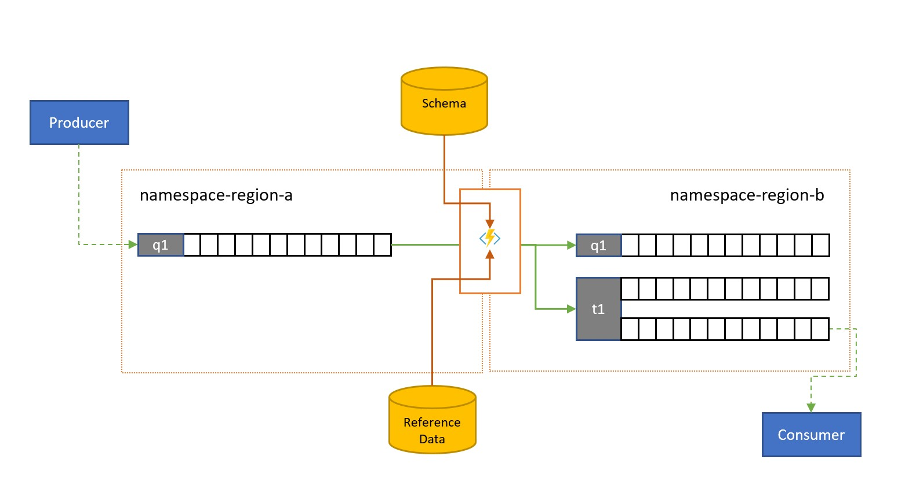
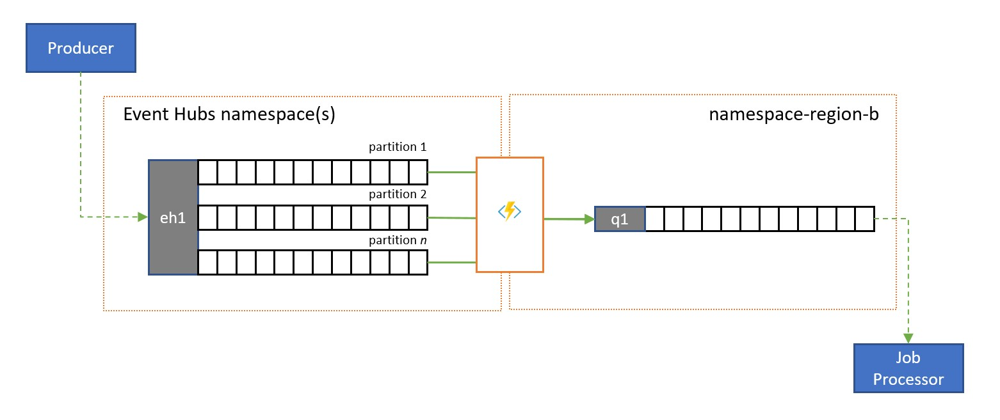
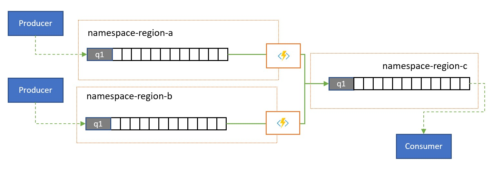
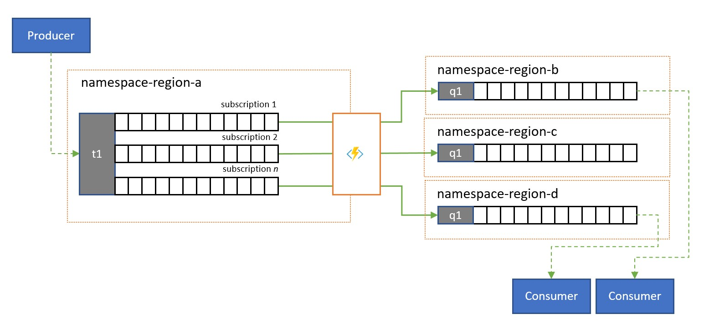

# Message replication and cross-region federation

Within namespaces, Azure Service Bus supports [creating topologies of chained queues and topic subscriptions using autoforwarding](service-bus-auto-forwarding.md) to allow for the implementation of various routing patterns. For instance, you can provide partners with dedicated queues to which they have send or receive permissions and which can be temporarily suspended if needed, and flexibly connect them to other entities that are private to the application. You can also create complex multi-stage routing topologies, or you can create mailbox-style queues, which drain the queue-like subscriptions of topics and allow for more storage capacity per subscriber. 

Many sophisticated solutions also require messages to be replicated across namespace boundaries in order to implement these and other patterns. Messages may have to flow between namespaces associated with multiple, different application tenants, or across multiple, different Azure regions. 

Your solution will maintain multiple Service Bus namespaces in different regions and replicate messages between Queues and Topics, and/or that you will exchange messages with sources and targets like [Azure Event Hubs](../event-hubs/event-hubs-about.md), [Azure IoT Hub](../iot-fundamentals/iot-introduction.md), or [Apache Kafka](https://kafka.apache.org). 

These scenarios are the focus of this article. 

## Federation Patterns

There are numerous potential motivations for why you may want to move messages between Service Bus entities like Queues or Topics, or between Service Bus and other sources and targets. 

Compared with the similar set of patterns for [Event Hubs](../service-bus-messaging/service-bus-federation-overview.md), federation for queue-like entities is more complex because message queues promise their consumers exclusive ownership over any single message, are expected to preserve arrival order in message delivery, and for the broker to coordinate fair distribution of messages between [competing consumers](/azure/architecture/patterns/competing-consumers). 

There are practical impediments, including the constraints of the [CAP theorem](https://en.wikipedia.org/wiki/CAP_theorem), that make it difficult to provide a unified view of a queue that is simultaneously available in multiple regions, and which allows for regionally distributed, [competing consumers](/azure/architecture/patterns/competing-consumers) to take exclusive ownership of messages. Such a geo-distributed queue would require fully consistent replication not only of messages, but also of the delivery state of every message before messages can be made available to consumers. A goal of a full consistency for a hypothetical, regionally distributed queue is in direct conflict with the key goal that practically all Azure Service Bus customers have when considering federation scenarios: Maximum availability and reliability for their solutions. 

The patterns presented here therefore focus on availability and reliability, while also aiming to best avoid both information loss and duplicate handling of messages. 

### Resiliency against regional availability events 

While maximum availability and reliability are the top operational priorities for Service Bus, there are nevertheless many ways in which a producer or consumer might be prevented from talking to its assigned "primary" Service Bus due to networking or name resolution issues, or where Service Bus entity might indeed be temporarily unresponsive or returning errors. The designated message processor might also become unavailable.

Such conditions are not "disastrous" such that you will want to abandon the regional deployment altogether as you might do in a disaster recovery situation, but the business scenario of some applications might already be impacted by availability events that last not more than a few minutes or even seconds. Azure Service Bus is often used in hybrid cloud environments and with clients that reside at the network edge, for instance in retail stores, restaurant, banking branches, manufacturing sites, logistics facilities, and airports. It's possible for a network routing or congestion issue to impact any one site's ability to reach its assigned Service Bus endpoint while a secondary endpoint in a different region might be reachable. At the same time, systems processing messages arriving from these sites may still have unimpeded access to both the primary and the secondary Service Bus endpoints. 

There are many practical examples of such hybrid cloud and edge applications with a low business tolerance for impact of network routing issues or of transient availability issues of a Service Bus entity. Those include processing of payments at retail sites, boarding at airport gates, and mobile phone orders at restaurants, all of which come to an instant, and complete standstill whenever the reliable communication path is not available.

In this category, we discuss three distinct distributed patterns: "all-active" replication, "active-passive" replication, and "spillover" replication. 

#### All-Active Replication

The "all-active" replication pattern allows for an active replica of the same logical topic (or queue) to be available in multiple namespaces (and regions), and for all messages to become available in all replicas, irrespective of where they have been enqueued. The pattern generally preserves the order of messages relative to any publisher. 



As shown in the illustration, the pattern generally leans on Service Bus Topics. One topic for each namespace that shall participate in the replication scheme. Each of these topics has one "replication subscription" for any of the other topics that messages shall be replicated to. In the illustration above, we simply have a pair of topics and therefore a single replication subscription for the respective other topic. In a scenario with three namespaces *{n1, n2, n3}*, a topic in namespace *n1* would have two replication subscriptions, one for the corresponding topic in *n2* and one for the corresponding topic in *n3*. 

Each replication subscription has a rule that combines a SQL filter expression (`replicated <> 1`) and a SQL action (`set replicated = 1`). The filter of the rule ensures that only messages where the custom property `replication` is not set or does not have the value `1` become eligible for this subscription, and the action sets that exact property to the value `1` on each selected message right afterwards. The effect is that when the message is copied to the corresponding topic, it's no longer eligible for replication in the opposite direction and therefore we avoid messages bouncing between replicas.

A subscription with a respective rule can be easily added to any topic using the Azure CLI like this.

```azurecli

az servicebus topic subscription rule create --resource-group myresourcegroup \
   --namespace mynamespace --topic-name mytopic 
   --subscription-name replication --name replication \
   --action-sql-expression "set replication = 1" \
   --filter-sql-expression "replication IS NULL"
```

To model a queue, each topic is restricted to just one regular subscription (other than the replication subscriptions) that all consumers share.

> The all-active replication model puts a copy of every message sent into any of the topics into each
> of the topics. That means your application code in each region will see and process all messages.
> This pattern is suitable for scenarios where data is being shared out into multiple regions or if redundant
> processing is generally desired. If you need to process every message only once, as with a regular
> queue, you need to consider one of the following two patterns.  

#### Active-Passive Replication

The "active-passive" replication pattern is variation of the prior pattern where only one of the topics (the "primary") is actively used by the application for sending and receiving messages and messages are replicated into a secondary topic for the case when the primary topic might become unavailable or unreachable. 



The key difference between this pattern and the prior pattern is that replication is unidirectional from the primary topic into the secondary topic. The secondary topic never becomes the primary, but is a backup option for when the primary topic is temporarily unusable. 

The upside of using this pattern is that it attempts to help minimizing duplicate processing. During the replication, the `TimeToLive` message property is set to a duration on the replicated messages that reflects the expected time during which a failure of the primary will lead to a failover. For example, if your use-case scenario requires a switchover of the consumer to the secondary within at most 1 minute of when retrieval of messages from the primary start showing problems, the secondary should ideally have all the messages available that you could not access in the primary, but a minimal number of messages that you had already processed from the primary before the issues appeared. If we set the `TimeToLive` to twice that period, 2 minutes, during replication (`set sys.TimeToLive = '0:2:0'` in the rule action), the secondary will only retain messages for 2 minutes and will discard older ones. That means when the receiver switches over to the secondary, it can quickly read through and discard messages older than the last one it processed and then process from the first message that it has not yet seen. The actual retention duration will depend on the specific use-case and on quickly you want to and can switch over to the secondary in your application. The `TimeToLive` setting is honored in the range from a few seconds to days. 

While the application is using the secondary, it can also publish directly to the secondary topic, which then acts as any regular topic would. After the switchover to the secondary, the consumer will therefore see a mix of replicated messages and messages published directly to the secondary. The application should therefore first switch publishing back to the primary and still allow draining of the locally published messages before switching the consumer back to the secondary. Because of the replication resuming automatically once the primary is again available, the consumer would also get new messages published to the primary during that time, albeit with somewhat higher latency. 

> This pattern is suitable for scenarios where messages should be processed only once. The application needs to 
> cooperate in keeping track of messages it has processed from the primary because it will find duplicates for 
> the duration of the failover window in the secondary, and it will again find duplicates while switching back.
> The de-duplication criterion should best be an application-supplied `MessageId`. The `EnqueuedTimeUtc` value is 
> also suitable as a watermark indicator, but the application needs to allow for some amount of clock drift (several seconds)
> between primary and secondary as with any distributed system.


#### Spillover Replication

The "spillover" replication pattern allows for active/active use of multiple Service Bus entities in multiple regions to deal with the scenario where Service Bus is healthy, but the *consumer* becomes overwhelmed with the number of pending messages or is outright unavailable. A reason for it might be that a database backing the consumer process may be slow or unavailable. This pattern works with plain queues and with topic subscriptions.  

  

As shown in the illustration, the spillover replication pattern replicates messages from a queue's or subscription's associated [dead-letter queue](service-bus-dead-letter-queues.md) to a paired queue or topic in a different namespace. 

Without there being a failure situation, the two namespaces are used in parallel, each receiving some subset of the overall message traffic and their associated consumers handling that subset. Once one of the consumers starts exhibiting high failure rates or stops outright, the respective messages will end up in the dead-letter queue either through exceeding the delivery count or because it expires. The replication tasks will then pick them up and re-enqueue them in the paired queue, where they are then presented to the presumable healthy consumer. 

If processing must occur within a certain deadline, the `TimeToLive` for the queue and/or messages should be set such that processing can still occur in time by the spillover secondary, for instance `TimeToLive` might be set to half of the permitted time.

As with the [all-active pattern](#all-active-replication), the application can add an indicator to the message whether the message has already been replicated once such that they don't bounce between the pair of queues, but are rather posted into an auxiliary queue that acts as the dead-letter queue for the composite pattern.

> This pattern is suitable for scenarios where the top concern is to defend against availability issues in
> consumers or resources that the consumers rely on, and also to redistribute traffic spikes on one of the
> paired queues. It also provides protection against one of the namespaces becoming unavailable if consumers
> read from both queues, but the replication lag imposed by the `TimeToLive` expiration may cause messages
> within that time window to strand in the unavailable namespace. 

### Latency optimization 

Topics are used to distribute information to multiple consumers. In some cases, especially the consumers with wide geographical distribution, it might be beneficial to replicate messages from a topic into a topic in a secondary namespace closer to consumers.

  

For instance, when sharing data between regional, continental hubs, it's more efficient to transfer information only once between hubs and have consumers obtain their copy of the data from those hubs. 

Replication transfers can be done in batches, which consumers often obtain and settle messages one by one. With a base network latency of 100 ms between, say, North America and Europe, each message takes 200 ms longer to process for the two round-trips to a remote entity for acquiring and settling the messages, compared to an entity in the same region. 

### Validation, reduction, and enrichment

Messages may be submitted into a Service Bus queue or topic by clients external to your own solution.

  

Such messages may require checking for compliance with a given schema, and for non-compliant messages to be dropped or dead-lettered. Some messages may have to be reduced in complexity by omitting data and some may have to be enriched by adding data based on reference data lookups. The operations can be performed with custom functionality in the replication task. 

### Stream To Queue Replication

Azure Event Hubs is an ideal solution for handling extreme volumes of incoming events. But neither Event Hubs nor similar engines like Apache Kafka provide a service-managed [competing consumer](/azure/architecture/patterns/competing-consumers) model where multiple consumers can handle messages from the same source concurrently without risking duplicate processing, and finally settle those messages once they have been processed. 



A stream to queue replication transfers the content of a single Event Hub partition or the content of a full Event Hub into a Service Bus queue, from where the messages can be processed safely, transactionally, and with competing consumers. This replication also enables using all other Service Bus capabilities for those messages, including routing with topics and session-based demultiplexing. 

### Consolidation and normalization 

Global solutions are often composed of regional footprints that are largely independent including having their own processing capabilities, but supra-regional and global perspectives will require data integration and therefore a central consolidation of the same message data that is evaluated in the respective regional footprints for the local perspective. 



Normalization is a flavor of the consolidation scenario, whereby two or more incoming sequences of messages carry the same kind of information, but with different structures or different encodings, and the messages must be transcoded or transformed before they can be consumed. 

Normalization may also include cryptographic work such as decrypting end-to-end encrypted payloads and re-encrypting it with different keys and algorithms for the downstream consumer audience. 

### Splitting and routing

Service Bus topics and their subscription rules are often used to filter a stream of messages for a particular audience, and that audience then obtained the filtered set from a subscription. 



In a global system where the audience for those messages is globally distributed or belongs to different applications, replication can be used to transfer messages from such a subscription to a queue or topic in a different namespace from where they are consumed.

### Replication applications in Azure Functions

Implementing the patterns above requires a scalable and reliable execution environment for the replication tasks that you want to configure and run. On Azure, the runtime environment that is best suited for stateless tasks is [Azure Functions](../azure-functions/functions-overview.md). 

Azure Functions can run under a [Azure managed identity](../active-directory/managed-identities-azure-resources/overview.md) such that the replication tasks can integrate with the role-based access control rules of the source and target services without you having to manage secrets along the replication path. For replication sources and targets that require explicit credentials, Azure Functions can hold the configuration values for those credentials in tightly access-controlled storage inside of [Azure Key Vault](../key-vault/general/overview.md).

Azure Functions furthermore allows the replication tasks to directly integrate with Azure virtual networks and [service endpoints](../virtual-network/virtual-network-service-endpoints-overview.md) for all Azure messaging services, and it's readily integrated with [Azure Monitor](../azure-monitor/overview.md).

Most importantly, Azure Functions has prebuilt, scalable triggers and output bindings for [Azure Event Hubs](../azure-functions/functions-bindings-service-bus.md), [Azure IoT Hub](../azure-functions/functions-bindings-event-iot.md), [Azure Service Bus](../azure-functions/functions-bindings-service-bus.md), [Azure Event Grid](../azure-functions/functions-bindings-event-grid.md), and [Azure Queue Storage](../azure-functions/functions-bindings-storage-queue.md), custom extensions for [RabbitMQ](https://github.com/azure/azure-functions-rabbitmq-extension), and [Apache Kafka](https://github.com/azure/azure-functions-kafka-extension). Most triggers will dynamically adapt to the throughput needs by scaling the number of concurrently executing instances up and down based on documented metrics. 

With the Azure Functions consumption plan, the prebuilt triggers can even scale down to zero while no messages are available for replication, which means you incur no costs for keeping the configuration ready to scale back up. The key downside of using the consumption plan is that the latency for replication tasks "waking up" from this state is significantly higher than with the hosting plans where the infrastructure is kept running.  

In contrast to all of this, most common replication engines for messaging and eventing, such as Apache Kafka's [MirrorMaker](http://kafka.apache.org/documentation/#basic_ops_mirror_maker) require you to provide a hosting environment and scale the replication engine yourself. That includes configuring and integrating the security and networking features and facilitating the flow of monitoring data, and then you still don't have an opportunity to inject custom replication tasks into the flow. 

### Replication tasks with Azure Logic Apps

A non-coding alternative to doing replication using Functions would be to use [Logic Apps](../logic-apps/logic-apps-overview.md) instead. Logic Apps have [predefined replication tasks](../logic-apps/create-replication-tasks-azure-resources.md) for Service Bus. These can help with setting up replication between different instances, and can be adjusted for further customization.

## Next Steps

In this article, we explored a range of federation patterns and explained the role of Azure Functions as the event and messaging replication runtime in Azure. 

Next, you might want to read up how to set up a replicator application with Azure Functions and then how to replicate event flows between Event Hubs and various other eventing and messaging systems:

- [Replication applications in Azure Functions](service-bus-federation-replicator-functions.md)
- [Replicating events between Service Bus entities](https://github.com/Azure-Samples/azure-messaging-replication-dotnet/tree/main/functions/config/ServiceBusCopy)
- [Routing events to Azure Event Hubs](https://github.com/Azure-Samples/azure-messaging-replication-dotnet/tree/main/functions/config/ServiceBusCopyToEventHub)
- [Acquire events from Azure Event Hubs](https://github.com/Azure-Samples/azure-messaging-replication-dotnet/tree/main/functions/config/EventHubCopyToServiceBus)

[1]: ./media/service-bus-auto-forwarding/IC628632.gif
