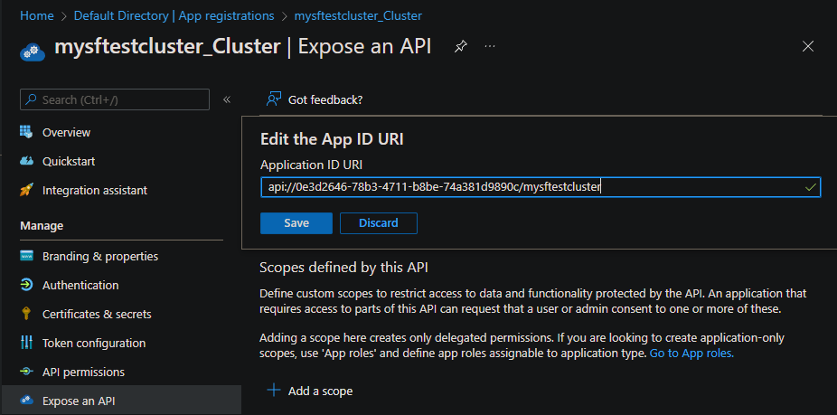
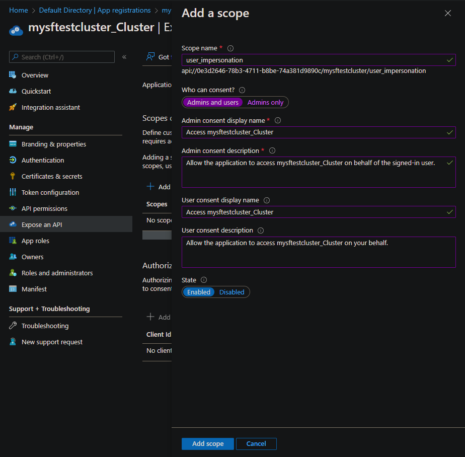
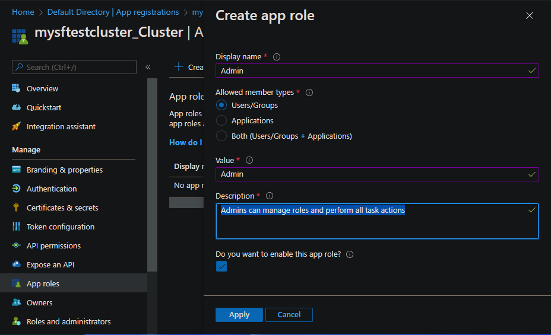
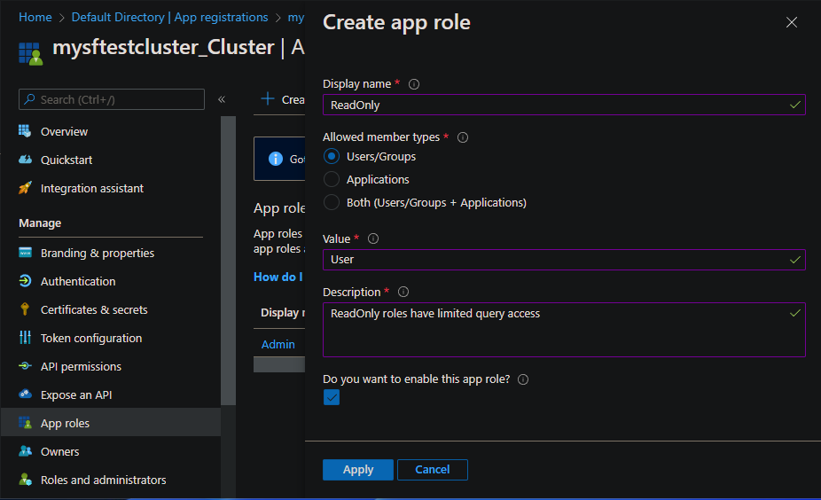

# Set up Azure Active Directory for client authentication in the Azure portal

For clusters running on Azure, you can use Azure Active Directory (Azure AD) to help secure access to management endpoints. This article describes how to set up Azure AD to authenticate clients for an Azure Service Fabric cluster in the Azure portal.

In this article, the term *application* generally refers to [Azure AD applications](../active-directory/develop/developer-glossary.md#client-application), not Service Fabric applications. Azure AD enables organizations (known as *tenants*) to manage user access to applications.

A Service Fabric cluster offers several entry points to its management functionality, including the web-based [Service Fabric Explorer][service-fabric-visualizing-your-cluster] and [Visual Studio][service-fabric-manage-application-in-visual-studio]. As a result, you'll create two Azure AD applications to control access to the cluster: one web application and one native application. After you create the applications, you'll assign users to read-only and admin roles.

> [!NOTE]
> - On Linux, you must complete the following steps before you create the cluster. On Windows, you also have the option to [configure Azure AD authentication for an existing cluster](https://github.com/Azure/Service-Fabric-Troubleshooting-Guides/blob/master/Security/Configure%20Azure%20Active%20Directory%20Authentication%20for%20Existing%20Cluster.md).
> - It's a [known issue](https://github.com/microsoft/service-fabric/issues/399) that applications and nodes on Linux Azure AD-enabled clusters can't be viewed in the Azure portal.
> - Azure AD now requires an application's (app registration) publisher domain to be verified or use a default scheme. For more information, see [Configure an application's publisher domain](../active-directory/develop/howto-configure-publisher-domain.md) and [AppId URI in single-tenant applications will require use of default scheme or verified domains](../active-directory/develop/reference-breaking-changes.md#appid-uri-in-single-tenant-applications-will-require-use-of-default-scheme-or-verified-domains).

## Prerequisites

This article assumes that you've already created a tenant. If you haven't, start by reading [Quickstart: Set up a tenant][active-directory-howto-tenant].

## Register an Azure AD cluster app

Open the Azure AD [App registrations](https://portal.azure.com/#view/Microsoft_AAD_IAM/ActiveDirectoryMenuBlade/~/RegisteredApps) pane in the Azure portal and select **+ New registration**.


On the **Register an application** pane, enter the following information, and then select **Register**:

- **Name**: Enter a descriptive name. It's helpful to define a registration type in the name, as in this example: **{{cluster name}}_Cluster**.
- **Supported account types**: Select **Accounts in this organizational directory only**.
- **Redirect URI**: Select **Web** and enter the URL that the client will redirect to. This example uses the Service Fabric Explorer URL: `https://{{cluster name}}.{{location}}.cloudapp.azure.com:19080/Explorer/index.html`. 

  After registration is complete, you can add more redirect URIs by selecting **Authentication** > **Add URI**.

> [!NOTE]
> Add more redirect URIs if you're planning to access Service Fabric Explorer by using a shortened URL, such as `https://{{cluster name}}.{{location}}.cloudapp.azure.com:19080/Explorer`. An exact URL is required to avoid this AADSTS50011 error: "The redirect URI specified in the request does not match the redirect URIs configured for the application. Make sure the redirect URI sent in the request matches one added to the application in the Azure portal." [Learn more about troubleshooting this error](https://aka.ms/redirectUriMismatchError).


### Branding & properties

After you register the cluster app, select **Branding & properties** and populate any additional information. For **Home page URL**, enter the Service Fabric Explorer URL.


### Authentication

Select **Authentication**. Under **Implicit grant and hybrid flows**, select the **ID tokens (used for implicit and hybrid flows)** checkbox.


### Expose an API

Select **Expose an API** and then the **Set** link to enter a value for **Application ID URI**. Enter either the URI of a verified domain or a URI that uses an API scheme format of `api://{{tenant Id}}/{{cluster name}}`. For example: `api://0e3d2646-78b3-4711-b8be-74a381d9890c/mysftestcluster`.

For more information, see [AppId URI in single-tenant applications will require use of default scheme or verified domains](../active-directory/develop/reference-breaking-changes.md#appid-uri-in-single-tenant-applications-will-require-use-of-default-scheme-or-verified-domains).



Select **+ Add a scope**, and then enter the following information: 

- **Scope name**: Enter **user_impersonation**.
- **Who can consent?**: Select **Admins and users**.
- **Admin consent display name**: Enter a descriptive name. It's helpful to define the cluster name and authentication type, as in this example: **Access mysftestcluster_Cluster**.
- **Admin consent description**: Enter a description like this example: **Allow the application to access mysftestcluster_Cluster on behalf of the signed-in user.**
- **User consent display name**: Enter a descriptive name. It's helpful to define the cluster name and authentication type, as in this example: **Access mysftestcluster_Cluster**.
- **User consent description**: Enter a description like this example: **Allow the application to access mysftestcluster_Cluster on your behalf.**
- **State**: Select **Enabled**.



### App roles

Select **App roles** > **+ Create app role** to add admin and read-only user roles.


Enter the following information for an admin user, and then select **Apply**:
- **Display name**: Enter **Admin**.
- **Allowed member types**: Select **Users/Groups**.
- **Value**: Enter **Admin**.
- **Description**: Enter **Admins can manage roles and perform all task actions**.



Enter the following information for a read-only user, and then select **Apply**:
- **Display name**: Enter **ReadOnly**.
- **Allowed member types**: Select **Users/Groups**.
- **Value**: Enter **ReadOnly**.
- **Description**: Enter **ReadOnly roles have limited query access**.



## Register an Azure AD client app

Open the Azure AD [App registrations](https://portal.azure.com/#view/Microsoft_AAD_IAM/ActiveDirectoryMenuBlade/~/RegisteredApps) pane in the Azure portal, and then select **+ New registration**.


Enter the following information, and then select **Register**:

- **Name**: Enter a descriptive name. It's helpful to define the registration type in the name, as in the following example: **{{cluster name}}_Client**.
- **Supported account types**: Select **Accounts in this organizational directory only**.
- **Redirect URI**: Select **Public client/native** and enter `urn:ietf:wg:oauth:2.0:oob`.


### Authentication

After you register the client app, select **Authentication**. Under **Advanced Settings**, select **Yes** for **Allow public client flows**, and then select **Save**.


### API permissions

Select **API permissions** > **+ Add a permission**.


Select **Delegated Permissions**, select **user_impersonation** permissions, and then select **Add permissions**.


In the API permissions list, select **Grant admin consent for Default Directory**.


Select **Yes** to confirm that you want to grant admin consent.


### Properties

For the client app registration only, go to the [Enterprise Applications](https://portal.azure.com/#view/Microsoft_AAD_IAM/StartboardApplicationsMenuBlade/~/AppAppsPreview/menuId~/null) pane. 

Select **Properties**, and then select **No** for **Assignment required?**.


## Assign application roles to users

After you create Azure AD app registrations for Service Fabric, you can modify Azure AD users to use app registrations to connect to a cluster by using Azure AD. 

For both the read-only and admin roles, you use Azure AD cluster app registration. You don't use Azure AD client app registration for role assignments. Instead, you assign roles from the [Enterprise applications](https://portal.azure.com/#view/Microsoft_AAD_IAM/StartboardApplicationsMenuBlade/~/AppAppsPreview/menuId~/null) pane. 

### Remove filters

To view the enterprise applications that you created during the app registration process, you must remove the default filters for **Application type** and **Application ID starts with** from the **All applications** pane in the portal. Optionally, you can view enterprise applications by opening the **Enterprise applications** link from the **API permissions** pane for app registration.

The following screenshot shows default filters to be removed.


The following screenshot shows the enterprise apps with the filters removed.


### Add role assignments to Azure AD users

To add applications to existing Azure AD users, go to **Enterprise Applications** and find the Azure AD cluster app registration that you created.

Select **Users and groups** > **+ Add user/group** to add an existing Azure AD user role assignment. 


Under **Users**, select the **None Selected** link.


For users who need read-only (view) access, find each user, and then under **Select a role**, choose the **None Selected** link. Then on the **Select a role** pane, add the **ReadOnly** role.


For users who need full read/write access, find each user, and then under **Select a role**, choose the **None Selected** link. Then on the **Select a role** pane, add the **Admin** role.


## Configure clusters with Azure AD registrations

In the Azure portal, open the [Service Fabric Clusters](https://ms.portal.azure.com/#view/HubsExtension/BrowseResource/resourceType/Microsoft.ServiceFabric%2Fclusters) pane.

### Service Fabric managed cluster configuration

Open the managed cluster resource and select **Security**.
Select the **Enable Azure Active Directory** checkbox.

Enter the following information, and then select **Apply**:

- **Tenant ID**: Enter the tenant ID. 
- **Cluster application**: Enter the ID for the Azure AD cluster app registration. This is also known as the web application.
- **Client application**: Enter the ID for the Azure AD client app registration. This is also known as the native application.


### Service Fabric cluster configuration

Open the cluster resource and select **Security**.
Then select **+ Add**.


Enter the following information, and then select **Add**:

- **Authentication type**: Select **Azure Active Directory**.
- **TenantID**: Enter the tenant ID.
- **Cluster application**: Enter the ID for the Azure AD cluster app registration. This is also known as the web application.
- **Client application**: Enter the ID for the Azure AD client app registration. This is also known as the native application.


## Connect to a cluster with Azure AD

To learn more about the code in the following examples, see [Connect-ServiceFabricCluster cmdlet](/powershell/module/servicefabric/connect-servicefabriccluster).

### Connect to a Service Fabric cluster by using Azure AD authentication via PowerShell

To use PowerShell to connect to a Service Fabric cluster, you must run the commands from a machine that has the Service Fabric SDK installed. The SDK includes nodes currently in a cluster. 

To connect the Service Fabric cluster, use the following PowerShell command example:

```powershell
Import-Module servicefabric

$clusterEndpoint = 'sftestcluster.eastus.cloudapp.azure.com'
$serverCertThumbprint = ''
Connect-ServiceFabricCluster -ConnectionEndpoint $clusterEndpoint `
  -AzureActiveDirectory `
  -ServerCertThumbprint $serverCertThumbprint `
  -Verbose
```

### Connect to a Service Fabric managed cluster by using Azure AD authentication via PowerShell

To connect to a managed cluster, the Az.Resources PowerShell module is also required to query the dynamic cluster server certificate thumbprint that needs to be enumerated and used. 

To connect the Service Fabric cluster, use the following PowerShell command example:

```powershell
Import-Module servicefabric
Import-Module Az.Resources

$clusterEndpoint = 'mysftestcluster.eastus.cloudapp.azure.com'
$clusterName = 'mysftestcluster'

$clusterResource = Get-AzResource -Name $clusterName -ResourceType 'Microsoft.ServiceFabric/managedclusters'
$serverCertThumbprint = $clusterResource.Properties.clusterCertificateThumbprints

Connect-ServiceFabricCluster -ConnectionEndpoint $clusterEndpoint `
  -AzureActiveDirectory `
  -ServerCertThumbprint $serverCertThumbprint `
  -Verbose
```

## Troubleshoot setting up Azure Active Directory
Setting up Azure AD and using it can be challenging. Here are some pointers on what you can do to debug problems.

### Service Fabric Explorer prompts you to select a certificate
#### Problem
After you sign in successfully to Azure AD in Service Fabric Explorer, the browser returns to the home page but a message prompts you to select a certificate.

![Screenshot of a Service Fabric Explorer dialog for selecting a certificate.][sfx-select-certificate-dialog]

#### Reason
The user is not assigned a role in the Azure AD cluster application, so Azure AD authentication fails on the Service Fabric cluster. Service Fabric Explorer falls back to certificate authentication.

#### Solution
Follow the instructions for setting up Azure AD, and assign user roles. Also, we recommend that you turn on **User assignment required to access app**, as `SetupApplications.ps1` does.

### Connection with PowerShell fails with an error: "The specified credentials are invalid"
#### Problem
When you use PowerShell to connect to the cluster by using `AzureActiveDirectory` security mode, after you sign in successfully to Azure AD, the connection fails with an error: "The specified credentials are invalid."

#### Solution
Follow the instructions for setting up Azure AD, and assign user roles. Also, we recommend that you turn on **User assignment required to access app**, as `SetupApplications.ps1` does.

### Service Fabric Explorer returns an error when you sign in: "AADSTS50011"
#### Problem
When you try to sign in to Azure AD in Service Fabric Explorer, the page returns an error: "AADSTS50011: The reply address &lt;url&gt; does not match the reply addresses configured for the application: &lt;guid&gt;."

![Screenshot of a Service Fabric Explorer sign-in error that says the reply addresses don't match.][sfx-reply-address-not-match]

#### Reason
The cluster (web) application that represents Service Fabric Explorer tries to authenticate against Azure AD. As part of the request, it provides the redirect return URL. But the URL isn't listed in the **Redirect URIs** list for the Azure AD application.

#### Solution
On the Azure AD app registration page for your cluster, select **Authentication**. In the **Redirect URIs** section, add the Service Fabric Explorer URL to the list. Save your change.

![Screenshot of setting up reply URL for a web application.][web-application-reply-url]

### Connecting to the cluster by using Azure AD authentication via PowerShell gives an error when you sign in: "AADSTS50011"
#### Problem
When you try to connect to a Service Fabric cluster by using Azure AD via PowerShell, the sign-in page returns an error: "AADSTS50011: The reply url specified in the request does not match the reply urls configured for the application: &lt;guid&gt;."

#### Reason
PowerShell attempts to authenticate against Azure AD, which provides a redirect URL that isn't listed in the **Reply URIs** list for the Azure AD application.  

#### Solution
On the Azure AD app registration page for your cluster, select **Authentication**. In the **Redirect URIs** section, set the URL to `urn:ietf:wg:oauth:2.0:oob`. This URL is a special redirect for command-line authentication.

## FAQ

### Can I reuse the same Azure AD tenant in multiple clusters?
Yes. But remember to add the URL of Service Fabric Explorer to your cluster (web) application. Otherwise, Service Fabric Explorer doesn't work.

### Why do I still need a server certificate while Azure AD is enabled?
`FabricClient` and `FabricGateway` perform a mutual authentication. During Azure AD authentication, Azure AD integration provides a client identity to the server, and the client uses the server certificate to verify the server's identity. For more information about Service Fabric certificates, see [X.509 certificates and Service Fabric][x509-certificates-and-service-fabric].

## Next steps
After you set up Azure Active Directory applications and set roles for users, [configure and deploy a cluster](service-fabric-cluster-creation-via-arm.md).

<!-- Links -->

[azure-cli]: /cli/azure/get-started-with-azure-cli
[azure-portal]: https://portal.azure.com/
[service-fabric-cluster-security]: service-fabric-cluster-security.md
[active-directory-howto-tenant]:../active-directory/develop/quickstart-create-new-tenant.md
[service-fabric-visualizing-your-cluster]: service-fabric-visualizing-your-cluster.md
[service-fabric-manage-application-in-visual-studio]: service-fabric-manage-application-in-visual-studio.md
[sf-azure-ad-ps-script-download]:http://servicefabricsdkstorage.blob.core.windows.net/publicrelease/MicrosoftAzureServiceFabric-AADHelpers.zip
[x509-certificates-and-service-fabric]: service-fabric-cluster-security.md#x509-certificates-and-service-fabric

<!-- Images -->
[sfx-select-certificate-dialog]: ./media/service-fabric-cluster-creation-setup-aad/sfx-select-certificate-dialog.png
[sfx-reply-address-not-match]: ./media/service-fabric-cluster-creation-setup-aad/sfx-reply-address-not-match.png
[web-application-reply-url]: ./media/service-fabric-cluster-creation-setup-aad/web-application-reply-url.png
