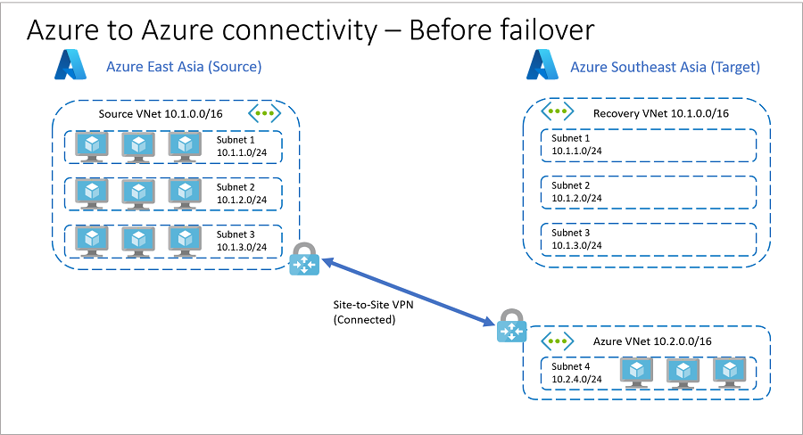
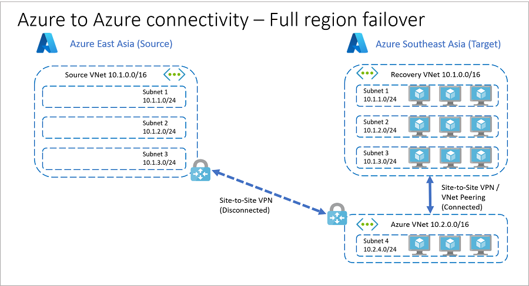
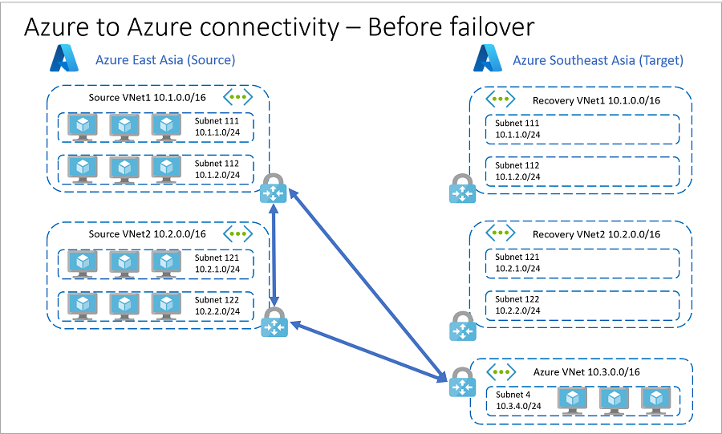
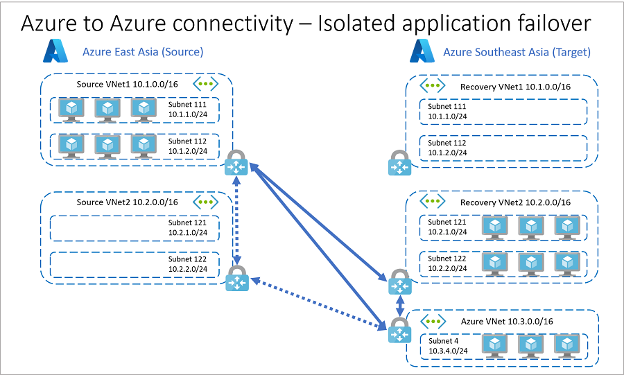
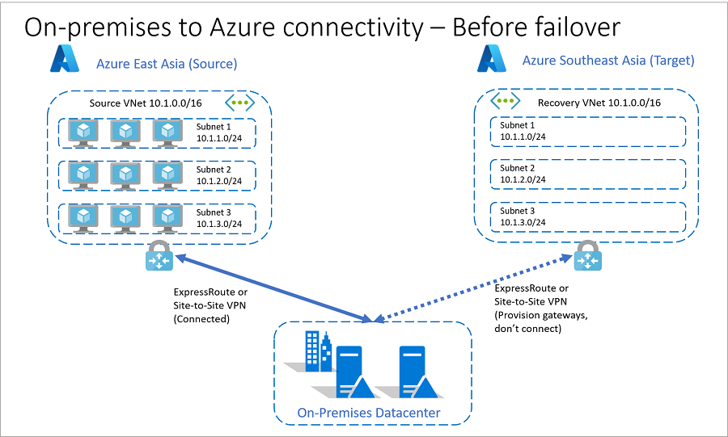
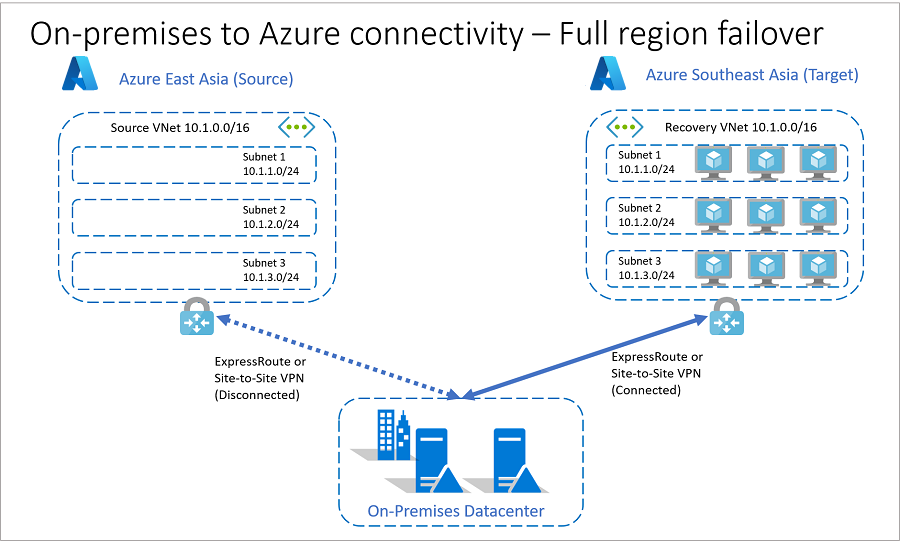

# Retain IP addresses during failover

[Azure Site Recovery](site-recovery-overview.md) enables disaster recovery for Azure VMs by replicating VMs to another Azure region, failing over if an outage occurs, and failing back to the primary region when things are back to normal.

During failover, you might want to keep the IP addressing in the target region identical to the source region:

- By default, when you enable disaster recovery for Azure VMs, Site Recovery creates target resources based on source resource settings. For Azure VMs configured with static IP addresses, Site Recovery tries to provision the same IP address for the target VM, if it's not in use. For a full explanation of how Site Recovery handles addressing, [review this article](azure-to-azure-network-mapping.md#set-up-ip-addressing-for-target-vms).
- For simple applications, the default configuration is sufficient. For more complex apps, you might need to provision additional resource to make sure that connectivity works as expected after failover.

This article provides some examples for retaining IP addresses in more complex example scenarios. The examples include:

- Failover for a company with all resources running in Azure
- Failover for a company with a hybrid deployment, and resources running both on-premises and in Azure

## Resources in Azure: full failover

Company A has all its apps running in Azure.

### Before failover

>[!NOTE]
> Replication can now be done between any two Azure regions around the world. Customers are no longer limited to enabling replication within their continent.

Here's the architecture before failover.

- Company A has identical networks and subnets in source and target Azure regions.
- To reduce recovery time objective (RTO), company uses replica nodes for SQL Server Always On, domain controllers, etc. These replica nodes are in a different VNet in the target region, so that they can establish VPN site-to-site connectivity between the source and target regions. This isn't possible if the same IP address space is used in the source and target.  
- Before failover, the network architecture is as follows:
    - Primary region is Azure East Asia
        - East Asia has a VNet (**Source VNet**) with address space 10.1.0.0/16.
        - East Asia has workloads split across three subnets in the VNet:
            - **Subnet 1**: 10.1.1.0/24
            - **Subnet 2**: 10.1.2.0/24
            - **Subnet 3**: 10.1.3.0/24
    - Secondary (target) region is Azure Southeast Asia
        - Southeast Asia has a recovery VNet (**Recovery VNet**) identical to **Source VNet**.
        - Southeast Asia has an additional VNet (**Azure VNet**) with address space 10.2.0.0/16.
        - **Azure VNet** contains a subnet (**Subnet 4**) with address space 10.2.4.0/24.
        - Replica nodes for SQL Server Always On, domain controller etc. are located in **Subnet 4**.
    - **Source VNet** and **Azure VNet** are connected with a VPN site-to-site connection.
    - **Recovery VNet** is not connected with any other virtual network.
    - **Company A** assigns/verifies target IP addresses for replicated items. The target IP is the same as source IP for each VM.

### After failover

If a source regional outage occurs, Company A can fail over all its resources to the target region.

- With target IP addresses already in place before the failover, Company A can orchestrate failover and automatically establish connections after failover between **Recovery VNet** and **Azure VNet**. This is illustrated in the following diagram..
- Depending on app requirements, connections between the two VNets (**Recovery VNet** and **Azure VNet**) in the target region can be established before, during (as an intermediate step) or after the failover.
  - The company can use [recovery plans](site-recovery-create-recovery-plans.md) to specify when connections will be established.
  - They can connect between the VNets using VNet peering or site-to-site VPN.
      - VNet peering doesn't use a VPN gateway and has different constraints.
      - VNet peering [pricing](https://azure.microsoft.com/pricing/details/virtual-network) is calculated differently than VNet-to-VNet VPN Gateway [pricing](https://azure.microsoft.com/pricing/details/vpn-gateway). For failovers, we generally advise to use the same connectivity method as source networks, including the connection type, to minimize unpredictable network incidents.

    

## Resources in Azure: isolated app failover

You might need to fail over at the app level. For example, to fail over a specific app or app tier located in a dedicated subnet.

- In this scenario, although you can retain IP addressing, it's not generally advisable since it increases the chance of connectivity inconsistencies. You'll also lose subnet connectivity to other subnets within the same Azure VNet.
- A better way to do subnet-level app failover is to use different target IP addresses for failover (if you need connectivity to other subnets on source VNet), or to isolate each app in its own dedicated VNet in the source region. With the latter approach you can establish connectivity between networks in the source region, and emulate the same behavior when you fail over to the target region.  

In this example, Company A places apps in the source region in dedicated VNets, and establishes connectivity between those VNets. With this design, they can perform isolated app failover, and retain the source private IP addresses in the target network.

### Before failover

Before failover, the architecture is as follows:

- Application VMs are hosted in the primary Azure East Asia region:
    - **App1** VMs are located in VNet **Source VNet 1**: 10.1.0.0/16.
    - **App2** VMs are located in VNet **Source VNet 2**: 10.2.0.0/16.
    - **Source VNet 1** has two subnets.
    - **Source VNet 2** has two subnets.
- Secondary (target) region is Azure Southeast Asia
        - Southeast Asia has a recovery VNets (**Recovery VNet 1** and **Recovery VNet 2**) that are identical to **Source VNet 1** and **Source VNet 2**.
        - **Recovery VNet 1** and **Recovery VNet 2** each have two subnets that match the subnets in **Source VNet 1** and **Source VNet 2**
        - Southeast Asia has an additional VNet (**Azure VNet**) with address space 10.3.0.0/16.
        - **Azure VNet** contains a subnet (**Subnet 4**) with address space 10.3.4.0/24.
        - Replica nodes for SQL Server Always On, domain controller etc. are located in **Subnet 4**.
- There are a number of site-to-site VPN connections:
    - **Source VNet 1** and **Azure VNet**
    - **Source VNet 2** and **Azure VNet**
    - **Source VNet 1** and **Source VNet 2** are connected with VPN site-to-site
- **Recovery VNet 1** and **Recovery VNet 2** aren't connected to any other VNets.
- **Company A** configures VPN gateways on **Recovery VNet 1** and **Recovery VNet 2**, to reduce RTO.  
- **Recovery VNet1** and **Recovery VNet2** are not connected with any other virtual network.
- To reduce recovery time objective (RTO), VPN gateways are configured on **Recovery VNet1** and **Recovery VNet2** prior to failover.

    

### After failover

In the event of an outage or issue that affects a single app (in **Source VNet 2 in our example), Company A can recover the affected app as follows:

- Disconnect VPN connections between **Source VNet1** and **Source VNet2**, and between **Source VNet2** and **Azure VNet** .
- Establish VPN connections between **Source VNet1** and **Recovery VNet2**, and between **Recovery VNet2** and **Azure VNet**.
- Fail over VMs in **Source VNet2** to **Recovery VNet2**.

- This example can be expanded to include more applications and network connections. The recommendation is to follow a like-like connection model, as far as possible, when failing over from source to target.
- VPN Gateways use public IP addresses and gateway hops to establish connections. If you don't want to use public IP addresses, or you want to avoid extra hops, you can use [Azure VNet peering](../virtual-network/virtual-network-peering-overview.md) to peer virtual networks across [supported Azure regions](../virtual-network/virtual-network-manage-peering.md#cross-region).

## Hybrid resources: full failover

In this scenario, **Company B** runs a hybrid business, with part of the application infrastructure running on Azure, and the remainder running on-premises.

### Before failover

Here’s what the network architecture looks like before failover.

- Application VMs are hosted in Azure East Asia.
- East Asia has a VNet (**Source VNet**) with address space 10.1.0.0/16.
  - East Asia has workloads split across three subnets in **Source VNet**:
    - **Subnet 1**: 10.1.1.0/24
    - **Subnet 2**: 10.1.2.0/24
    - **Subnet 3**: 10.1.3.0/24, utilizing an Azure virtual network with address space 10.1.0.0/16. This virtual network is named **Source VNet**
      - The secondary (target) region is Azure Southeast Asia:
  - Southeast Asia has a recovery VNet (**Recovery VNet**) identical to **Source VNet**.
- VMs in East Asia are connected to an on-premises datacenter with Azure ExpressRoute or site-to-site VPN.
- To reduce RTO, Company B provisions gateways on Recovery VNet in Azure Southeast Asia prior to failover.
- Company B assigns/verifies target IP addresses for replicated VMs. The target IP address is the same as source IP address for each VM.

### After failover

If a source regional outage occurs, Company B can fail over all its resources to the target region.

- With target IP addresses already in place before the failover, Company B can orchestrate failover and automatically establish connections after failover between **Recovery VNet** and **Azure VNet**.
- Depending on app requirements, connections between the two VNets (**Recovery VNet** and **Azure VNet**) in the target region can be established before, during (as an intermediate step) or after the failover. The company can use [recovery plans](site-recovery-create-recovery-plans.md) to specify when connections will be established.
- The original connection between Azure East Asia and the on-premises datacenter should be disconnected before establishing the connection between Azure Southeast Asia and on-premises datacenter.
- The on-premises routing is reconfigured to point to the target region and gateways post failover.

## Hybrid resources: isolated app failover

Company B can't fail over isolated apps at the subnet level. This is because the address space on source and recovery VNets is the same, and the original source to on-premises connection is active.

 - For app resiliency Company B will need to place each app in its own dedicated Azure VNet.
 - With each app in a separate VNet, Company B can fail over isolated apps, and route source connections to the target region.

## Next steps

Learn about [recovery plans](site-recovery-create-recovery-plans.md).
