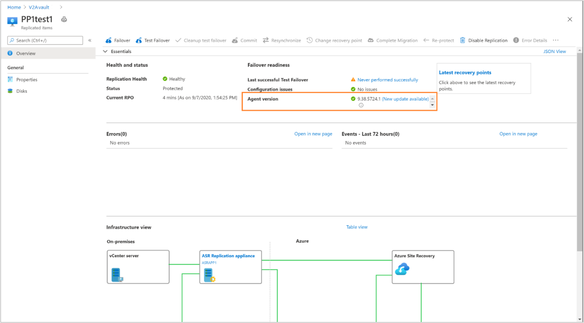
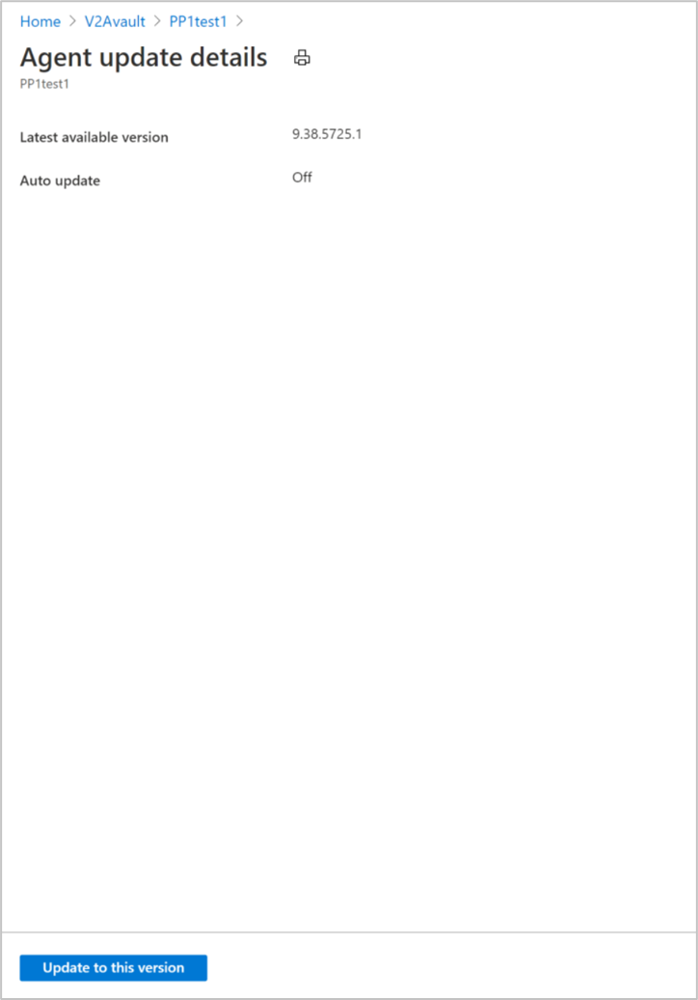

# Upgrade Mobility Service and Appliance components (Preview)

From this preview, you do not need to maintain source machine's Root/Admin credentials are not required for performing upgrades. The credentials are required only for the initial installation of the agent. Once done, you can remove the credentials.

## Update mobility agent automatically

By default, automatic updates are enabled on a vault. Automatic updates will be triggered at 12:00 AM local time every day, if a new version is available.

> [!NOTE]
> If you are using private preview bits, automatic updates are blocked for the protected machines. Ensure that you setup Site Recovery on your machine again, using a fresh Preview appliance.

To avail the latest features, enhancements and fixes, we recommend you to choose **Allow Site Recovery to manage** option on the **Mobility agent upgrade settings (Preview)**. Automatic updates do not require a reboot or affect on-going replication of your virtual machines. Automatic updates also ensure that all the replication appliances in the vault are automatically updated.

To turn off the automatic updates, toggle the **Allow Site Recovery to manage** button.

## Update mobility agent manually

If you have turned off automatic updates for your mobility agent, you can update the agent manually using the following procedures:

### Upgrade mobility agent on multiple protected items

To manually update mobility agent on multiple protected items, follow these steps:

1. Navigate to **Recovery services vault** > **Replicated items** , click *New Site Recovery mobility agent update is available*. Click to install.

   

2. Choose the source machines to update and then click **OK**.

   >[!NOTE]
   >If prerequisites to upgrade Mobility service are not met, then the VM cannot be selected. See information on [how to resolve](#resolve-blocking-issues-for-agent-upgrade).

4. After initiating the upgrade, a Site Recovery job is created in the vault for each upgrade operation and can be tracked by navigating to **Monitoring** > **Site Recovery jobs**.

### Update mobility agent for a single protected machine

To update mobility agent of a protected item, follow these steps:
1. Navigate to **recovery services vault** > **Replicated items** , select a VM.
2. In VM's **Overview** blade, against **Agent version**, view the current version of the mobility agent. If a new update is available, the status is updated as **New update available**.

   

3. Click **New update available**, latest available version is displayed. Click **Update to this version** to initiate the update job.

   

   > [!NOTE]
   > If upgrade is blocked, check and resolve the errors as detailed [here](#resolve-blocking-issues-for-agent-upgrade).

## Mobility agent on latest version

After Mobility agent is updated to the latest version or has been updated automatically to the latest version,  the status displays as **Up to date**.

### Resolve blocking issues for agent upgrade

If prerequisites to upgrade the mobility agent are not met, then VM cannot be updated. Resolve these to proceed with the upgrade.

The prerequisite includes, but not limited to:

- A pending mandatory reboot on the protected machine.

- If the replication appliance is on an incompatible version.

- If the replication appliance components –  Proxy server or Process server is unable to communicate with Azure services.

- If mobility agent on the protected machine is not able to communicate with the replication appliance.

In case any of the above issues are applicable, the status is updated as **Cannot update to latest version**. Click the status to view the reasons blocking the update and recommended actions to fix the issue.

>[!NOTE]
>After resolving the blocking reasons, wait for 30 minutes to retry the operations. It takes time for the latest information to be updated in the Site Recovery services.

### Mobility agent upgrade job failure

In case mobility agent upgrade operation fails (manually triggered or automatic upgrade operation), the job is updated with the reason for failure. Resolve the errors and then retry the operation.

To view the failure errors, you can either navigate to Site Recovery jobs, click a specific job to fetch the resolution of errors. Or, you can use the steps below:

1. Navigate to replicated items section, select a specific VM.

2. In the **Overview** blade, against **Agent version**, the current version of the mobility agent displayed.

3. Next to the current version, the status is updated with the message **Update failed**. Click the status to retry the update operation.

4.  A link to the previous upgrade job is available. Click the job to navigate to the specific job.

5. Resolve the previous job errors.

Trigger the update operation after resolving the errors from previous failed job.

## Upgrade appliance

By default, automatic updates are enabled on the appliance. Automatic updates are triggered at 12:00 AM local time every day, if a new version is available for any of the components.

To check the update status of any of the components, navigate to appliance server and open **Microsoft Azure Appliance Configuration Manager**. Navigate to  **Appliance components**  and expand it to view the list of all the components and their version.

If any of these need to be updated, then the **Status** reflects the same. Click the status message to upgrade the component.

  

### Resolve issues with component upgrade

If prerequisites to upgrade any of the components are not met, then it cannot be updated. The reasons/prerequisites include, but not limited to,

- If one of the components of the replication appliance is on an incompatible version.

- If replication appliance is unable to communicate with Azure services.

In case any of the above issues are applicable, the status is updated as **Cannot update to latest version**. Click the status to view the reasons blocking the update and recommended actions to fix the issue. After resolving the blocking reasons, try the update manually.
