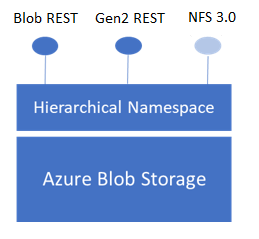

# Network File System (NFS) 3.0 protocol support in Azure Blob Storage

Blob storage now supports the Network File System (NFS) 3.0 protocol. This support provides Linux file system compatibility at object storage scale and prices and enables Linux clients to mount a container in Blob storage from an Azure Virtual Machine (VM) or a computer on-premises.

It's always been a challenge to run large-scale legacy workloads, such as High Performance Computing (HPC) in the cloud. One reason is that applications often use traditional file protocols such as NFS or Server Message Block (SMB) to access data. Also, native cloud storage services focused on object storage that have a flat namespace and extensive metadata instead of file systems that provide a hierarchical namespace and efficient metadata operations.

Blob Storage now supports a hierarchical namespace, and when combined with NFS 3.0 protocol support, Azure makes it much easier to run legacy applications on top of large-scale cloud object storage.

## Applications and workloads suited for this feature

The NFS 3.0 protocol feature is best suited for processing high throughput, high scale, read heavy workloads such as media processing, risk simulations, and genomics sequencing. You should consider using this feature for any other type of workload that uses multiple readers and many threads, which require high bandwidth.

## NFS 3.0 and the hierarchical namespace

NFS 3.0 protocol support requires blobs to be organized into on a hierarchical namespace. You can enable a hierarchical namespace when you create a storage account. The ability to use a hierarchical namespace was introduced by Azure Data Lake Storage Gen2. It organizes objects (files) into a hierarchy of directories and subdirectories in the same way that the file system on your computer is organized. The hierarchical namespace scales linearly and doesn't degrade data capacity or performance. Different protocols extend from the hierarchical namespace. The NFS 3.0 protocol is one of the these available protocols.

> [!div class="mx-imgBorder"]
> 

## Data stored as block blobs

If you enable NFS 3.0 protocol support, all of the data in your storage account will be stored as block blobs. Block blobs are optimized to efficiently process large amounts of read-heavy data. Block blobs are composed of blocks. Each block is identified by a block ID. A block blob can include up to 50,000 blocks. Each block in a block blob can be a different size, up to the maximum size permitted for the service version that your account uses.

When your application makes a request by using the NFS 3.0 protocol, that request is translated into combination of block blob operations. For example, NFS 3.0 read Remote Procedure Call (RPC) requests are translated into [Get Blob](/rest/api/storageservices/get-blob) operation. NFS 3.0 write RPC requests are translated into a combination of [Get Block List](/rest/api/storageservices/get-block-list), [Put Block](/rest/api/storageservices/put-block), and [Put Block List](/rest/api/storageservices/put-block-list).

## General workflow: Mounting a storage account container

Your Linux clients can mount a container in Blob storage from an Azure Virtual Machine (VM) or a computer on-premises. To mount a storage account container, you'll have to do these things.

1. Create an Azure Virtual Network (VNet).

2. Configure network security.

3. Create and configure storage account that accepts traffic only from the VNet.

4. Create a container in the storage account.

5. Mount the container.

For step-by-step guidance, see [Mount Blob storage by using the Network File System (NFS) 3.0 protocol](network-file-system-protocol-support-how-to.md).

## Network security

Traffic must originate from a VNet. A VNet enables clients to securely connect to your storage account. The only way to secure the data in your account is by using a VNet and other network security settings. Any other tool used to secure data including account key authorization, Azure Active Directory (AD) security, and access control lists (ACLs) are not yet supported in accounts that have the NFS 3.0 protocol support enabled on them.

To learn more, see [Network security recommendations for Blob storage](security-recommendations.md#networking).

### Supported network connections

A client can connect over a public or a [private endpoint](../common/storage-private-endpoints.md), and can connect from any of the following network locations:

- The VNet that you configure for your storage account.

  In this article, we'll refer to that VNet as the *primary VNet*. To learn more, see [Grant access from a virtual network](../common/storage-network-security.md#grant-access-from-a-virtual-network).

- A peered VNet that is in the same region as the primary VNet.

  You'll have to configure your storage account to allow access to this peered VNet. To learn more, see [Grant access from a virtual network](../common/storage-network-security.md#grant-access-from-a-virtual-network).

- An on-premises network that is connected to your primary VNet by using [VPN Gateway](../../vpn-gateway/vpn-gateway-about-vpngateways.md) or an [ExpressRoute gateway](../../expressroute/expressroute-howto-add-gateway-portal-resource-manager.md).

  To learn more, see [Configuring access from on-premises networks](../common/storage-network-security.md#configuring-access-from-on-premises-networks).

- An on-premises network that is connected to a peered network.

  This can be done by using [VPN Gateway](../../vpn-gateway/vpn-gateway-about-vpngateways.md) or an [ExpressRoute gateway](../../expressroute/expressroute-howto-add-gateway-portal-resource-manager.md) along with [Gateway transit](/azure/architecture/reference-architectures/hybrid-networking/vnet-peering#gateway-transit).

> [!IMPORTANT]
> If you're connecting from an on-premises network, make sure that your client allows outgoing communication through ports 111 and 2048. The NFS 3.0 protocol uses these ports.

## Known issues and limitations

See the [Known issues](network-file-system-protocol-known-issues.md) article for a complete list of issues and limitations with the current release of NFS 3.0 support.

## Pricing

See the [Azure Blob Storage pricing](https://azure.microsoft.com/pricing/details/storage/blobs/) page for data storage and transaction costs.

## See also

- [Mount Blob storage by using the Network File System (NFS) 3.0 protocol](network-file-system-protocol-support-how-to.md)
- [Network File System (NFS) 3.0 performance considerations in Azure Blob Storage](network-file-system-protocol-support-performance.md)
- [Compare access to Azure Files, Blob Storage, and Azure NetApp Files with NFS](../common/nfs-comparison.md)
