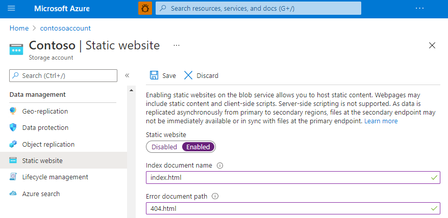

<!---Customer intent: I want to host files for a static website in Blob storage and access the website from an Azure endpoint.--->

# Tutorial: Host a static website on Blob Storage

In this tutorial, you'll learn how to build and deploy a static website to Azure Storage. When you're finished, you will have a static website that users can access publicly.

In this tutorial, you learn how to:

> [!div class="checklist"]
> - Configure static website hosting
> - Deploy a Hello World website

## Prerequisites

[!INCLUDE [storage-quickstart-prereq-include](../../../includes/storage-quickstart-prereq-include.md)]

> [!NOTE]
> Static websites are now available for general-purpose v2 Standard storage accounts as well as storage accounts with hierarchical namespace enabled.

This tutorial uses [Visual Studio Code](https://code.visualstudio.com/download), a free tool for programmers, to build the static website and deploy it to an Azure Storage account.

After you install Visual Studio Code, install the Azure Storage preview extension. This extension integrates Azure Storage management functionality with Visual Studio Code. You will use the extension to deploy your static website to Azure Storage. To install the extension:

1. Launch Visual Studio Code.
2. On the toolbar, click **Extensions**. Search for *Azure Storage*, and select the **Azure Storage** extension from the list. Then click the **Install** button to install the extension.

    

## Sign in to the Azure portal

Sign in to the [Azure portal](https://portal.azure.com/) to get started.

## Configure static website hosting

The first step is to configure your storage account to host a static website in the Azure portal. When you configure your account for static website hosting, Azure Storage automatically creates a container named *$web*. The *$web* container will contain the files for your static website.

1. Open the [Azure portal](https://portal.azure.com/) in your web browser.
1. Locate your storage account and display the account overview.
1. Select **Static website** to display the configuration page for static websites.
1. Select **Enabled** to enable static website hosting for the storage account.
1. In the **Index document name** field, specify a default index page of *index.html*. The default index page is displayed when a user navigates to the root of your static website.
1. In the **Error document path** field, specify a default error page of *404.html*. The default error page is displayed when a user attempts to navigate to a page that does not exist in your static website.
1. Click **Save**. The Azure portal now displays your static website endpoint.

    

## Deploy a Hello World website

Next, create a Hello World web page with Visual Studio Code and deploy it to the static website hosted in your Azure Storage account.

1. Create an empty folder named *mywebsite* on your local file system.
1. Launch Visual Studio Code, and open the folder that you just created from the **Explorer** panel.

    

1. Create the default index file in the *mywebsite* folder and name it *index.html*.

    

1. Open *index.html* in the editor, paste the following text into the file, and save it:

    ```
    <!DOCTYPE html>
    <html>
      <body>
        <h1>Hello World!</h1>
      </body>
    </html>
    ```

1. Create the default error file and name it *404.html*.
1. Open *404.html* in the editor, paste the following text into the file, and save it:

    ```
    <!DOCTYPE html>
    <html>
      <body>
        <h1>404</h1>
      </body>
    </html>
    ```

1. Right-click under the *mywebsite* folder in the **Explorer** panel and select **Deploy to Static Website...** to deploy your website. You will be prompted to log in to Azure to retrieve a list of subscriptions.

1. Select the subscription containing the storage account for which you enabled static website hosting. Next, select the storage account when prompted.

Visual Studio Code will now upload your files to your web endpoint, and show the success status bar. Launch the website to view it in Azure.

You've successfully completed the tutorial and deployed a static website to Azure.

## Feature support

This table shows how this feature is supported in your account and the impact on support when you enable certain capabilities.

| Storage account type                | Blob Storage (default support)   | Data Lake Storage Gen2 <sup>1</sup>                        | NFS 3.0 <sup>1</sup>
|-----------------------------|---------------------------------|------------------------------------|--------------------------------------------------|
| Standard general-purpose v2 |  |              |  |
| Premium block blobs          |  |              |  |

<sup>1</sup>    Data Lake Storage Gen2 and the Network File System (NFS) 3.0 protocol both require a storage account with a hierarchical namespace enabled.

## Next steps

In this tutorial, you learned how to configure your Azure Storage account for static website hosting, and how to create and deploy a static website to an Azure endpoint.

Next, learn how to configure a custom domain with your static website.

> [!div class="nextstepaction"]
> [Map a custom domain to an Azure Blob Storage endpoint](storage-custom-domain-name.md)
