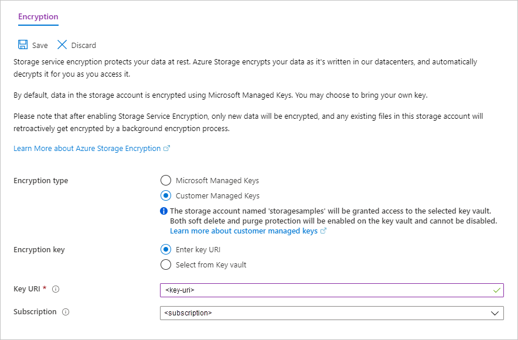
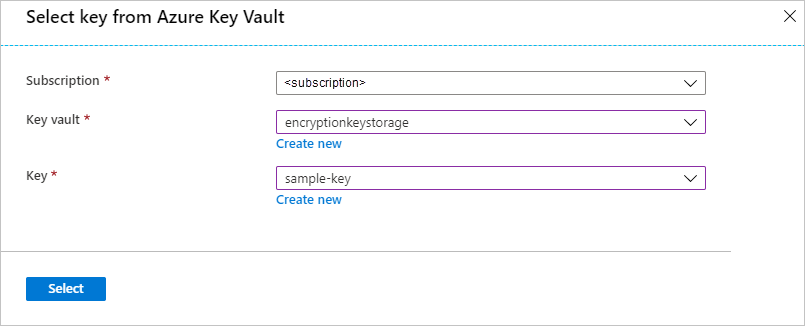

# Configure customer-managed keys with Azure Key Vault by using the Azure portal

[!INCLUDE [storage-encryption-configure-keys-include](../../../includes/storage-encryption-configure-keys-include.md)]

This article shows how to configure an Azure Key Vault with customer-managed keys using the [Azure portal](https://portal.azure.com/). To learn how to create a key vault using the Azure portal, see [Quickstart: Set and retrieve a secret from Azure Key Vault using the Azure portal](../../key-vault/secrets/quick-create-portal.md).

## Configure Azure Key Vault

Using customer-managed keys with Azure Storage encryption requires that two properties be set on the key vault, **Soft Delete** and **Do Not Purge**. These properties are not enabled by default, but can be enabled using either PowerShell or Azure CLI on a new or existing key vault.

To learn how to enable these properties on an existing key vault, see the sections titled **Enabling soft-delete** and **Enabling Purge Protection** in one of the following articles:

- [How to use soft-delete with PowerShell](../../key-vault/general/soft-delete-powershell.md).
- [How to use soft-delete with CLI](../../key-vault/general/soft-delete-cli.md).

Azure storage encryption supports RSA and RSA-HSM keys of sizes 2048, 3072 and 4096. For more information about keys, see **Key Vault keys** in [About Azure Key Vault keys, secrets and certificates](../../key-vault/about-keys-secrets-and-certificates.md#key-vault-keys).

## Enable customer-managed keys

To enable customer-managed keys in the Azure portal, follow these steps:

1. Navigate to your storage account.
1. On the **Settings** blade for the storage account, click **Encryption**. Select the **Customer Managed Keys** option, as shown in the following image.

    

## Specify a key

After you enable customer-managed keys, you'll have the opportunity to specify a key to associate with the storage account.

### Specify a key as a URI

To specify a key as a URI, follow these steps:

1. To locate the key URI in the Azure portal, navigate to your key vault, and select the **Keys** setting. Select the desired key, then click the key to view its versions. Select a key version to view the settings for that version.
1. Copy the value of the **Key Identifier** field, which provides the URI.

    

1. In the **Encryption** settings for your storage account, choose the **Enter key URI** option.
1. Paste the URI that you copied into the **Key URI** field.

   

1. Specify the subscription that contains the key vault.
1. Save your changes.

### Specify a key from a key vault

To specify a key from a key vault, first make sure that you have a key vault that contains a key. To specify a key from a key vault, follow these steps:

1. Choose the **Select from Key Vault** option.
1. Select the key vault containing the key you want to use.
1. Select the key from the key vault.

   

1. Save your changes.

## Update the key version

When you create a new version of a key, update the storage account to use the new version. Follow these steps:

1. Navigate to your storage account and display the **Encryption** settings.
1. Enter the URI for the new key version. Alternately, you can select the key vault and the key again to update the version.
1. Save your changes.

## Use a different key

To change the key used for Azure Storage encryption, follow these steps:

1. Navigate to your storage account and display the **Encryption** settings.
1. Enter the URI for the new key. Alternately, you can select the key vault and choose a new key.
1. Save your changes.

## Disable customer-managed keys

When you disable customer-managed keys, your storage account is once again encrypted with Microsoft-managed keys. To disable customer-managed keys, follow these steps:

1. Navigate to your storage account and display the **Encryption** settings.
1. Deselect the checkbox next to the **Use your own key** setting.

## Next steps

- [Azure Storage encryption for data at rest](storage-service-encryption.md)
- [What is Azure Key Vault](https://docs.microsoft.com/azure/key-vault/key-vault-overview)?
