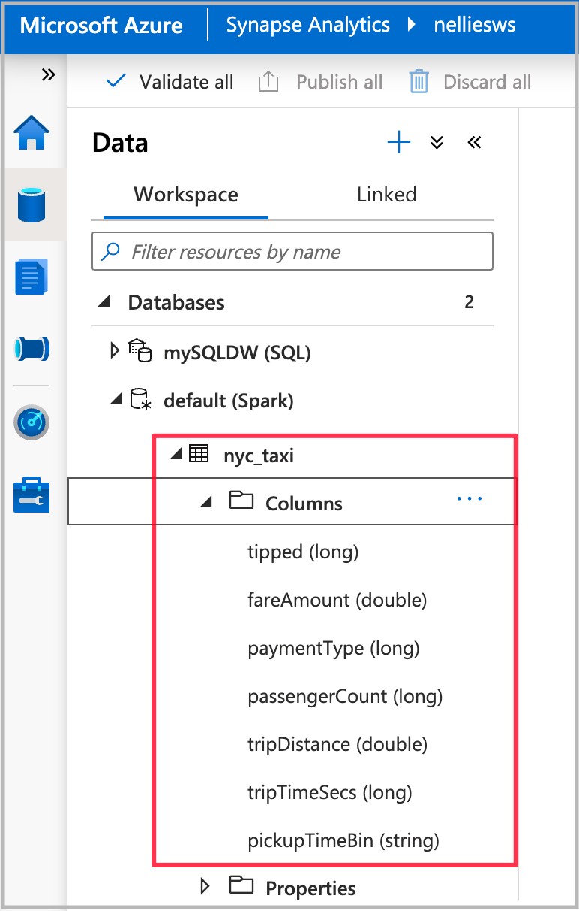
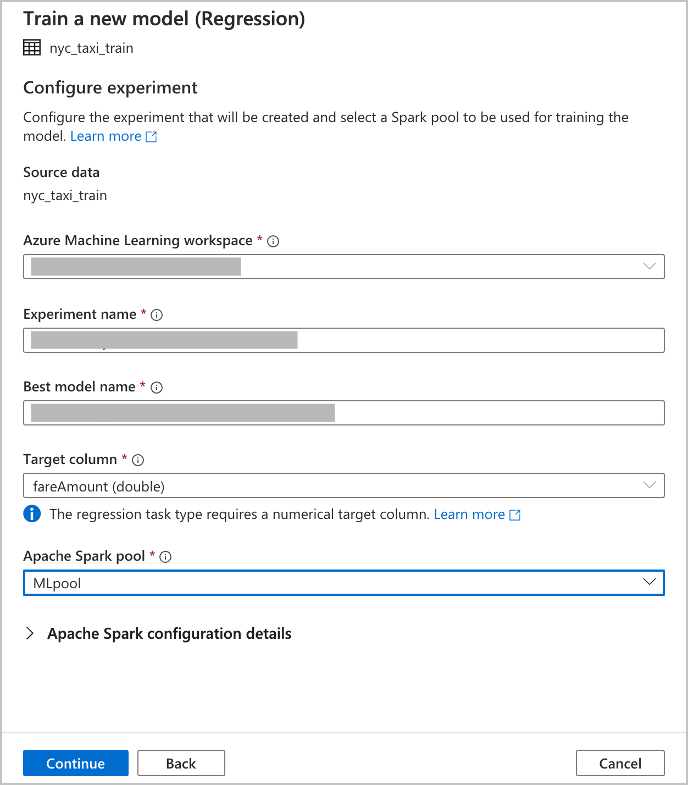

# Tutorial: Train a machine learning model without code

You can enrich your data in Spark tables with new machine learning models that you train by using [automated machine learning](../../machine-learning/concept-automated-ml.md). In Azure Synapse Analytics, you can select a Spark table in the workspace to use as a training dataset for building machine learning models, and you can do this in a code-free experience.

In this tutorial, you learn how to train machine learning models by using a code-free experience in Synapse Studio. Synapse Studio is a feature of Azure Synapse Analytics. 

You'll use automated machine learning in Azure Machine Learning, instead of coding the experience manually. The type of model that you train depends on the problem you're trying to solve.

If you don't have an Azure subscription, [create a free account before you begin](https://azure.microsoft.com/free/).

## Prerequisites

- An [Azure Synapse Analytics workspace](../get-started-create-workspace.md). Ensure that it has an Azure Data Lake Storage Gen2 storage account configured as the default storage. For the Data Lake Storage Gen2 file system that you work with, ensure that you're the *Storage Blob Data Contributor*.
- An Apache Spark pool in your Azure Synapse Analytics workspace. For details, see [Quickstart: Create a serverless Apache Spark pool using Synapse Studio](../quickstart-create-apache-spark-pool-studio.md).
- An Azure Machine Learning linked service in your Azure Synapse Analytics workspace. For details, see [Quickstart: Create a new Azure Machine Learning linked service in Azure Synapse Analytics](quickstart-integrate-azure-machine-learning.md).

## Sign in to the Azure portal

Sign in to the [Azure portal](https://portal.azure.com/).

## Create a Spark table for the training dataset

For this tutorial, you need a Spark table. The following notebook creates one:

1. Download the notebook [Create-Spark-Table-NYCTaxi- Data.ipynb](https://go.microsoft.com/fwlink/?linkid=2149229).

1. Import the notebook to Synapse Studio.

1. Select the Spark pool that you want to use, and then select **Run all**. This step gets New York taxi data from the open dataset and saves the data to your default Spark database.

1. After the notebook run has completed, you see a new Spark table under the default Spark database. From **Data**, find the table named **nyc_taxi**.

## Open the automated machine learning wizard

To open the wizard:

1. Right-click the Spark table that you created in the previous step. Then select **Machine Learning** > **Enrich with new model**.

1. Provide configuration details for creating an automated machine learning experiment run in Azure Machine Learning. This run trains multiple models. The best model from a successful run is registered in the Azure Machine Learning model registry.

   

    - **Azure Machine Learning workspace**: An Azure Machine Learning workspace is required for creating an automated machine learning experiment run. You also need to link your Azure Synapse Analytics workspace with the Azure Machine Learning workspace by using a [linked service](quickstart-integrate-azure-machine-learning.md). After you've fulfilled all the prerequisites, you can specify the Azure Machine Learning workspace that you want to use for this automated run.

    - **Experiment name**: Specify the experiment name. When you submit an automated machine learning run, you provide an experiment name. Information for the run is stored under that experiment in the Azure Machine Learning workspace. This experience creates a new experiment by default and generates a proposed name, but you can also provide the name of an existing experiment.

    - **Best model name**: Specify the name of the best model from the automated run. The best model is given this name and saved in the Azure Machine Learning model registry automatically after this run. An automated machine learning run creates many machine learning models. Based on the primary metric that you select in a later step, those models can be compared and the best model can be selected.

    - **Target column**: This is what the model is trained to predict. Choose the column that you want to predict. (In this tutorial, we select the numeric column `fareAmount` as the target column.)

    - **Spark pool**: Specify the Spark pool that you want to use for the automated experiment run. The computations are run on the pool that you specify.

    - **Spark configuration details**: In addition to the Spark pool, you have the option to provide session configuration details.

1. Select **Continue**.

## Choose a task type

Select the machine learning model type for the experiment, based on the question you're trying to answer. Because `fareAmount` is the target column, and it's a numeric value, we recommend that you select **Regression** here. Then select **Continue**.

## Additional configurations

If you selected **Regression** or **Classification** as your model type in the previous section, the following configurations are available:

- **Primary metric**: Enter the metric that measures how well the model is doing. You use this metric to compare different models created in the automated run and determine which model performed best.

- **Training job time (hours)**: Specify the maximum amount of time, in hours, for an experiment to run and train models. Note that you can also provide values less than 1 (for example, **0.5**).

- **Max concurrent iterations**: Choose the maximum number of iterations that run in parallel.

- **ONNX model compatibility**: If you enable this option, the models trained by automated machine learning are converted to the ONNX format. This is particularly relevant if you want to use the model for scoring in Azure Synapse Analytics SQL pools.

These settings all have a default value that you can customize.

After all the required configurations are done, you can start your automated run. You can choose **Create run**, which starts your run directly, without code. Alternatively, if you prefer code, you can select **Open in notebook**. This option allows you to see the code that creates the run and then run the notebook.

>[!NOTE]
>If you selected **Time series forecasting** as your model type in the previous section, you must make additional configurations. Forecasting also doesn't support ONNX model compatibility.

### Create a run directly

To start your automated machine learning run directly, select **Start Run**. You see a notification that indicates the run is starting. Then you see another notification that indicates success. You can also check the status in Azure Machine Learning by selecting the link in the notification.

### Create a run with a notebook

To generate a notebook, select **Open In Notebook**. Then select **Run all**. This also gives you an opportunity to add settings to your automated machine learning run.

After you've successfully submitted the run, you see a link to the experiment run in the Azure Machine Learning workspace in the notebook output. Select the link to monitor your automated run in Azure Machine Learning.
)

## Next steps

- [Tutorial: Machine learning model scoring wizard (preview) for dedicated SQL pools](tutorial-sql-pool-model-scoring-wizard.md)
- [Quickstart: Create a new Azure Machine Learning linked service in Azure Synapse Analytics](quickstart-integrate-azure-machine-learning.md)
- [Machine learning capabilities in Azure Synapse Analytics](what-is-machine-learning.md)
