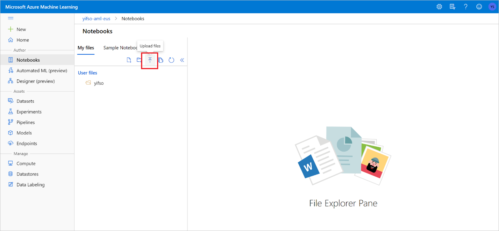
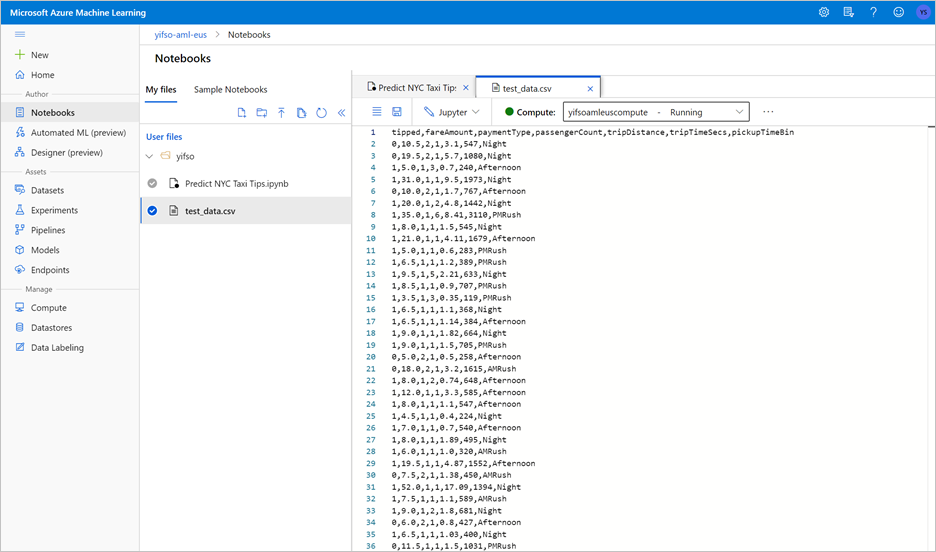
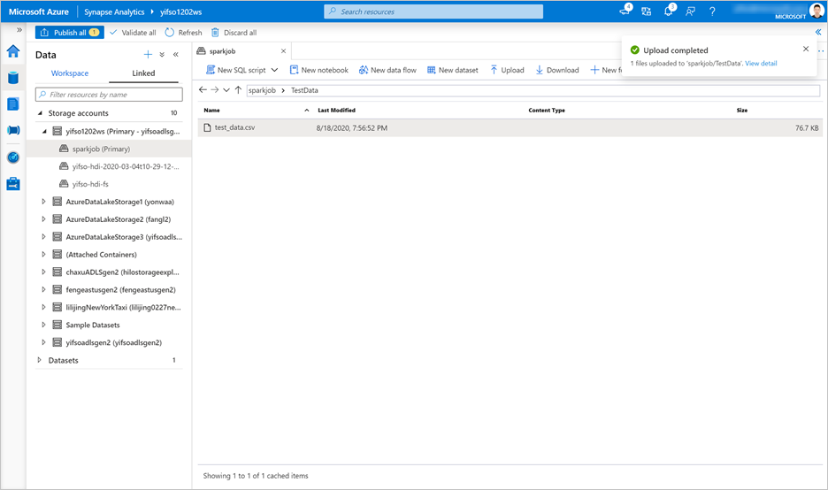
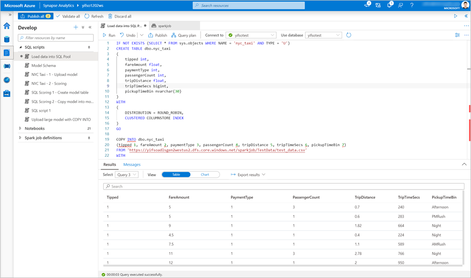
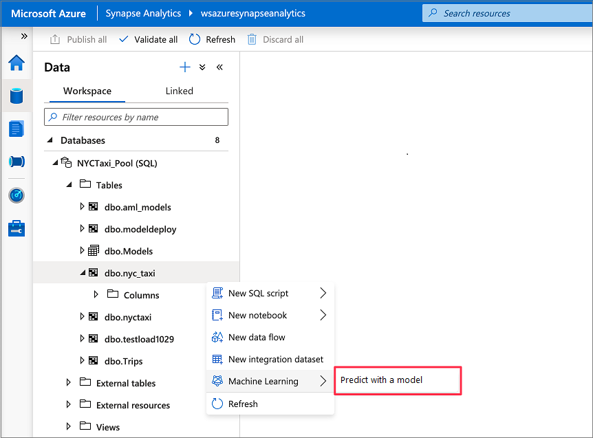
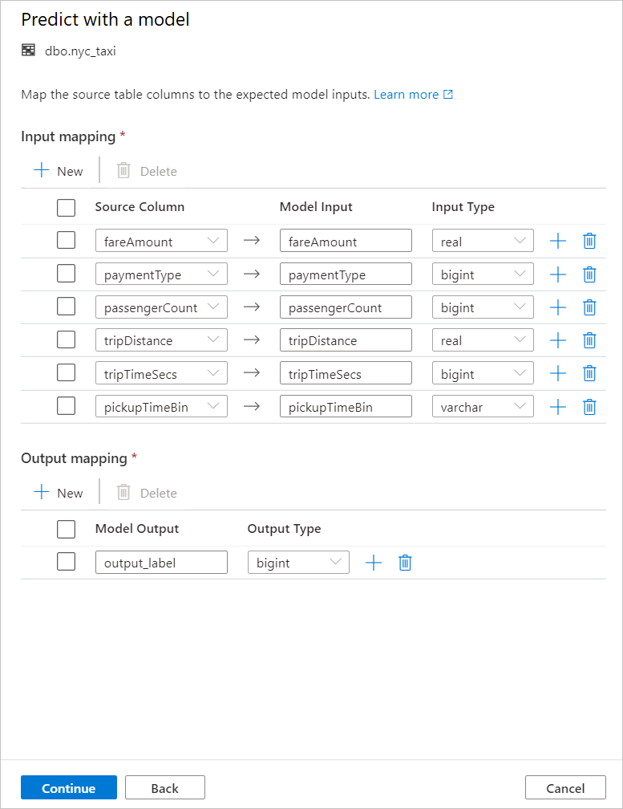
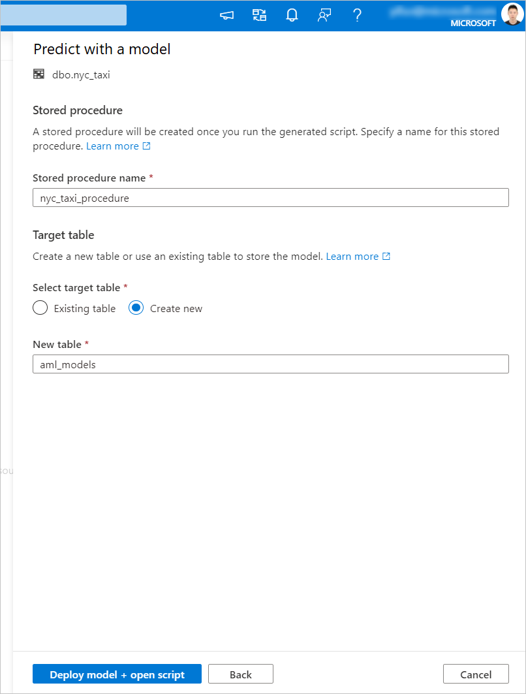
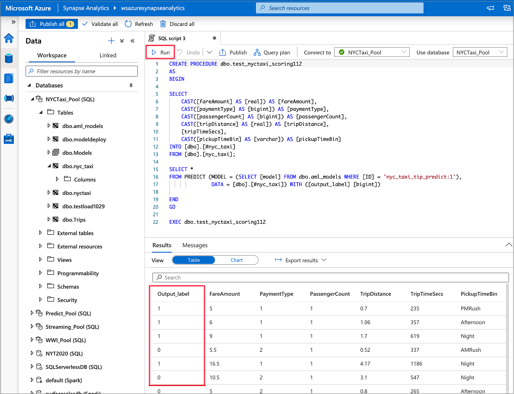

# Tutorial: Machine learning model scoring wizard (preview) for dedicated SQL pools

Learn how to easily enrich your data in dedicated SQL pools with predictive machine learning models. The models that your data scientists create are now easily accessible to data professionals for predictive analytics. A data professional in Azure Synapse Analytics can simply select a model from the Azure Machine Learning model registry for deployment in Azure Synapse SQL pools and launch predictions to enrich the data.

In this tutorial, you'll learn how to:

> [!div class="checklist"]
> - Train a predictive machine learning model and register the model in the Azure Machine Learning model registry.
> - Use the SQL scoring wizard to launch predictions in a dedicated SQL pool.

If you don't have an Azure subscription, [create a free account before you begin](https://azure.microsoft.com/free/).

## Prerequisites

- [Azure Synapse Analytics workspace](../get-started-create-workspace.md) with an Azure Data Lake Storage Gen2 storage account configured as the default storage. You need to be the *Storage Blob Data Contributor* of the Data Lake Storage Gen2 file system that you work with.
- Dedicated SQL pool in your Azure Synapse Analytics workspace. For details, see [Create a dedicated SQL pool](../quickstart-create-sql-pool-studio.md).
- Azure Machine Learning linked service in your Azure Synapse Analytics workspace. For details, see [Create an Azure Machine Learning linked service in Azure Synapse](quickstart-integrate-azure-machine-learning.md).

## Sign in to the Azure portal

Sign in to the [Azure portal](https://portal.azure.com/).

## Train a model in Azure Machine Learning

Before you begin, verify that your version of sklearn is 0.20.3.

Before you run all cells in the notebook, check that the compute instance is running.


1. Go to your Azure Machine Learning workspace.

1. Download [Predict NYC Taxi Tips.ipynb](https://go.microsoft.com/fwlink/?linkid=2144301).

1. Open the Azure Machine Learning workspace in [Azure Machine Learning Studio](https://ml.azure.com).

1. Go to **Notebooks** > **Upload files**. Then select the **Predict NYC Taxi Tips.ipynb** file that you downloaded and upload it.
   

1. After the notebook is uploaded and opened, select **Run all cells**.

   One of the cells might fail and ask you to authenticate to Azure. Watch for this in the cell outputs, and authenticate in your browser by following the link and entering the code. Then re-run the notebook.

1. The notebook will train an ONNX model and register it with MLflow. Go to **Models** to check that the new model is registered properly.
   

1. Running the notebook will also export the test data into a CSV file. Download the CSV file to your local system. Later, you'll import the CSV file into a dedicated SQL pool and use the data to test the model.

   The CSV file is created in the same folder as your notebook file. Select **Refresh** in File Explorer if you don't see it right away.

   

## Launch predictions with the SQL scoring wizard

1. Open the Azure Synapse workspace with Synapse Studio.

1. Go to **Data** > **Linked** > **Storage Accounts**. Upload `test_data.csv` to the default storage account.

   

1. Go to **Develop** > **SQL scripts**. Create a new SQL script to load `test_data.csv` into your dedicated SQL pool.

   > [!NOTE]
   > Update the file URL in this script before running it.

   ```SQL
   IF NOT EXISTS (SELECT * FROM sys.objects WHERE NAME = 'nyc_taxi' AND TYPE = 'U')
   CREATE TABLE dbo.nyc_taxi
   (
       tipped int,
       fareAmount float,
       paymentType int,
       passengerCount int,
       tripDistance float,
       tripTimeSecs bigint,
       pickupTimeBin nvarchar(30)
   )
   WITH
   (
       DISTRIBUTION = ROUND_ROBIN,
       CLUSTERED COLUMNSTORE INDEX
   )
   GO
   
   COPY INTO dbo.nyc_taxi
   (tipped 1, fareAmount 2, paymentType 3, passengerCount 4, tripDistance 5, tripTimeSecs 6, pickupTimeBin 7)
   FROM '<URL to linked storage account>/test_data.csv'
   WITH
   (
       FILE_TYPE = 'CSV',
       ROWTERMINATOR='0x0A',
       FIELDQUOTE = '"',
       FIELDTERMINATOR = ',',
       FIRSTROW = 2
   )
   GO
   
   SELECT TOP 100 * FROM nyc_taxi
   GO
   ```

   

1. Go to **Data** > **Workspace**. Open the SQL scoring wizard by right-clicking the dedicated SQL pool table. Select **Machine Learning** > **Predict with a model**.

   > [!NOTE]
   > The machine learning option does not appear unless you have a linked service created for Azure Machine Learning. (See [Prerequisites](#prerequisites) at the beginning of this tutorial.)

   

1. Select a linked Azure Machine Learning workspace in the drop-down box. This step loads a list of machine learning models from the model registry of the chosen Azure Machine Learning workspace. Currently, only ONNX models are supported, so this step will display only ONNX models.

1. Select the model that you just trained, and then select **Continue**.

   

1. Map the table columns to the model inputs and specify the model outputs. If the model is saved in the MLflow format and the model signature is populated, the mapping will be done automatically for you by using a logic based on the similarity of names. The interface also supports manual mapping.

   Select **Continue**.

   

1. The generated T-SQL code is wrapped inside a stored procedure. This is why you need to provide a stored procedure name. The model binary, including metadata (version, description, and other information), will be physically copied from Azure Machine Learning to a dedicated SQL pool table. So you need to specify which table to save the model in. 

   You can choose either **Existing table** or **Create new**. When you're done, select **Deploy model + open script** to deploy the model and generate a T-SQL prediction script.

   

1. After the script is generated, select **Run** to execute the scoring and get predictions.

   

## Next steps

- [Quickstart: Create a new Azure Machine Learning linked service in Azure Synapse](quickstart-integrate-azure-machine-learning.md)
- [Machine Learning capabilities in Azure Synapse Analytics](what-is-machine-learning.md)
