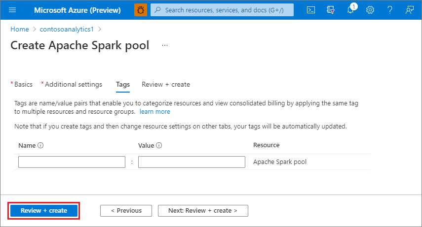
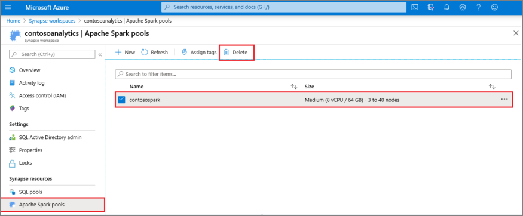
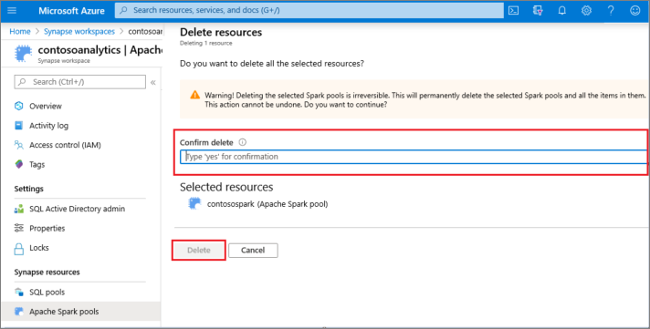

# Quickstart: Create a new Apache Spark pool (preview) using the Azure portal

Azure Synapse Analytics offers various analytics engines to help you ingest, transform, model, analyze, and distribute your data. An Apache Spark pool provides open-source big data compute capabilities. After you've created an Apache Spark pool in your Synapse workspace, data can be loaded, modeled, processed, and distributed for faster analytic insight.

In this quickstart, you learn how to use the Azure portal to create an Apache Spark pool in a Synapse workspace.

> [!IMPORTANT]
> Billing for Spark instances is prorated per minute, whether you are using them or not. Be sure to shutdown your Spark instance after you have finished using it, or set a short timeout. For more information, see the **Clean up resources** section of this article.

If you don't have an Azure subscription, [create a free account before you begin](https://azure.microsoft.com/free/).

## Prerequisites

- Azure subscription - [create one for free](https://azure.microsoft.com/free/)
- [Synapse Analytics workspace](quickstart-create-workspace.md)

## Sign in to the Azure portal

Sign in to the [Azure portal](https://portal.azure.com/)

## Navigate to the Synapse workspace 
1. Navigate to the Synapse workspace where the Apache Spark pool will be created by typing the service name (or resource name directly) into the search bar.

1. From the list of workspaces, type the name (or part of the name) of the workspace to open. For this example, we'll use a workspace named **contosoanalytics**.

## Create new Apache Spark pool

1. In the Synapse workspace where you want to create the Apache Spark pool, select **New Apache Spark pool**.
    
2. Enter the following details in the **Basics** tab:

    |Setting | Suggested value | Description |
    | :------ | :-------------- | :---------- |
    | **Apache Spark pool name** | A valid pool name | This is the name that the Apache Spark pool will have. |
    | **Node size** | Small (4 vCPU / 32 GB) | Set this to the smallest size to reduce costs for this quickstart |
    | **Autoscale** | Disabled | We don't need autoscale for this quickstart |
    | **Number of nodes** | 5 | Use a small size to limit costs for this quickstart |

    
    > [!IMPORTANT]
    > Note that there are specific limitations for the names that Apache Spark pools can use. Names must contain letters or numbers only, must be 15 or less characters, must start with a letter, not contain reserved words, and be unique in the workspace.

3. Select **Next: additional settings** and review the default settings. Do not modify any default settings.
    

4. Select **Next: tags**. Don't add any tags.
    

5. Select **Review + create**.

6. Make sure that the details look correct based on what was previously entered, and select **Create**.
    

7. At this point, the resource provisioning flow will start, indicating once it's complete.
    

8. After the provisioning completes, navigating back to the workspace will show a new entry for the newly created Apache Spark pool.
    

9. At this point, there are no resources running, no charges for Spark, you have created metadata about the Spark instances you want to create.

## Clean up resources

Follow the steps below to delete the Apache Spark pool from the workspace.
> [!WARNING]
> Deleting an Apache Spark pool will remove the analytics engine from the workspace. It will no longer be possible to connect to the pool, and all queries, pipelines, and notebooks that use this Apache Spark pool will no longer work.

If you want to delete the Apache Spark pool, do the following:

1. Navigate to the Apache Spark pools blade in the workspace.
2. Select the Apache Spark pool to be deleted (in this case, **contosospark**).
3. Press **delete**.
 
4. Confirm the deletion, and press **Delete** button.
 
5. When the process completes successfully, the Apache Spark pool will no longer be listed in the workspace resources.

## Next steps

- See [Quickstart: Create an Apache Spark notebook](quickstart-apache-spark-notebook.md).
- See [Quickstart: Create a Synapse SQL pool using the Azure portal](quickstart-create-sql-pool-portal.md).
