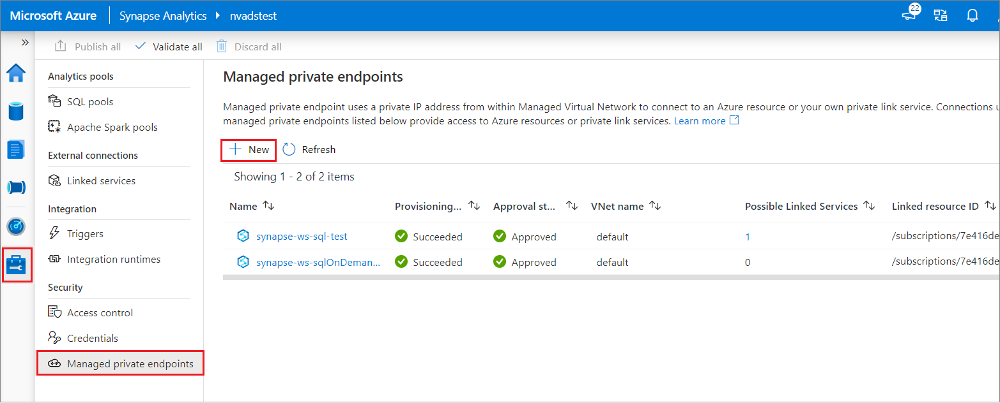
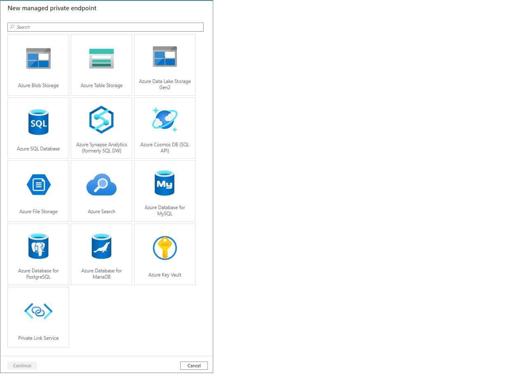
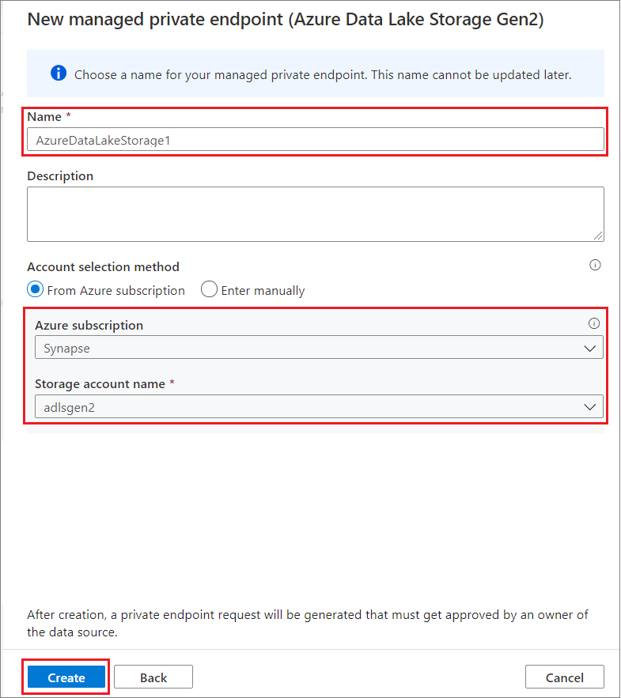
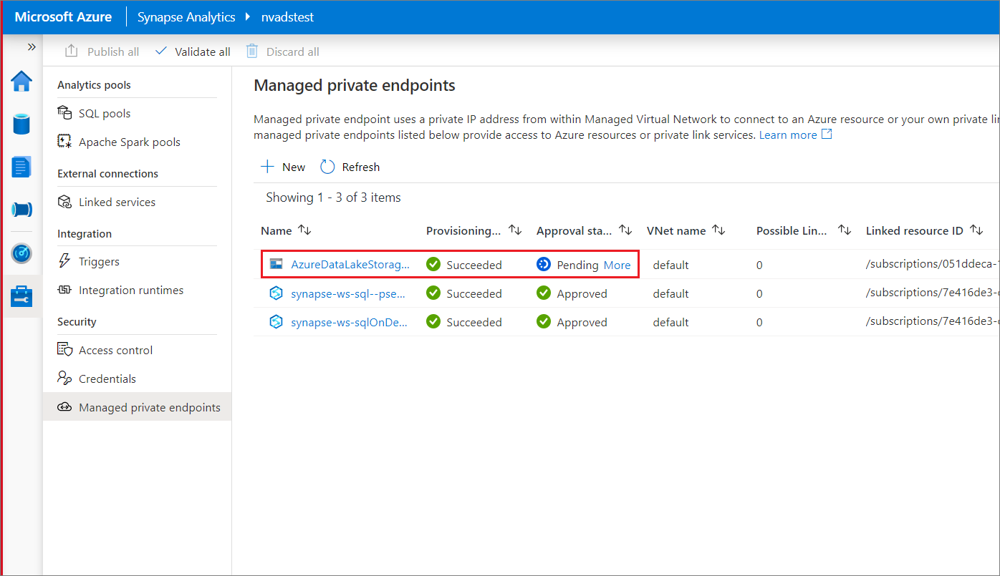

# Create a Managed private endpoint to your data source

This article will teach you how to create a Managed private endpoint to your data source in Azure. See [Managed private endpoints](./synapse-workspace-managed-private-endpoints.md) to learn more.

## Step 1: Open your Azure Synapse workspace in Azure portal

You can create a Managed private endpoint to your data source from Azure Synapse Studio. Select the **Overview** tab in Azure portal and select **Open** on the Open Synapse Studio card in the Getting started section.

## Step 2: Navigate to the Managed Virtual Networks tab in Synapse Studio

In Azure Synapse Studio, select the **Manage** tab from the left navigation. Select **Managed private endpoints** and then select **+ New**.

## Step 3: Select the data source type

Select the data source type. In this case, the target data source is an ADLS Gen2 account. Select **Continue**.

## Step 4: Enter information about the data source

In the next window, enter information about the data source. In this example, we're creating a Managed private endpoint to an ADLS Gen2 account. Enter a **Name** for the Managed private endpoint. Provide an **Azure subscription** and a **Storage account name**. Select **Create**.

## Step 5: Verify that your Managed private endpoint was successfully created

After submitting the request, you'll see its status. To verify the successful creation of your Managed private endpoint was created, check its *Provisioning State*. You may need to wait 1 minute and select **Refresh** to update the provisioning state. You can see that the Managed private endpoint to the ADLS Gen2 account was successfully created.

You can also see that the *Approval State* is *Pending*. The owner of the target resource can approve or deny the private endpoint connection request. If the owner approves the private endpoint connection request, then a private link is established. If denied, then a private link isn't established.

## Next steps

Learn more about [Managed private endpoints](./synapse-workspace-managed-private-endpoints.md)