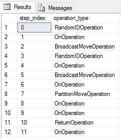
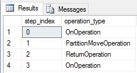

# Design guidance for using replicated tables in Synapse SQL pool

This article gives recommendations for designing replicated tables in your Synapse SQL pool schema. Use these recommendations to improve query performance by reducing data movement and query complexity.

## Prerequisites

This article assumes you are familiar with data distribution and data movement concepts in SQL pool. For more information, see the [architecture](massively-parallel-processing-mpp-architecture.md) article.

As part of table design, understand as much as possible about your data and how the data is queried.  For example, consider these questions:

- How large is the table?
- How often is the table refreshed?
- Do I have fact and dimension tables in a SQL pool?

## What is a replicated table?

A replicated table has a full copy of the table accessible on each Compute node. Replicating a table removes the need to transfer data among Compute nodes before a join or aggregation. Since the table has multiple copies, replicated tables work best when the table size is less than 2 GB compressed. 2 GB is not a hard limit.  If the data is static and does not change, you can replicate larger tables.

The following diagram shows a replicated table that is accessible on each Compute node. In SQL pool, the replicated table is fully copied to a distribution database on each compute node.

:::image type="content" source="./media/design-guidance-for-replicated-tables/replicated-table.png" alt-text="Replicated table" lightbox="./media/design-guidance-for-replicated-tables/replicated-table.png":::

Replicated tables work well for dimension tables in a star schema. Dimension tables are typically joined to fact tables, which are distributed differently than the dimension table.  Dimensions are usually of a size that makes it feasible to store and maintain multiple copies. Dimensions store descriptive data that changes slowly, such as customer name and address, and product details. The slowly changing nature of the data leads to less maintenance of the replicated table.

Consider using a replicated table when:

- The table size on disk is less than 2 GB, regardless of the number of rows. To find the size of a table, you can use the [DBCC PDW_SHOWSPACEUSED](/sql/t-sql/database-console-commands/dbcc-pdw-showspaceused-transact-sql?toc=/azure/synapse-analytics/sql-data-warehouse/toc.json&bc=/azure/synapse-analytics/sql-data-warehouse/breadcrumb/toc.json&view=azure-sqldw-latest&preserve-view=true) command: `DBCC PDW_SHOWSPACEUSED('ReplTableCandidate')`.
- The table is used in joins that would otherwise require data movement. When joining tables that are not distributed on the same column, such as a hash-distributed table to a round-robin table, data movement is required to complete the query.  If one of the tables is small, consider a replicated table. We recommend using replicated tables instead of round-robin tables in most cases. To view data movement operations in query plans, use [sys.dm_pdw_request_steps](/sql/relational-databases/system-dynamic-management-views/sys-dm-pdw-request-steps-transact-sql?toc=/azure/synapse-analytics/sql-data-warehouse/toc.json&bc=/azure/synapse-analytics/sql-data-warehouse/breadcrumb/toc.json&view=azure-sqldw-latest&preserve-view=true).  The BroadcastMoveOperation is the typical data movement operation that can be eliminated by using a replicated table.  

Replicated tables may not yield the best query performance when:

- The table has frequent insert, update, and delete operations. The data manipulation language (DML) operations require a rebuild of the replicated table. Rebuilding frequently can cause slower performance.
- The SQL pool is scaled frequently. Scaling a SQL pool changes the number of Compute nodes, which incurs rebuilding the replicated table.
- The table has a large number of columns, but data operations typically access only a small number of columns. In this scenario, instead of replicating the entire table, it might be more effective to distribute the table, and then create an index on the frequently accessed columns. When a query requires data movement, SQL pool only moves data for the requested columns.

> [!TIP]
> For more guidance on indexing and replicated tables, see the [Cheat sheet for dedicated SQL pool (formerly SQL DW) in Azure Synapse Analytics](cheat-sheet.md#index-your-table).

## Use replicated tables with simple query predicates

Before you choose to distribute or replicate a table, think about the types of queries you plan to run against the table. Whenever possible,

- Use replicated tables for queries with simple query predicates, such as equality or inequality.
- Use distributed tables for queries with complex query predicates, such as LIKE or NOT LIKE.

CPU-intensive queries perform best when the work is distributed across all of the Compute nodes. For example, queries that run computations on each row of a table perform better on distributed tables than replicated tables. Since a replicated table is stored in full on each Compute node, a CPU-intensive query against a replicated table runs against the entire table on every Compute node. The extra computation can slow query performance.

For example, this query has a complex predicate.  It runs faster when the data is in a distributed table instead of a replicated table. In this example, the data can be round-robin distributed.

```sql
SELECT EnglishProductName
FROM DimProduct
WHERE EnglishDescription LIKE '%frame%comfortable%';
```

## Convert existing round-robin tables to replicated tables

If you already have round-robin tables, we recommend converting them to replicated tables if they meet the criteria outlined in this article. Replicated tables improve performance over round-robin tables because they eliminate the need for data movement.  A round-robin table always requires data movement for joins.

This example uses [CTAS](/sql/t-sql/statements/create-table-as-select-azure-sql-data-warehouse?toc=/azure/synapse-analytics/sql-data-warehouse/toc.json&bc=/azure/synapse-analytics/sql-data-warehouse/breadcrumb/toc.json&view=azure-sqldw-latest&preserve-view=true) to change the `DimSalesTerritory` table to a replicated table. This example works regardless of whether `DimSalesTerritory` is hash-distributed or round-robin.

```sql
CREATE TABLE [dbo].[DimSalesTerritory_REPLICATE]
WITH
  (
    HEAP,  
    DISTRIBUTION = REPLICATE  
  )  
AS SELECT * FROM [dbo].[DimSalesTerritory]
OPTION  (LABEL  = 'CTAS : DimSalesTerritory_REPLICATE')

-- Switch table names
RENAME OBJECT [dbo].[DimSalesTerritory] to [DimSalesTerritory_old];
RENAME OBJECT [dbo].[DimSalesTerritory_REPLICATE] TO [DimSalesTerritory];

DROP TABLE [dbo].[DimSalesTerritory_old];
```

### Query performance example for round-robin versus replicated

A replicated table does not require any data movement for joins because the entire table is already present on each Compute node. If the dimension tables are round-robin distributed, a join copies the dimension table in full to each Compute node. To move the data, the query plan contains an operation called BroadcastMoveOperation. This type of data movement operation slows query performance and is eliminated by using replicated tables. To view query plan steps, use the [sys.dm_pdw_request_steps](/sql/relational-databases/system-dynamic-management-views/sys-dm-pdw-request-steps-transact-sql?toc=/azure/synapse-analytics/sql-data-warehouse/toc.json&bc=/azure/synapse-analytics/sql-data-warehouse/breadcrumb/toc.json&view=azure-sqldw-latest&preserve-view=true) system catalog view.  

For example, in following query against the `AdventureWorks` schema, the `FactInternetSales` table is hash-distributed. The `DimDate` and `DimSalesTerritory` tables are smaller dimension tables. This query returns the total sales in North America for fiscal year 2004:

```sql
SELECT [TotalSalesAmount] = SUM(SalesAmount)
FROM dbo.FactInternetSales s
INNER JOIN dbo.DimDate d
  ON d.DateKey = s.OrderDateKey
INNER JOIN dbo.DimSalesTerritory t
  ON t.SalesTerritoryKey = s.SalesTerritoryKey
WHERE d.FiscalYear = 2004
  AND t.SalesTerritoryGroup = 'North America'
```

We re-created `DimDate` and `DimSalesTerritory` as round-robin tables. As a result, the query showed the following query plan, which has multiple broadcast move operations:



We re-created `DimDate` and `DimSalesTerritory` as replicated tables, and ran the query again. The resulting query plan is much shorter and does not have any broadcast moves.



## Performance considerations for modifying replicated tables

SQL pool implements a replicated table by maintaining a master version of the table. It copies the master version to the first distribution database on each Compute node. When there is a change, the master version is updated first, then the tables on each Compute node are rebuilt. A rebuild of a replicated table includes copying the table to each Compute node and then building the indexes.  For example, a replicated table on a DW2000c has five copies of the data.  A master copy and a full copy on each Compute node.  All data is stored in distribution databases. SQL pool uses this model to support faster data modification statements and flexible scaling operations.

Asynchronous rebuilds are triggered by the first query against the replicated table after:

- Data is loaded or modified
- The Synapse SQL instance is scaled to a different level
- Table definition is updated

Rebuilds are not required after:

- Pause operation
- Resume operation

The rebuild does not happen immediately after data is modified. Instead, the rebuild is triggered the first time a query selects from the table.  The query that triggered the rebuild reads immediately from the master version of the table while the data is asynchronously copied to each Compute node. Until the data copy is complete, subsequent queries will continue to use the master version of the table.  If any activity happens against the replicated table that forces another rebuild, the data copy is invalidated and the next select statement will trigger data to be copied again.

### Use indexes conservatively

Standard indexing practices apply to replicated tables. SQL pool rebuilds each replicated table index as part of the rebuild. Only use indexes when the performance gain outweighs the cost of rebuilding the indexes.

### Batch data load

When loading data into replicated tables, try to minimize rebuilds by batching loads together. Perform all the batched loads before running select statements.

For example, this load pattern loads data from four sources and invokes four rebuilds.

- Load from source 1.
- Select statement triggers rebuild 1.
- Load from source 2.
- Select statement triggers rebuild 2.
- Load from source 3.
- Select statement triggers rebuild 3.
- Load from source 4.
- Select statement triggers rebuild 4.

For example, this load pattern loads data from four sources, but only invokes one rebuild.

- Load from source 1.
- Load from source 2.
- Load from source 3.
- Load from source 4.
- Select statement triggers rebuild.

### Rebuild a replicated table after a batch load

To ensure consistent query execution times, consider forcing the build of the replicated tables after a batch load. Otherwise, the first query will still use data movement to complete the query.

The 'Build Replicated Table Cache' operation can execute up to two operations simultaneously. For example, if you attempt to rebuild the cache for five tables, the system will utilize a staticrc20 (which cannot be modified) to concurrently build two tables at the time. Therefore, it is recommended to avoid using large replicated tables exceeding 2 GB, as this may slow down the cache rebuild across the nodes and increase the overall time.

This query uses the [sys.pdw_replicated_table_cache_state](/sql/relational-databases/system-catalog-views/sys-pdw-replicated-table-cache-state-transact-sql?toc=/azure/synapse-analytics/sql-data-warehouse/toc.json&bc=/azure/synapse-analytics/sql-data-warehouse/breadcrumb/toc.json&view=azure-sqldw-latest&preserve-view=true) DMV to list the replicated tables that have been modified, but not rebuilt.

```sql
SELECT SchemaName = SCHEMA_NAME(t.schema_id)
 , [ReplicatedTable] = t.[name]
 , [RebuildStatement] = 'SELECT TOP 1 * FROM ' + '[' + SCHEMA_NAME(t.schema_id) + '].[' + t.[name] +']'
FROM sys.tables t 
JOIN sys.pdw_replicated_table_cache_state c 
  ON c.object_id = t.object_id
JOIN sys.pdw_table_distribution_properties p
  ON p.object_id = t.object_id
WHERE c.[state] = 'NotReady'
AND p.[distribution_policy_desc] = 'REPLICATE'
```

To trigger a rebuild, run the following statement on each table in the preceding output.

```sql
SELECT TOP 1 * FROM [ReplicatedTable]
```

> [!NOTE]
> If you are planning to rebuild the statistics of the uncached replicated table, make sure to update the statistics before triggering the cache. Updating statistics will invalidate the cache, so the sequence is important.
> 
> Example: Start with `UPDATE STATISTICS`, then trigger the rebuild of the cache. In the following examples, the correct sample updates the statistics then triggers the rebuild of the cache.
> 
> ```sql
> -- Incorrect sequence. Ensure that the rebuild operation is the last statement within the batch.
> BEGIN
> SELECT TOP 1 * FROM [ReplicatedTable]
> 
> UPDATE STATISTICS [ReplicatedTable]
> END
> ```
>
> ```sql
> -- Correct sequence. Ensure that the rebuild operation is the last statement within the batch.
> BEGIN
> UPDATE STATISTICS [ReplicatedTable]
>
> SELECT TOP 1 * FROM [ReplicatedTable]
> END
> ```

To monitor the rebuild process, you can use [sys.dm_pdw_exec_requests](/sql/relational-databases/system-dynamic-management-views/sys-dm-pdw-exec-requests-transact-sql?view=azure-sqldw-latest&preserve-view=true), where the `command` will start with 'BuildReplicatedTableCache'. For example:

```sql
-- Monitor Build Replicated Cache
SELECT *
FROM sys.dm_pdw_exec_requests
WHERE command like 'BuildReplicatedTableCache%'
```

> [!TIP]
> [Table size queries](/azure/synapse-analytics/sql-data-warehouse/sql-data-warehouse-tables-overview#table-size-queries) can be used to verify which table(s) have a replicated distribution policy and which are larger than 2 GB.

## Next steps

To create a replicated table, use one of these statements:

- [CREATE TABLE (SQL pool)](/sql/t-sql/statements/create-table-azure-sql-data-warehouse?toc=/azure/synapse-analytics/sql-data-warehouse/toc.json&bc=/azure/synapse-analytics/sql-data-warehouse/breadcrumb/toc.json&view=azure-sqldw-latest&preserve-view=true)
- [CREATE TABLE AS SELECT (SQL pool)](/sql/t-sql/statements/create-table-as-select-azure-sql-data-warehouse?toc=/azure/synapse-analytics/sql-data-warehouse/toc.json&bc=/azure/synapse-analytics/sql-data-warehouse/breadcrumb/toc.json&view=azure-sqldw-latest&preserve-view=true)

For an overview of distributed tables, see [distributed tables](sql-data-warehouse-tables-distribute.md).
