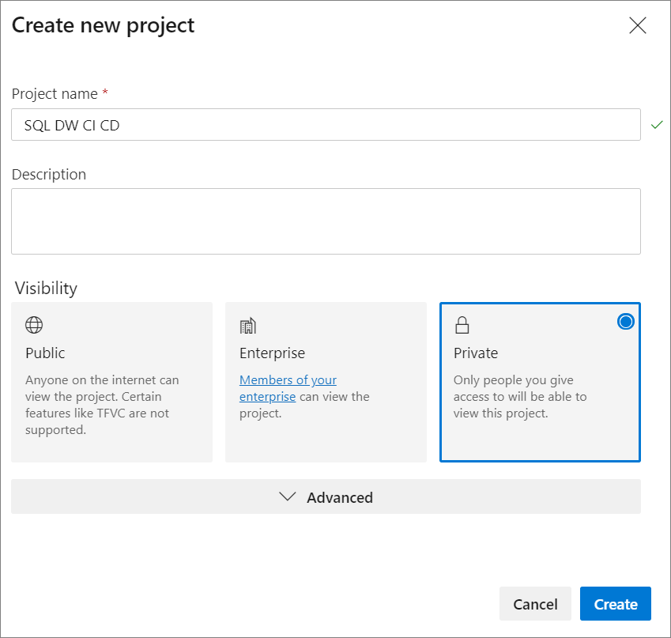
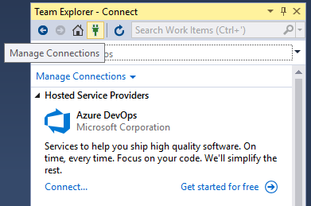
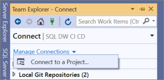
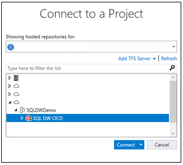
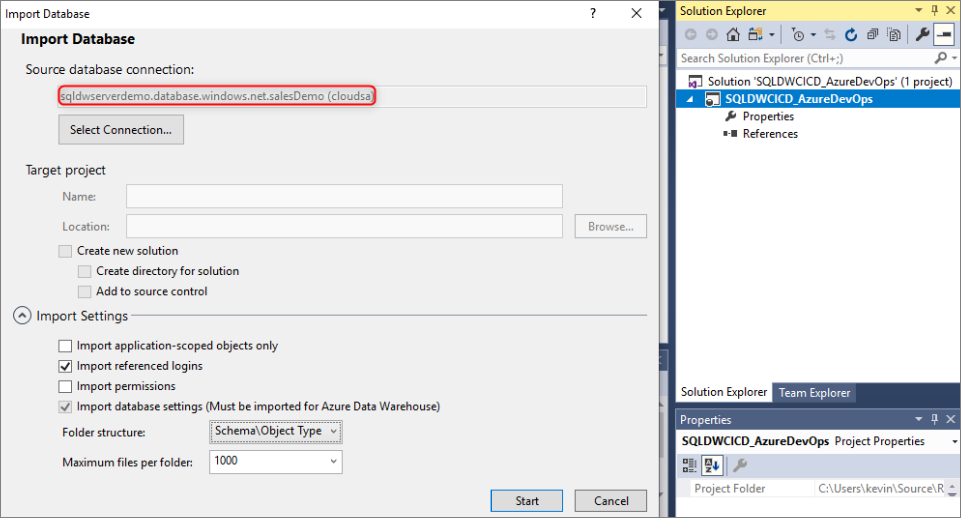
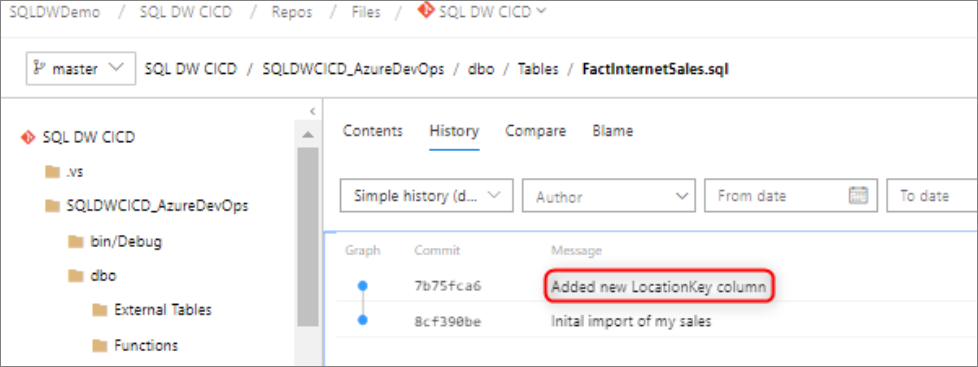

# Source Control Integration for dedicated SQL pool in Azure Synapse Analytics

This tutorial outlines how to integrate your SQL Server Data Tools (SSDT) database project with source control.  Source control integration is the first step in building your continuous integration and deployment pipeline with the dedicated SQL pool resource in Azure Synapse Analytics.

## Before you begin

- Sign up for an [Azure DevOps organization](https://azure.microsoft.com/services/devops/)
- Go through the [Create and Connect](create-data-warehouse-portal.md) tutorial
- [Install Visual Studio 2019](https://visualstudio.microsoft.com/vs/older-downloads/)

## Set up and connect to Azure DevOps

1. In your Azure DevOps Organization, create a project that will host your SSDT database project via an Azure Repos repository.

   

2. Open Visual Studio and connect to your Azure DevOps organization and project from step one by selecting **Manage Connection**.

   

3. Connect to your project by selecting **Manage Connections**, then **Connect to a project**.
 
    

4. Find the project you created in step one, select **Connect**.
 
    

3. Clone your Azure DevOps repository from your project to your local machine.

   

For more information about connecting projects using Visual Studio, see the [Connect to projects in Team Explorer](/visualstudio/ide/connect-team-project?view=vs-2019&preserve-view=true). For guidance on cloning a repo using Visual Studio, review the [Clone an exiting Git repo](/azure/devops/repos/git/clone?tabs=visual-studio) article. 

## Create and connect your project

1. In Visual Studio, create a new SQL Server Database Project with both a directory and local Git repository in your **local cloned repository**.

     

2. Right-click on your empty sqlproject and import your data warehouse into the database project.

     

3. In Team Explorer in Visual Studio, commit your changes to your local Git repository.

     

4. Now that you have the changes committed locally in the cloned repository, sync and push your changes to your Azure Repos repository in your Azure DevOps project.

   

     

## Validation

1. Verify changes have been pushed to your Azure Repos by updating a  table column in your database project from Visual Studio SQL Server Data Tools (SSDT).

   

2. Commit and push the change from your local repository to your Azure Repo.

   

3. Verify the change has been pushed in your Azure Repos repository.

   

4. (**Optional**) Use Schema Compare and update the changes to your target dedicated SQL pool using SSDT to ensure the object definitions in your Azure Repos repository and local repository reflect your dedicated SQL pool.

## Next steps

- [Developing for dedicated SQL pool](sql-data-warehouse-overview-develop.md)
