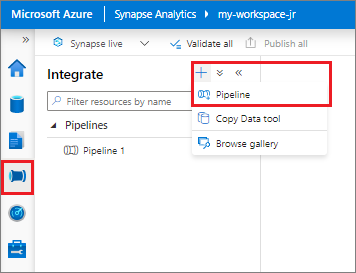
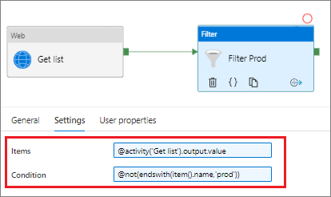
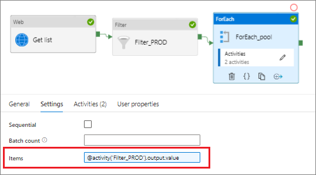
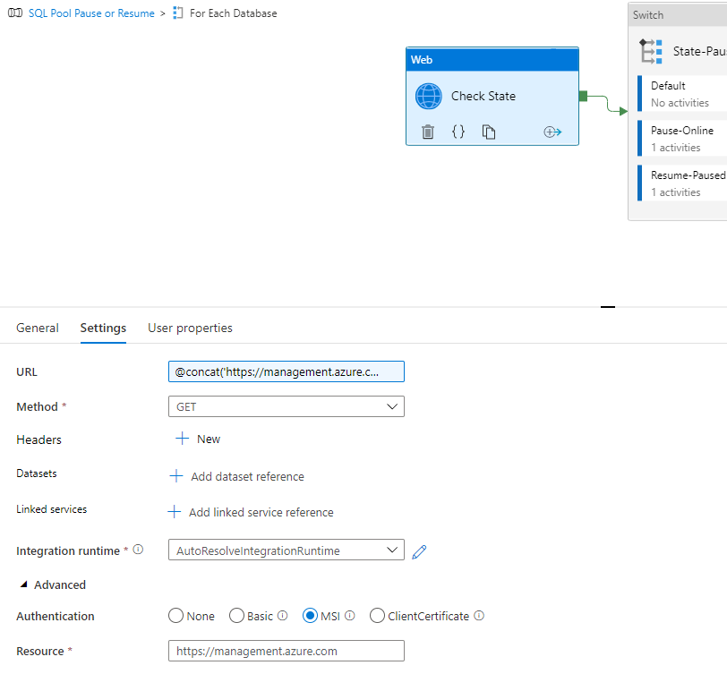
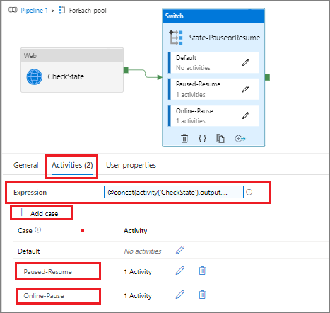
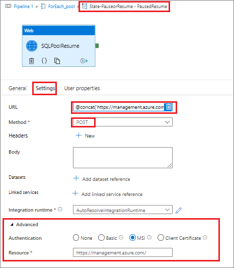
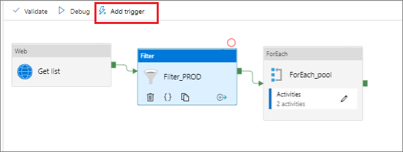

# Pause and resume dedicated SQL pools with Synapse Pipelines

Pause and resume for dedicated SQL pools can be automated using Synapse Pipelines in Azure Synapse Analytics. Pause and resume can be used to save costs for a dedicated SQL pool. This solution can easily be included in an existing data orchestration process. 

The following steps will guide you through setting up automated pause and resume.

1. Create a pipeline.
1. Set up parameters in your pipeline.
1. Identify the list of dedicated SQL pools in your Azure Synapse workspace.
1. Filter any dedicated SQL pools that you don't want to pause or resume from the list. 
1. Loop over each dedicated SQL pool and:
    1. Check the state of the dedicated SQL pool.
    1. Evaluate the state of the dedicated SQL pool.
    1. Pause or resume the dedicated SQL pool.

These steps are laid out in a simple pipeline in Azure Synapse:


Depending upon the nature of your environment, the whole process described here may not apply, and you may just want to choose the appropriate steps. The process described here can be used to pause or resume all instances in a development, test, or PoC environment. For a production environment, you're more likely to schedule pause or resume on an instance by instance basis so will only need Steps 5a through 5c.

The steps above use the REST APIs for Azure Synapse and Azure SQL:

- [Dedicated SQL pool operations](/rest/api/synapse/sqlpools)
 
- [Azure SQL Database REST API](/rest/api/sql)

Synapse Pipelines allow for the automation of pause and resume, but you can execute these commands on-demand via the tool or application of your choice.

## Prerequisites

- An existing [Azure Synapse workspace](../get-started-create-workspace.md)
- At least one [dedicated SQL pool](../get-started-analyze-sql-pool.md)
- Your workspace must be assigned the Azure contributor role to the affected Dedicated SQL Pool(s). See [Grant Synapse administrators the Azure Contributor role on the workspace](../security/how-to-set-up-access-control.md#step-5-grant-synapse-administrators-an-azure-contributor-role-for-the-workspace).

## Step 1: Create a pipeline in Synapse Studio.
1. Navigate to your workspace and open Synapse Studio. 
1. Select the **Integrate** icon, then select the **+** sign to create a new pipeline. 
1. Name your pipeline PauseResume.

     

## Step 2: Create pipeline parameters 

The pipeline you'll create will be parameter driven. Parameters allow you to create a generic pipeline that you can use across multiple subscriptions, resource groups, or dedicated SQL pools. Select the **Parameters** tab near the bottom of the pipeline screen. Select **+New** to create each of the following parameters:

    
|Name  |Type  |Default value  |Description|
|---------|---------|---------|-----------|
|ResourceGroup    |string        |Synapse          |Name of the resource group for your dedicated SQL pools|
|SubscriptionID   |string        |`<SubscriptionID>` |Subscription ID for your resource group|
|WorkspaceName    |string        |Synapse          |Name of your workspace|
|SQLPoolName      |string        |SQLPool1         |Name of your dedicated SQL pool|
|PauseorResume    |string        |Pause            |The state wanted at the end of the pipeline run|


## Step 3: Create list of dedicated SQL pools
 
 Set up a **Web** activity, you'll use this activity to create
 the list of dedicated SQL pools by calling the dedicated SQL pools - List By Server REST API request. The output is a JSON string that contains a list of the dedicated SQL pools in your workspace. The JSON string is passed to the next activity.
1. Under **Activities** > **General** drag a **Web** activity to the pipeline canvas as the first stage of your pipeline.  
1. In the **General** tab, name this stage GET List. 
1. Select the **Settings** tab then click in the **URL** entry space, then select **Add dynamic content**. Copy and paste the GET request that has been parameterized using the @concat string function  below into the dynamic content box. Select **Finish**.
The following code is a simple Get request:

    ```HTTP
    GET https://management.azure.com/subscriptions/{subscription-id}/resourceGroups/{resource-group-name}/providers/Microsoft.Synapse/workspaces/{workspace-name}/sqlPools?api-version=2019-06-01-preview
    ```
    
    GET request that has been parameterized using the @concat string function:
    
    ```HTTP
    @concat('https://management.azure.com/subscriptions/',pipeline().parameters.SubscriptionID,'/resourceGroups/',pipeline().parameters.ResourceGroup,'/providers/Microsoft.Synapse/workspaces/',pipeline().parameters.WorkspaceName,'/sqlPools?api-version=2019-06-01-preview')
    ``` 
1. Select the drop-down for **Method** and select **Get**.  
1. Select **Advanced** to expand the content. Select **MSI** as the Authentication type. For Resource enter `https://management.azure.com/` 
    > [!IMPORTANT]
    > For all of the Web Activities / REST API Web calls, you need to ensure that Synapse Pipeline is authenticated against dedicated SQL pool. [Managed Identity](../../data-factory/control-flow-web-activity.md#managed-identity) is required to run these REST API calls. 
        
        
    


## Step 4: Filter dedicated SQL pools
Remove dedicated SQL pools that you don't want to pause or resume. Use a filter activity that filters the values passed from the Get list activity.  In this example, we're extracting the records from the array that don't have "prod" in the name. Apply other conditions as needed. For example, filter on the sku/name of the Synapse workspace to ensure only valid dedicated SQL pools are identified.
1. Select and drag the **Filter** activity under **Iteration & conditionals** to the pipeline canvas.    
    
1. Connect the Get List Web activity to the Filter activity. Select the green tab on the Web activity and drag it to the Filter box.
1. Enter `@activity('Get list').output.value` for **Items** where GET List is the name of the preceding Web activity
1. Enter `@not(endswith(item().name,'prod'))` for **Condition**. The remaining records in the array are then passed to the next activity.

## Step 5: Create a ForEach loop
Create a ForEach activity to loop over each dedicated SQL pool. 
1. Select and drag the **ForEach** activity under **Iteration & conditionals** to the pipeline canvas.
1. On the **General** tab name the activity, we have used 'ForEach_pool'. 
1. On the Settings tab, select the **Items** input and select **Add dynamic content**. Scroll to the **Activity outputs** and select the output from your filter activity. Add `.value` to the activity. the value should be similar to `@activity('Filter_PROD').output.value`. Select **finish**.    
    
1. Select the **Activities** tab and select the edit pencil to open the ForEach loop canvas. 

## Step 5a: Check the state of the dedicated SQL pools    
Checking the state of the dedicated SQL pool requires a Web Activity, similar to step 1. This activity calls the [Check dedicated SQL pool state REST API for Azure Synapse](../sql-data-warehouse/sql-data-warehouse-manage-compute-rest-api.md#check-database-state). 
1. Select and drag a **Web** activity under **General** to the pipeline canvas.    
2. In the **General** tab, name this stage CheckState. 
3. Select the **Settings** tab.     
4. Click in the **URL** entry space, then select **Add dynamic content**. Copy and paste the GET request that has been parameterized using the @concat string function from below into the dynamic content box. Select **Finish**. Checking the state again uses a Get request using the following call:

    ```HTTP
    GET https://management.azure.com/subscriptions/{subscription-id}/resourceGroups/{resource-group-name}/providers/Microsoft.Synapse/workspaces/{workspace-name}/sqlPools/{database-name}?api-version=2019-06-01-preview HTTP/1.1
    ```
    
    The parameterize GET request using the @concat string function:
    
    ```HTTP
    @concat('https://management.azure.com/subscriptions/',pipeline().parameters.SubscriptionID,'/resourceGroups/',pipeline().parameters.ResourceGroup,'/providers/Microsoft.Synapse/workspaces/',pipeline().parameters.WorkspaceName,'/sqlPools/',item().name,'?api-version=2019-06-01-preview')
    ```
    
    In this case, we are using item().name, which is the name of the dedicated SQL pool from Step 1 that was passed to this activity from the ForEach loop. If you are using a pipeline to control a single dedicated SQL pool, you can embed the name of your dedicated SQL pool here, or use a parameter from the pipeline. For example, you could use pipeline().parameters.SQLPoolName.

    The output is a JSON string that contains details of the dedicated SQL pool, including its status (in properties.status). The JSON string is passed to the next activity. 
1. Select the drop-down for **Method** and select **Get**  Select **Advanced** to expand the content. Select **MSI** as the Authentication type. For Resource enter `https://management.azure.com/` 


    

    
## Step 5b: Evaluate the state of the dedicated SQL pools
Evaluate the desired state, Pause or Resume, and the current status, Online, or Paused, and then initiate Pause or Resume as needed.

1. Select and drag a **Switch** activity, under **Iteration & conditionals**, to the pipeline canvas.    
1. Connect the **Switch** activity to the **CheckState** activity. Select the green tab on the Web activity and drag it to the Switch box.  
1. In the **General** tab, name this stage State-PauseOrResume. 

    Based on the desired state and the current status, only the following two combinations will require a change in state: Paused->Resume or Online->Pause. 

1. On the **Activities** tab, copy the code below into the **Expression**.

    ```HTTP
    @concat(activity('CheckState').output.properties.status,'-',pipeline().parameters.PauseOrResume)
    ```
    
    Where Check State is the name of the preceding Web activity with output.properties.status defining the current status and pipeline().parameters.PauseOrResume indicates the desired state.
    
    The check condition does a check of the desired state and the current status. If the desired state is Resume and the current status is Paused, a Resume Activity is invoked within the Paused-Resume Case. If the desired state is Pause and the current status is Online, a Pause Activity is invoked with the Online-Pause Case. Any other cases, such as a desired state of Pause and a current status of Paused, or a desired state of Resume and a current status of Online, would require no action and be handled by the Default case, which has no activities.
1. On the Activities tab, select **+ Add Case**.  Add the cases `Paused-Resume` and `Online-Pause`. 
    

### Step 5c: Pause or Resume dedicated SQL pools     

The final and only relevant step for some requirements, is to initiate the pause or resume of your dedicated SQL pool. This step again uses a Web activity, calling the [Pause or Resume compute REST API for Azure Synapse](../sql-data-warehouse/sql-data-warehouse-manage-compute-rest-api.md#pause-compute). 
1. Select the activity edit pencil and add a **Web** activity to the State-PauseorResume canvas. 
1. Select the **Settings** tab then click in the **URL** entry space, then select **Add dynamic content**. Copy and paste the POST request that has been parameterized using the @concat string function below into the dynamic content box. Select **Finish**. 
1. Select the drop-down for **Method** and select **POST**.
1. In the Body section type "Pause and Resume"
1. Select **Advanced** to expand the content. Select **MSI** as the Authentication type. For Resource enter `https://management.azure.com/` 
1. Add a second activity for the resume functionality using the parameterized code below.

    
    
    
    The example here is to resume a dedicated SQL pool, invoking a POST request using the following call:
    
    ```HTTP
    POST https://management.azure.com/subscriptions/{subscription-id}/resourceGroups/{resource-group-name}/providers/Microsoft.Synapse/workspaces/{workspace-name}/sqlPools/{database-name}/resume?api-version=2019-06-01-preview HTTP/1.1
    ```
    
    You can parameterize the POST statement from above using the @concat string function:
    
    ```HTTP
    @concat('https://management.azure.com/subscriptions/',pipeline().parameters.SubscriptionID,'/resourceGroups/',pipeline().parameters.ResourceGroup,'/providers/Microsoft.Synapse/workspaces/',pipeline().parameters.WorkspaceName,'/sqlPools/',activity('CheckState').output.name,'/resume?api-version=2019-06-01-preview')
    ```
    
    In this case, we are using the activity 'Check State'.output.name with the names of the dedicated SQL pools from Step 3a that were passed to this activity through the Switch Condition. If you are using a single activity against a single database, you could embed the name of your dedicated SQL pool here, or use a parameter from the pipeline. For example, you could use the pipeline().parameters.DatabaseName.
    
    The POST request to pause a dedicated SQL pool is:
    
    ```HTTP
    POST https://management.azure.com/subscriptions/{subscription-id}/resourceGroups/{resource-group-name}/providers/Microsoft.Synapse/workspaces/{workspace-name}/sqlPools/{database-name}/pause?api-version=2019-06-01-preview HTTP/1.1    
    ```    
    
    The POST request can be parameterized using the @concat string function as shown:
    
    ```HTTP
    @concat('https://management.azure.com/subscriptions/',pipeline().parameters.SubscriptionID,'/resourceGroups/',pipeline().parameters.ResourceGroup,'/providers/Microsoft.Synapse/workspaces/',pipeline().parameters.WorkspaceName,'/sqlPools/',activity('CheckState').output.name,'/pause?api-version=2019-06-01-preview')
    ```

## Pipeline run output

When the full pipeline is run, you will see the output listed below. You can run your pipeline by selecting **Debug** mode or by selecting **add trigger**. For the pipeline results below, the pipeline parameter named "ResourceGroup" was set to a single resource group that had two Synapse Workspaces. One was named testprod and was filtered out, the second was named test1. The test1 dedicated SQL pool was paused, so the job initiated a resume.


## Save your pipeline

To save your pipeline, select **Publish all** above your pipeline.

## Schedule your pause or resume pipeline to run

To schedule your pipeline, select **Add trigger** at the top of your pipeline. Follow the screens to schedule your pipeline to run at a specified time.



## Next steps

Further details on Managed Identity for Azure Synapse, and how Managed Identity is added to your dedicated SQL pool can be found here:

[Azure Synapse workspace managed identity](../../data-factory/data-factory-service-identity.md?context=/azure/synapse-analytics/context/context&tabs=synapse-analytics)

[Grant permissions to workspace managed identity](../security/how-to-grant-workspace-managed-identity-permissions.md)
