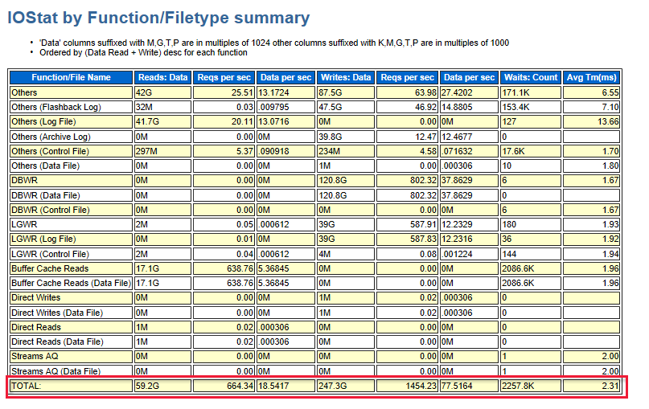
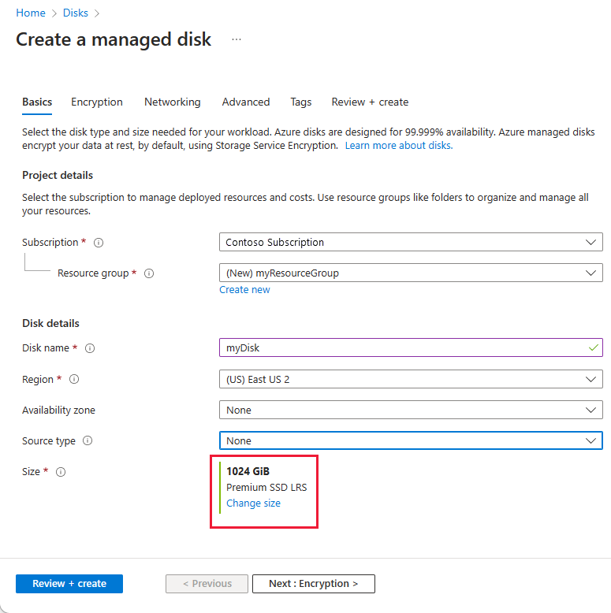
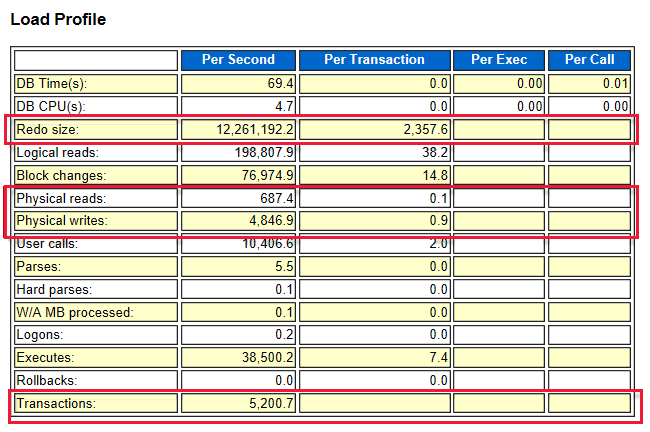

# Design and implement an Oracle database in Azure

**Applies to:** :heavy_check_mark: Linux VMs 

## Assumptions

- You're planning to migrate an Oracle database from on-premises to Azure.
- You have the [Diagnostics Pack](https://docs.oracle.com/cd/E11857_01/license.111/e11987/database_management.htm) or the [Automatic Workload Repository](https://www.oracle.com/technetwork/database/manageability/info/other-manageability/wp-self-managing-database18c-4412450.pdf) for the Oracle Database you're looking to migrate
- You have an understanding of the various metrics in Oracle.
- You have a baseline understanding of application performance and platform utilization.

## Goals

- Understand how to optimize your Oracle deployment in Azure.
- Explore performance tuning options for an Oracle database in an Azure environment.
- Have clear expectations between the limits of physical tuning through architecture and advantages or logical tuning of database code, (SQL) and the overall database design.

## The differences between an on-premises and Azure implementation 

Following are some important things to keep in mind when you're migrating on-premises applications to Azure. 

One important difference is that in an Azure implementation, resources such as VMs, disks, and virtual networks are shared among other clients. In addition, resources can be throttled based on the requirements. Instead of focusing on avoiding failing (MTBF), Azure is more focused on surviving the failure (MTTR).

The following table lists some of the differences between an on-premises implementation and an Azure implementation of an Oracle database.


|  | On-premises implementation | Azure implementation |
| --- | --- | --- |
| **Networking** |LAN/WAN  |SDN (software-defined networking)|
| **Security group** |IP/port restriction tools |[Network Security Group (NSG)](https://azure.microsoft.com/blog/network-security-groups) |
| **Resilience** |MTBF (mean time between failures) |MTTR (mean time to recovery)|
| **Planned maintenance** |Patching/upgrades|[Availability sets](/previous-versions/azure/virtual-machines/windows/infrastructure-example) (patching/upgrades managed by Azure) |
| **Resource** |Dedicated  |Shared with other clients|
| **Regions** |Datacenters |[Region pairs](../../regions.md#region-pairs)|
| **Storage** |SAN/physical disks |[Azure-managed storage](https://azure.microsoft.com/pricing/details/managed-disks/?v=17.23h)|
| **Scale** |Vertical scale |Horizontal scale|


### Requirements

- Determine the real CPU usage, as Oracle is licensed by core, sizing the vCPU needs can be an essential exercise to cost savings. 
- Determine the database size, backup storage, and growth rate.
- Determine the IO requirements, which you can estimate based on Oracle Statspack and AWR reports or from OS level storage monitoring tools.

## Configuration options

There are four potential areas that you can tune to improve performance in an Azure environment:

- Virtual machine size
- Network throughput
- Disk types and configurations
- Disk cache settings

### Generate an AWR report

If you have an existing an Oracle Enterprise Edition database and are planning to migrate to Azure, you have several options. If you have the [Diagnostics Pack](https://www.oracle.com/technetwork/oem/pdf/511880.pdf) for your Oracle instances, you can run the Oracle AWR report to get the metrics (IOPS, Mbps, GiBs, and so on). For those databases without the Diagnostics Pack license or for a Standard Edition database, the same important metrics can be collected with a Statspack report after manual snapshots have been collected.  The main difference between these two reporting methods is that AWR is automatically collected and provides more information about the database than it's predecessor reporting option of Statspack.

You might consider running your AWR report during both regular and peak workloads, so you can compare. To collect the more accurate workload, consider an extended window report of one week, vs. a 24-hr run, and realize that AWR does provide averages as part of its calculations in the report.  For a datacenter migration, we recommend gathering reports for sizing on the production systems and estimate remaining database copies used for user testing, test, development, etc. by percentages (UAT equal to production, test, and development 50% of production sizing, etc.)

By default, the AWR repository retains 8 days of data and takes snapshots on hourly intervals.  To run an AWR report from the command line, the following can be performed from a terminal:

```bash
$ sqlplus / as sysdba
SQL> @$ORACLE_HOME/rdbms/admin/awrrpt.sql;
```

### Key metrics

The report will prompt for the following information:
- Report type: HTML or TEXT, (HTML in 12.1 and provides additional information than the TEXT format.)
- The number of days of snapshots to display, (for one hour intervals, a one week report would be a 168 different in snapshot IDs)
- The beginning SnapshotID for the report window.
- The ending SnapshotId for the report window.
- The name of the report to be created by the AWR script.

If running the AWR on a Real Application Cluster, (RAC)  the command line report is the awrgrpt.sql instead of awrrpt.sql.  The "g" report will create a report for all nodes in the RAC database in a single report vs. having to run one on each RAC node.

Following are the metrics that you can obtain from the AWR report:

- Database Name, Instance Name and Host Name
- Database Version, (supportability by Oracle)
- CPU/Cores
- SGA/PGA, (and advisors to let you know if undersized)
- Total memory in GB
- CPU % Busy
- DB CPUs
- IOPs (read/write)
- MBPs (read/write)
- Network throughput
- Network latency rate (low/high)
- Top Wait Events 
- Parameter settings for Database
- Is database RAC, Exadata, using advanced features or configurations

### Virtual machine size

#### 1. Estimate VM size based on CPU, memory, and I/O usage from the AWR report

One thing you might look at is the top five timed foreground events that indicate where the system bottlenecks are.

For example, in the following diagram, the log file sync is at the top. It indicates the number of waits that are required before the LGWR writes the log buffer to the redo log file. These results indicate that better performing storage or disks are required. In addition, the diagram also shows the number of CPU (cores) and the amount of memory.


The following diagram shows the total I/O of read and write. There were 59 GB read and 247.3 GB written during the time of the report.



#### 2. Choose a VM

Based on the information that you collected from the AWR report, the next step is to choose a VM of a similar size that meets your requirements. You can find a list of available VMs in the article [Memory optimized](../../sizes-memory.md).

#### 3. Fine-tune the VM sizing with a similar VM series based on the ACU

After you've chosen the VM, pay attention to the ACU for the VM. You might choose a different VM based on the ACU value that better suits your requirements. For more information, see [Azure compute unit](../../acu.md).


### Network throughput

The following diagram shows the relation between throughput and IOPS:


The total network throughput is estimated based on the following information:
- SQL*Net traffic
- MBps x number of servers (outbound stream such as Oracle Data Guard)
- Other factors, such as application replication


Based on your network bandwidth requirements, there are various gateway types for you to choose from. These include basic, VpnGw, and Azure ExpressRoute. For more information, see the [VPN gateway pricing page](https://azure.microsoft.com/pricing/details/vpn-gateway/?v=17.23h).

**Recommendations**

- Network latency is higher compared to an on-premises deployment. Reducing network round trips can greatly improve performance.
- To reduce round-trips, consolidate applications that have high transactions or “chatty” apps on the same virtual machine.
- Use Virtual Machines with [Accelerated Networking](../../../virtual-network/create-vm-accelerated-networking-cli.md) for better network performance.
- For certain Linux distributions, consider enabling [TRIM/UNMAP support](/previous-versions/azure/virtual-machines/linux/configure-lvm#trimunmap-support).
- Install [Oracle Enterprise Manager](https://www.oracle.com/technetwork/oem/enterprise-manager/overview/index.html) on a separate Virtual Machine.
- Huge pages are not enabled on linux by default. Consider enabling huge pages and set `use_large_pages = ONLY` on the Oracle DB. This may help increase performance. For more information, see [USE_LARGE_PAGES](https://docs.oracle.com/en/database/oracle/oracle-database/12.2/refrn/USE_LARGE_PAGES.html#GUID-1B0F4D27-8222-439E-A01D-E50758C88390).

### Disk types and configurations

- *Default OS disks*: These disk types offer persistent data and caching. They are optimized for OS access at startup, and aren't designed for either transactional or data warehouse (analytical) workloads.

- *Managed disks*: Azure manages the storage accounts that you use for your VM disks. You specify the disk type (Most often premium SSD for Oracle workloads) and the size of the disk that you need. Azure creates and manages the disk for you.  Premium SSD managed disk is only available for memory-optimized and specifically designed VM series. After you choose a particular VM size, the menu shows only the available premium storage SKUs that are based on that VM size.



After you configure your storage on a VM, you might want to load test the disks before creating a database. Knowing the I/O rate in terms of both latency and throughput can help you determine if the VMs support the expected throughput with latency targets.

There are a number of tools for application load testing, such as Oracle Orion, Sysbench, SLOB and Fio.

Run the load test again after you've deployed an Oracle database. Start your regular and peak workloads, and the results show you the baseline of your environment.  Be realistic in the workload test-  it doesn't make sense to run a workload that is nothing like what you will run on the VM in reality.

As Oracle is an IO intensive database for many, it's quite important to size the storage based on the IOPS rate rather than the storage size. For example, if the required IOPS is 5,000, but you only need 200 GB, you might still get the P30 class premium disk even though it comes with more than 200 GB of storage.

The IOPS rate can be obtained from the AWR report. It's determined by the redo log, physical reads, and writes rate.  Always verify the VM series chosen has the ability to handle the IO demand of the workload, too.  If the VM has a lower IO limit than the storage, the limit max will be set by the VM.



For example, the redo size is 12,200,000 bytes per second, which is equal to 11.63 MBPs.
The IOPS is 12,200,000 / 2,358 = 5,174.

After you have a clear picture of the I/O requirements, you can choose a combination of drives that are best suited to meet those requirements.

**Recommendations**

- For data tablespace, spread the I/O workload across a number of disks by using managed storage or Oracle ASM.
- Use Oracle advanced Compression to reduce I/O (for both data and indexes).
- Separate redo logs, Temp and Undo tablespaces on separate data disks.
- Don't put any application files on default OS disks (/dev/sda). These disks aren't optimized for fast VM boot times, and they might not provide good performance for your application.
- When using M-Series VMs on Premium storage, enable [Write Accelerator](../../how-to-enable-write-accelerator.md) on redo logs disk.
- Consider moving redo logs with high latency to ultra disk.

### Disk cache settings

There are three options for host caching but for an Oracle database, only ReadOnly caching is recommended for a database workload.  ReadWrite can introduce significant vulnerabilities to a datafile, where the goal of a database write is to record it to the datafile, not cache the information.

Unlike a file system or application, for a database, the recommendation for host caching is *ReadOnly*: All requests are cached for future reads. All writes continue to be written to disk.

**Recommendations**

To maximize the throughput, we recommend that you start with **ReadOnly** for host caching whenever possible. For Premium Storage, keep in mind that you must disable the "barriers" when you mount the file system with the **ReadOnly** options. Update the /etc/fstab file with the UUID to the disks.


- For OS disks, use default **Read/Write** caching and use premium SSD for Oracle workload VMs.  Also ensure that the volume used for swap is also on premium SSD.
- For all DATAFILES, use **ReadOnly** for caching. ReadOnly caching is only available for premium managed disk, P30 and above.  There is a limit of a 4095GiB volume that can be used with ReadOnly caching.  Any allocation larger will disable host caching by default.

If workloads vary greatly between the day and evening and the IO workload can support it, P1-P20 Premium SSD with bursting may provide the performance required during night-time batch loads or limited IO demands.  

## Security

After you have set up and configured your Azure environment, the next step is to secure your network. Here are some recommendations:

- *NSG policy*: NSG can be defined by a subnet or NIC. It's simpler to control access at the subnet level, both for security and force routing for things like application firewalls.

- *Jumpbox*: For more secure access, administrators should not directly connect to the application service or database. A jumpbox is used as a media between the administrator machine and Azure resources.


    The administrator machine should offer IP-restricted access to the jumpbox only. The jumpbox should have access to the application and database.

- *Private network* (subnets): We recommend that you have the application service and database on separate subnets, so better control can be set by NSG policy.


## Additional reading

- [Configure Oracle ASM](configure-oracle-asm.md)
- [Configure Oracle Data Guard](configure-oracle-dataguard.md)
- [Configure Oracle Golden Gate](configure-oracle-golden-gate.md)
- [Oracle backup and recovery](./oracle-overview.md)

## Next steps

- [Tutorial: Create highly available VMs](../../linux/create-cli-complete.md)
- [Explore VM deployment Azure CLI samples](https://github.com/Azure-Samples/azure-cli-samples/tree/master/virtual-machine)
