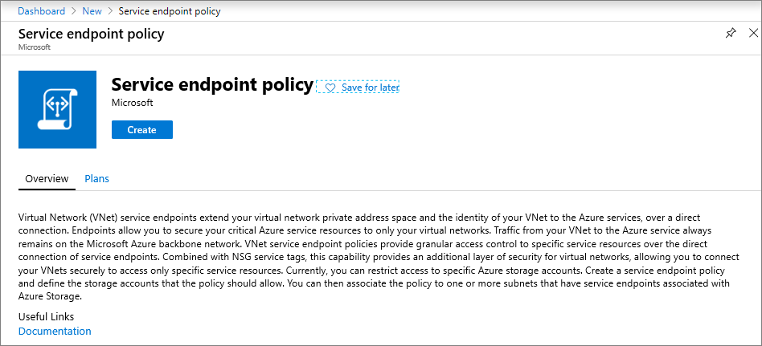
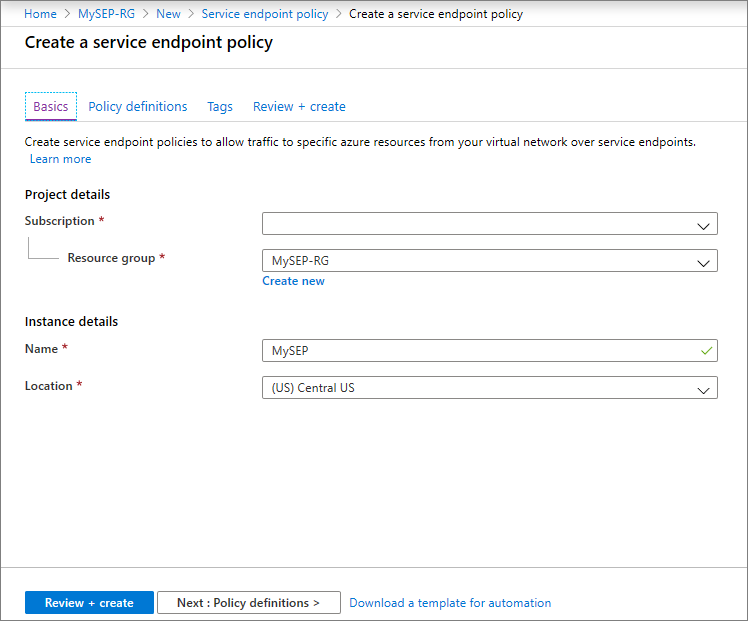
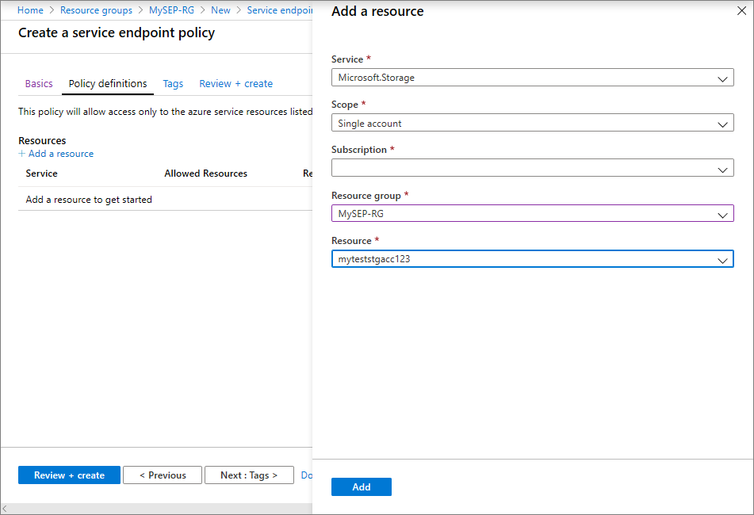
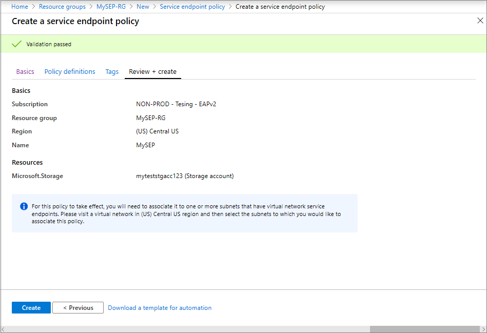
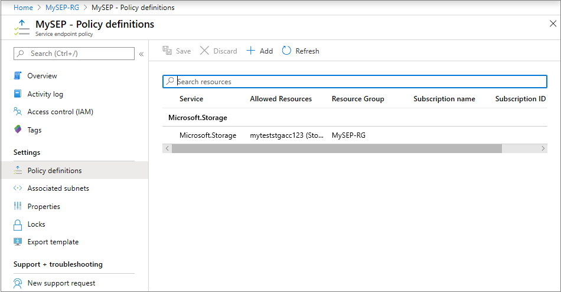
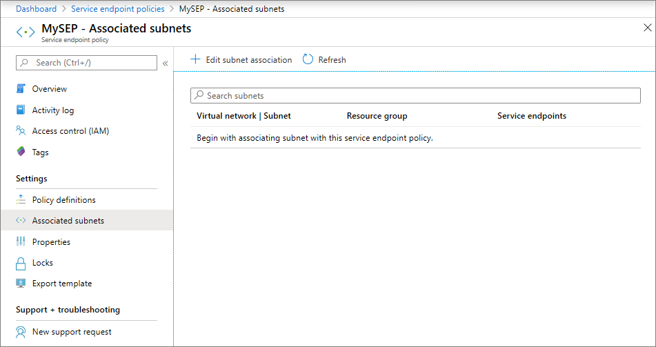
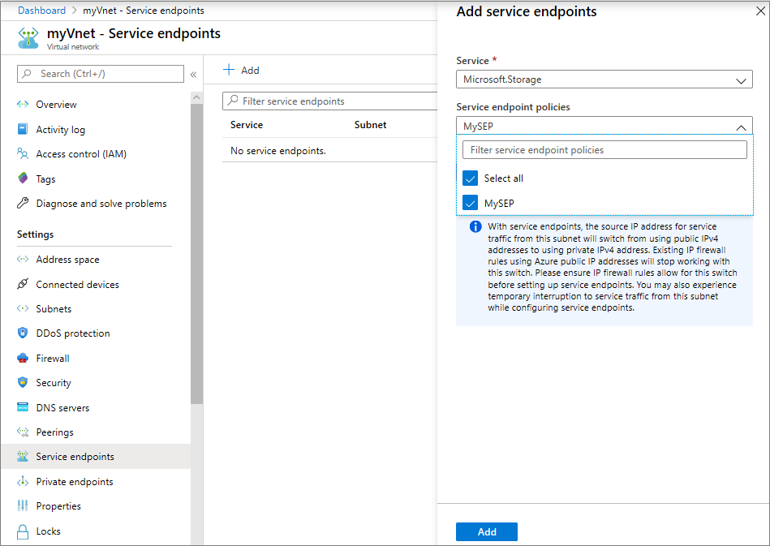
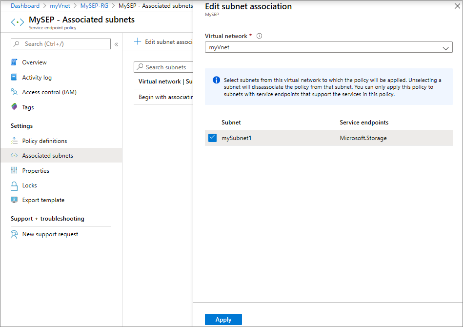

# Create, change, or delete service endpoint policy using the Azure portal

Service endpoint policies enable you to filter virtual network traffic to specific Azure resources, over service endpoints. If you're not familiar with service endpoint policies, see [service endpoint policies overview](virtual-network-service-endpoint-policies-overview.md) to learn more.

 In this tutorial, you learn how to:

> [!div class="checklist"]
> * Create a service endpoint policy
> * Create a service endpoint policy definition
> * Create a virtual network with a subnet
> * Associate a service endpoint policy to a subnet

If you don't have an Azure subscription, create a [free account](https://azure.microsoft.com/free/?WT.mc_id=A261C142F) before you begin.

## Sign in to Azure 

Sign in to the Azure portal at https://portal.azure.com.

## Create a service endpoint policy

1. Select **+ Create a resource** on the upper, left corner of the Azure portal.
2. In search pane, type "service endpoint policy" and select **Service endpoint policy** and then select **Create**.

3. Enter, or select, the following information in **Basics** 

   - Subscription   : Select your subscription for policy
   - Resource group : Select **Create new** and enter *myResourceGroup*
   - Name           : myEndpointPolicy
   - Location       : Central US
 
   

4. Select **+ Add** under **Resources** and enter or select the following information in **Add a resource** pane

   - Service        : Only **Microsoft.Storage** is available with Service Endpoint Policies
   - Scope          : Select one out of **Single Account**, **All accounts in  subscription** and **All accounts in resource group**
   - Subscription   : Select your subscription for storage account. Policy and storage accounts can be in different subscriptions.
   - Resource group : Select your resource group. Required, if  scope is set as, "All accounts in resource group" or "Single account".  
   - Resource       : Select your Azure Storage resource under the selected Subscription or Resource Group
   - Click on **Add** button at bottom to finish adding the resource

   

   - Add more resources by repeating the above steps as needed

5. Optional: Enter or select, the following information in **Tags**:
   
   - Key     : Select your key for the policy. Ex: Dept     
   - Value   : Enter value pair for the key. Ex: Finance

6. Select **Review + Create**. Validate the information and Click **Create**. To make further edits, click **Previous**. 

   
  
## View endpoint policies 

1. In the *All services* box in the portal, begin typing *service endpoint policies*. Select **Service Endpoint Policies**.
2. Under **Subscriptions**, select your subscription and resource group, as shown in the following picture

   
       
3. Select the policy and click on **Policy Definitions** to view or add more policy definitions.

   

4. Select **Associated subnets** to view the subnets the policy is associated. If no subnet is associated yet, follow the instructions in the next step.

   
 
5. Associate a policy to a subnet

>[!WARNING] 
> Ensure that all the resources accessed from the subnet are added to the policy definition before associating the policy to the given subnet. Once the policy is associated, only access to the *allow listed* resources will be allowed over service endpoints. 
>
> Also ensure that no managed Azure services exist in the subnet that is being associated to the service endpoint policy

- Before you can associate a policy to a subnet, you have to create a virtual network and subnet. Please refer to the [Create a Virtual Network](./quick-create-portal.md) article for help with this.

- Once you have the virtual network and subnet are setup, you need to configure Virtual Network Service Endpoints for Azure Storage. On the Virtual Network blade, select **Service endpoints**, and in the next pane select **Microsoft.Storage** and under **Subnets** select the desired VNet or Subnet

- Now, you can either choose to select the Service Endpoint Policy from the drop-down in the above pane if you have already created Service Endpoint policies before configuring Service Endpoint for the Subnet as shown below

    

- OR if you are associating Service Endpoint policies after Service Endpoints are already configured, you can choose to associate the subnet from within the Service Endpoint Policy blade by navigating to the **Associated Subnets** pane as shown below

    

>[!WARNING] 
>Access to Azure Storage resources in all regions will be restricted as per Service Endpoint Policy from this subnet.

## Next steps
In this tutorial, you created a service endpoint policy and associated it to a subnet. To learn more about service endpoint policies, see [service endpoint policies overview.](virtual-network-service-endpoint-policies-overview.md)
