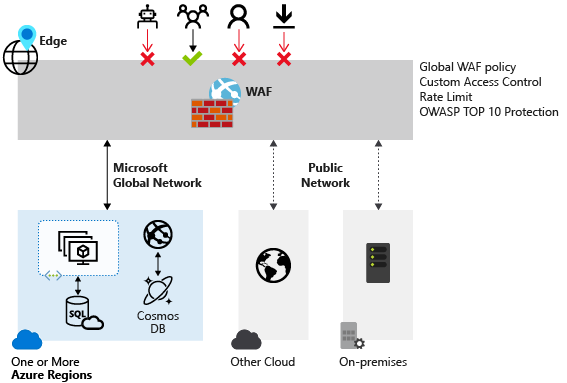
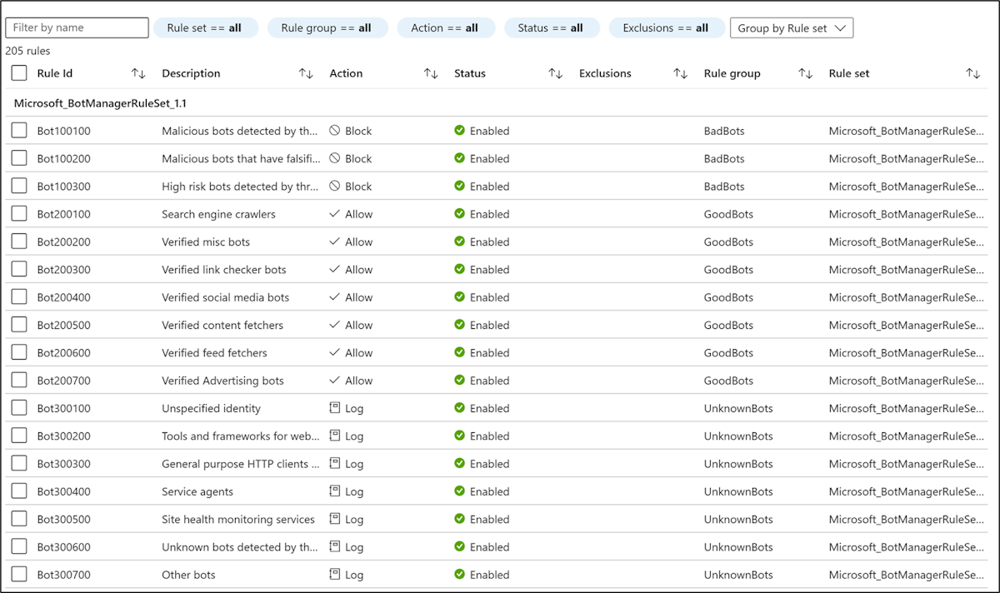

# Azure Web Application Firewall on Azure Front Door

Azure Web Application Firewall (WAF) on Azure Front Door provides centralized protection for your web applications. WAF defends your web services against common exploits and vulnerabilities. It keeps your service highly available for your users and helps you meet compliance requirements.

WAF on Front Door is a global and centralized solution. It's deployed on Azure network edge locations around the globe. WAF enabled web applications inspect every incoming request delivered by Front Door at the network edge. 

WAF prevents malicious attacks close to the attack sources, before they enter your virtual network. You get global protection at scale without sacrificing performance. A WAF policy easily links to any Front Door profile in your subscription. New rules can be deployed within minutes, so you can respond quickly to changing threat patterns.

Azure Front Door has [two tiers](../../frontdoor/standard-premium/overview.md): Front Door Standard and Front Door Premium. WAF is natively integrated with Front Door Premium with full capabilities. For Front Door Standard, only [custom rules](#custom-authored-rules) are supported.

## WAF policy and rules

You can configure a [WAF policy](waf-front-door-create-portal.md) and associate that policy to one or more Front Door front-ends for protection. A WAF policy consists of two types of security rules:

- custom rules that are authored by the customer.

- managed rule sets that are a collection of Azure-managed pre-configured set of rules.

When both are present, custom rules are processed before processing the rules in a managed rule set. A rule is made of a match condition, a priority, and an action. Action types supported are: ALLOW, BLOCK, LOG, and REDIRECT. You can create a fully customized policy that meets your specific application protection requirements by combining managed and custom rules.

Rules within a policy are processed in a priority order. Priority is a unique integer that defines the order of rules to process. Smaller integer value denotes a higher priority and those rules are evaluated before rules with a higher integer value. Once a rule is matched, the corresponding action that was defined in the rule is applied to the request. Once such a match is processed, rules with lower priorities aren't processed further.

A web application delivered by Front Door can have only one WAF policy associated with it at a time. However, you can have a Front Door configuration without any WAF policies associated with it. If a WAF policy is present, it's replicated to all of our edge locations to ensure consistent security policies across the world.

## WAF modes

WAF policy can be configured to run in the following two modes:

- **Detection mode:** When run in detection mode, WAF doesn't take any other actions other than monitors and logs the request and its matched WAF rule to WAF logs. You can turn on logging diagnostics for Front Door. When you use the portal, go to the **Diagnostics** section.

- **Prevention mode:** In prevention mode, WAF takes the specified action if a request matches a rule. If a match is found, no further rules with lower priority are evaluated. Any matched requests are also logged in the WAF logs.

## WAF actions

WAF customers can choose to run from one of the actions when a request matches a rule’s conditions:

- **Allow:**  Request passes through the WAF and is forwarded to back-end. No further lower priority rules can block this request.
- **Block:** The request is blocked and WAF sends a response to the client without forwarding the request to the back-end.
- **Log:**  Request is logged in the WAF logs and WAF continues evaluating lower priority rules.
- **Redirect:** WAF redirects the request to the specified URI. The URI specified is a policy level setting. Once configured, all requests that match the **Redirect** action will be sent to that URI.

## WAF rules

A WAF policy can consist of two types of security rules - custom rules, authored by the customer and managed rulesets, Azure-managed pre-configured set of rules.

### Custom authored rules

You can configure custom rules WAF as follows:

- **IP allow list and block list:** You can control access to your web applications based on a list of client IP addresses or IP address ranges. Both IPv4 and IPv6 address types are supported. This list can be configured to either block or allow those requests where the source IP matches an IP in the list.

- **Geographic based access control:** You can control access to your web applications based on the country code that's associated with a client’s IP address.

- **HTTP parameters-based access control:** You can base rules on string matches in HTTP/HTTPS request parameters.  For example, query strings, POST args, Request URI, Request Header, and Request Body.

- **Request method-based access control:** You base rules on the HTTP request method of the request. For example, GET, PUT, or HEAD.

- **Size constraint:** You can base rules on the lengths of specific parts of a request such as query string, Uri, or request body.

- **Rate limiting rules:** A rate control rule limits abnormally high traffic from any client IP address. You may configure a threshold on the number of web requests allowed from a client IP during a one-minute duration. This rule is distinct from an IP list-based allow/block custom rule that either allows all or blocks all request from a client IP. Rate limits can be combined with additional match conditions such as HTTP(S) parameter matches for granular rate control.

### Azure-managed rule sets

Azure-managed rule sets provide an easy way to deploy protection against a common set of security threats. Since such rulesets are managed by Azure, the rules are updated as needed to protect against new attack signatures. The Azure-managed Default Rule Set includes rules against the following threat categories:

- Cross-site scripting
- Java attacks
- Local file inclusion
- PHP injection attacks
- Remote command execution
- Remote file inclusion
- Session fixation
- SQL injection protection
- Protocol attackers

Custom rules are always applied before rules in the Default Rule Set are evaluated. If a request matches a custom rule, the corresponding rule action is applied. The request is either blocked or passed through to the back-end. No other custom rules or the rules in the Default Rule Set are processed. You can also remove the Default Rule Set from your WAF policies.

For more information, see [Web Application Firewall DRS rule groups and rules](waf-front-door-drs.md).

### Bot protection rule set

You can enable a managed bot protection rule set to take custom actions on requests from known bot categories. 

There are three bot categories supported: Bad, Good, and Unknown. Bot signatures are managed and dynamically updated by the WAF platform.

Bad bots include bots from malicious IP addresses and bots that have falsified their identities. Malicious IP addresses  are sourced from the Microsoft Threat Intelligence feed and updated every hour. [Intelligent Security Graph](https://www.microsoft.com/security/operations/intelligence) powers Microsoft Threat Intelligence and is used by multiple services including Microsoft Defender for Cloud.

Good Bots include validated search engines. Unknown categories include additional bot groups that have identified themselves as bots. For example, market analyzer, feed fetchers and data collection agents. 

Unknown bots are classified via published user agents without additional validation. You can set custom actions to block, allow, log, or redirect for different types of bots.

If bot protection is enabled, incoming requests that match bot rules are logged. You may access WAF logs from a storage account, event hub, or log analytics.

## Configuration

You can configure and deploy all WAF policies using the Azure portal, REST APIs, Azure Resource Manager templates, and Azure PowerShell. You can also configure and manage Azure WAF policies at scale using Firewall Manager integration (preview). For more information, see [Use Azure Firewall Manager to manage Web Application Firewall policies (preview)](../shared/manage-policies.md).

## Monitoring

Monitoring for WAF at Front Door is integrated with Azure Monitor to track alerts and easily monitor traffic trends.

## Next steps

- Learn about [Web Application Firewall on Azure Application Gateway](../ag/ag-overview.md)
