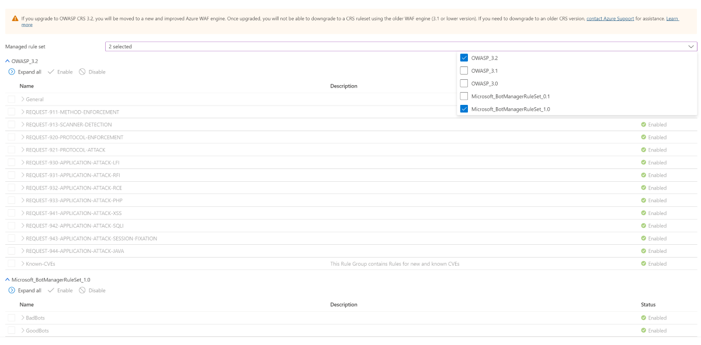

# Azure Web Application Firewall on Azure Application Gateway bot protection overview

Roughly 20% of all Internet traffic comes from bad bots. They do things like scraping, scanning, and looking for vulnerabilities in your web application. When these bots are stopped at the Web Application Firewall (WAF), they can’t attack you. They also can’t use up your resources and services, such as your backends and other underlying infrastructure.

You can enable a managed bot protection rule set for your WAF to block or log requests from known malicious IP addresses. The IP addresses are sourced from the Microsoft Threat Intelligence feed. Intelligent Security Graph powers Microsoft threat intelligence and is used by multiple services including Azure Security Center.

## Use with OWASP rulesets

You can use the Bot Protection ruleset alongside any of the OWASP rulesets (2.2.9, 3.0, and 3.1). Only one OWASP ruleset can be used at any given time. The bot protection ruleset contains an additional rule that appears in its own ruleset. It's titled **Microsoft_BotManagerRuleSet_0.1**, and you can  enable or disable it like the other OWASP rules.



## Ruleset update

The bot mitigation ruleset list of known bad IP addresses updates multiple times per day from the Microsoft Threat Intelligence feed to stay in sync with the bots. Your web applications are continuously protected even as the bot attack vectors change.

## Log example

Here's an example log entry for bot protection:

```
{
        "timeStamp": "0000-00-00T00:00:00+00:00",
            "resourceId": "appgw",
            "operationName": "ApplicationGatewayFirewall",
            "category": "ApplicationGatewayFirewallLog",
            "properties": {
            "instanceId": "vm1",
                "clientIp": "1.2.3.4",
                "requestUri": "/hello.php?arg1=aaaaaaabccc",
                "ruleSetType": "MicrosoftBotProtection",
                "message": "IPReputationTriggered",
                "action": "Blocked",
                "hostname": "example.com",
                "transactionId": "abc",
                "policyId": "waf policy 1",
                "policyScope": "Global",
                "policyScopeName": "Default Policy",
                "engine": "Azwaf"
        }
    }
```

## Next steps

- [Configure bot protection for Web Application Firewall on Azure Application Gateway](bot-protection.md)
