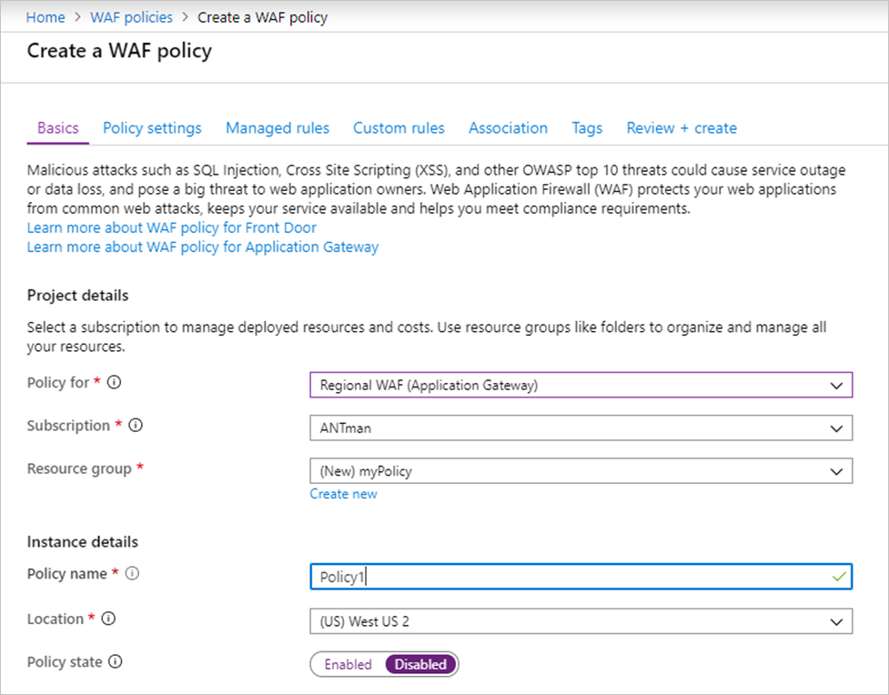
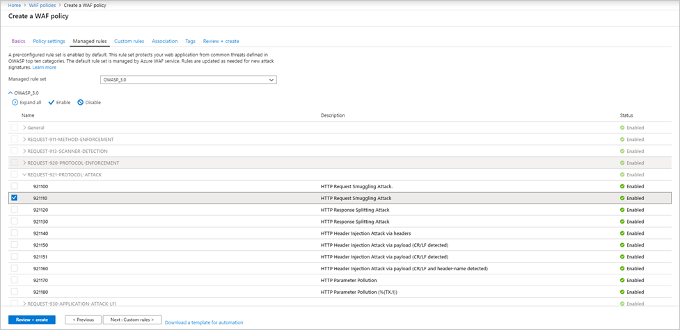
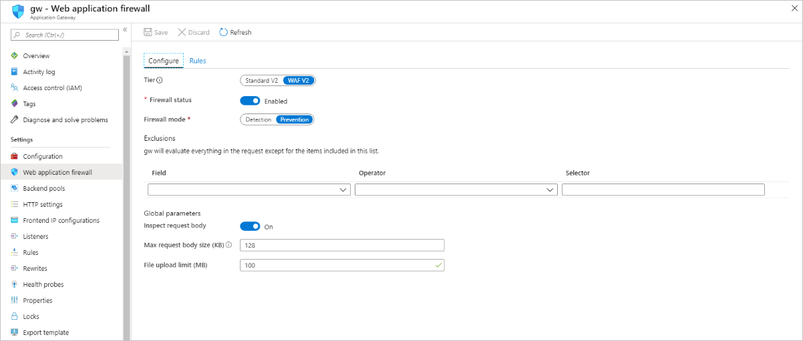
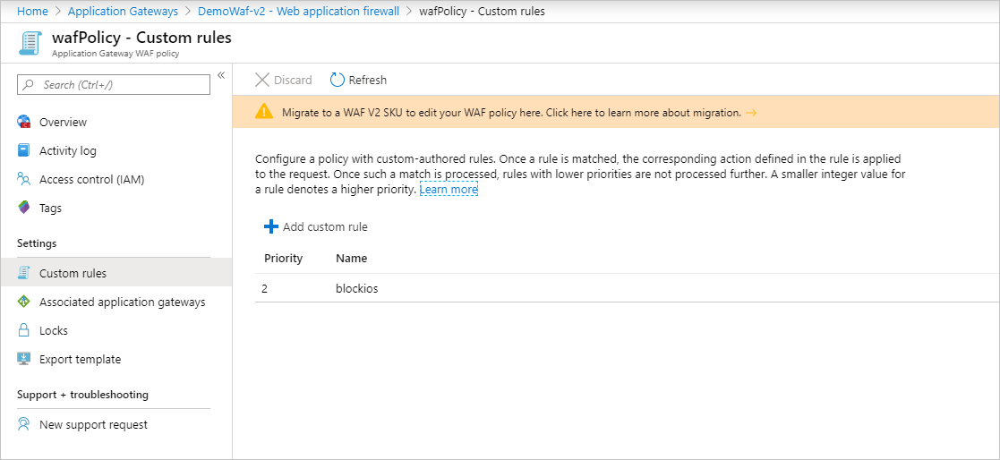
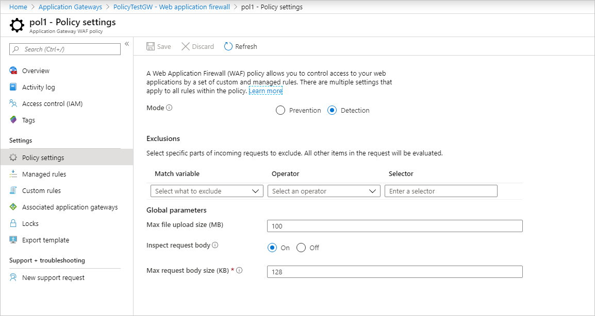

# Create Web Application Firewall policies for Application Gateway

Associating a WAF policy with listeners allows for multiple sites behind a single WAF to be protected by different policies. For example, if there are five sites behind your WAF, you can have five separate WAF policies (one for each listener) to customize the exclusions, custom rules, and managed rulesets for one site without effecting the other four. If you want a single policy to apply to all sites, you can just associate the policy with the Application Gateway, rather than the individual listeners, to make it apply globally. Policies can also be applied to a path-based routing rule. 

You can make as many policies as you want. Once you create a policy, it must be associated to an Application Gateway to go into effect, but it can be associated with any combination of Application Gateways and listeners. 

If your Application Gateway has an associated policy, and then you associate a different policy to a listener on that Application Gateway, the listener's policy takes effect, but just for the listener(s) that they're assigned to. The Application Gateway policy still applies to all other listeners that don't have a specific policy assigned to them. 

   > [!NOTE]
   > Once a Firewall Policy is associated to a WAF, there must always be a policy associated to that WAF. You may overwrite that policy, but disassociating a policy from the WAF entirely isn't supported. 

All new Web Application Firewall's WAF settings (custom rules, managed ruleset configurations, exclusions, etc.) live inside of a WAF Policy. If you have an existing WAF, these settings may still exist in your WAF config. For steps on how to move to the new WAF Policy, see [Upgrade your WAF Config to a WAF Policy](#upgrade) later in this article. 

WAF policies need to be in the enabled state to inspect request traffic, log events and take action on requests. WAF policies in detection mode will log events when WAF rules are triggered but won't take any other action. Policies in prevention mode will take action on requests as well as log the event in the logs.

## Create a policy

First, create a basic WAF policy with a managed Default Rule Set (DRS) using the Azure portal.

1. On the upper left side of the portal, select **Create a resource**. Search for **WAF**, select **Web Application Firewall**, then select **Create**.
2. On **Create a WAF policy** page, **Basics** tab, enter or select the following information and accept the defaults for the remaining settings:

   |Setting  |Value  |
   |---------|---------|
   |Policy for     |Regional WAF (Application Gateway)|
   |Subscription     |Select your subscription name|
   |Resource group     |Select your resource group|
   |Policy name     |Type a unique name for your WAF policy.|
3. On the **Association** tab, select **Add association**, then select one of the following settings:

   |Setting  |Value  |
   |---------|---------|
   |Application Gateway     |Select the application gateway, and then select **Add**.|
   |HTTP Listener     |Select the application gateway, select the listeners, then select **Add**.|
   |Route Path|Select the application gateway, select the listener, select the routing rule, and then select **Add**.

   > [!NOTE]
   > If you assign a policy to your Application Gateway (or listener) that already has a policy in place, the original policy is overwritten and replaced by the new policy.
4. Select **Review + create**, then select **Create**.

   

## Configure WAF rules (optional)

When you create a WAF policy, by default it is in *Detection* mode. In Detection mode, WAF doesn't block any requests. Instead, the matching WAF rules are logged in the WAF logs. To see WAF in action, you can change the mode settings to *Prevention*. In Prevention mode, matching rules defined in the Microsoft Managed Rulesets you selected are blocked and/or logged in the WAF logs.

## Managed rules

Azure-managed OWASP rules are enabled by default. To disable an individual rule within a rule group, expand the rules within that rule group, select the check box in front of the rule number, and select **Disable** on the tab above.

[  ](../media/create-waf-policy-ag/managed-rules-lrg.png#lightbox)

## Custom rules

To create a custom rule, select **Add custom rule** under the **Custom rules** tab. This opens the custom rule configuration page. The following screenshot shows an example custom rule configured to block a request if the query string contains the text *blockme*.

[  ](../media/create-waf-policy-ag/edit-custom-rule-lrg.png#lightbox)

## <a name="upgrade"></a>Upgrade your WAF Config to a WAF Policy

If you have an existing WAF, you may have noticed some changes in the portal. First you need to identify what kind of Policy you've enabled on your WAF. There are three potential states:

1. No WAF Policy
2. Custom Rules only Policy
3. WAF Policy

You can tell which state your WAF is in by looking at it in the portal. If the WAF settings are visible and can be changed from within the Application Gateway view, your WAF is in state 1.

[  ](../media/create-waf-policy-ag/waf-configure-lrg.png#lightbox)

If you select **Web Application Firewall** and it shows you an associated policy, the WAF is in state 2 or state 3. After navigating to the policy, if it shows **only** custom rules, and Associated Application Gateways, then it's a Custom Rules only Policy.



If it also shows Policy Settings and Managed Rules, then it's a full Web Application Firewall policy. 



## Upgrade to WAF Policy

If you have a Custom Rules only WAF Policy, then you may want to move to the new WAF Policy. Going forward, the firewall policy supports WAF policy settings, managed rulesets, exclusions, and disabled rule-groups. Essentially, all the WAF configurations that were previously done inside the Application Gateway are now done through the WAF Policy. 

Edits to the custom rule only WAF policy are disabled. To edit any WAF settings such as disabling rules, adding exclusions, etc. you have to upgrade to a new top-level firewall policy resource.

To do so, create a *Web Application Firewall Policy* and associate it to your Application Gateway(s) and listener(s) of choice. This new Policy must be exactly the same as the current WAF config, meaning every custom rule, exclusion, disabled rule, etc. must be copied into the new Policy you're creating. Once you have a Policy associated with your Application Gateway, then you can continue to make changes to your WAF rules and settings. You can also do this with Azure PowerShell. For more information, see [Associate a WAF policy with an existing Application Gateway](associate-waf-policy-existing-gateway.md).

Optionally, you can use a migration script to upgrade to a WAF policy. For more information, see [Upgrade Web Application Firewall policies using Azure PowerShell](migrate-policy.md).

## Force mode

If you don't want to copy everything into a policy that is exactly the same as your current config, you can set the WAF into "force" mode. Run the following Azure PowerShell code to put your WAF in force mode. Then you can associate any WAF Policy to your WAF, even if it doesn't have the exact same settings as your config. 

```azurepowershell-interactive
$appgw = Get-AzApplicationGateway -Name <your Application Gateway name> -ResourceGroupName <your Resource Group name>
$appgw.ForceFirewallPolicyAssociation = $true
```

Then proceed with the steps to associate a WAF Policy to your application gateway. For more information, see [Associate a WAF Policy with an existing Application Gateway.](associate-waf-policy-existing-gateway.md)

## Next steps

Learn more about [Web Application Firewall CRS rule groups and rules](application-gateway-crs-rulegroups-rules.md).
