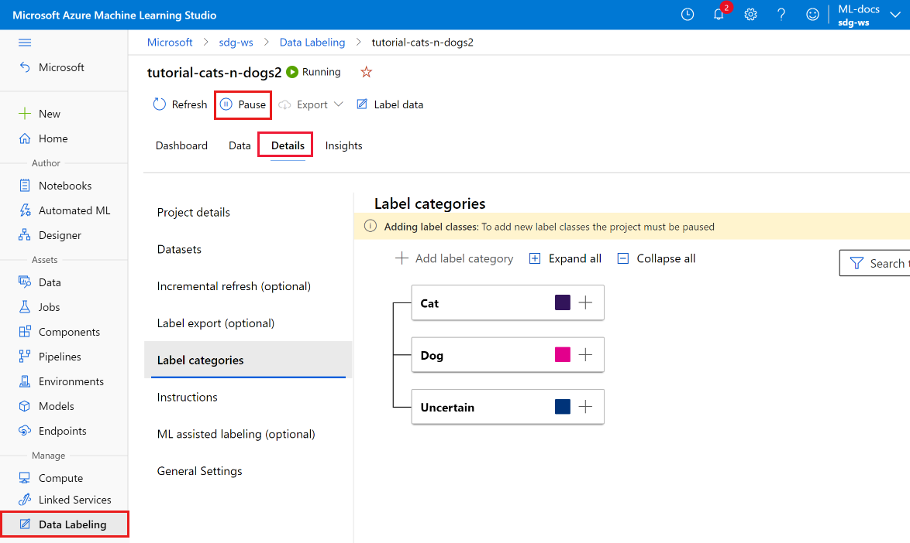

During the data labeling process, you may want to add more labels to classify your items.  For example, you may want to add an "Unknown" or "Other" label to indicate confusion.

Use these steps to add one or more labels to a project:

1. Select the project on the main **Data Labeling** page.
1. At the top right of the page, toggle **Running** to **Paused** to stop labelers from their activity.
1. Select the **Details** tab.
1. In the list on the left, select **Label classes**.
1. At the top of the list, select **+ Add Labels**
    
1. In the form, add your new label. Then choose how to continue the project.  Since you've changed the available labels, you choose how to treat the already labeled data:
    * Start over, removing all existing labels.  Choose this option if you want to start labeling from the beginning with the new full set of labels. 
    * Start over, keeping all existing labels.  Choose this option to mark all data as unlabeled, but keep the existing labels as a default tag for images that were previously labeled.
    * Continue, keeping all existing labels. Choose this option to keep all data already labeled as is, and start using the new label for data not yet labeled.
1. Modify your instructions page as necessary for the new label(s).
1. Once you've added all new labels, at the top right of the page toggle **Paused** to **Running** to restart the project. 