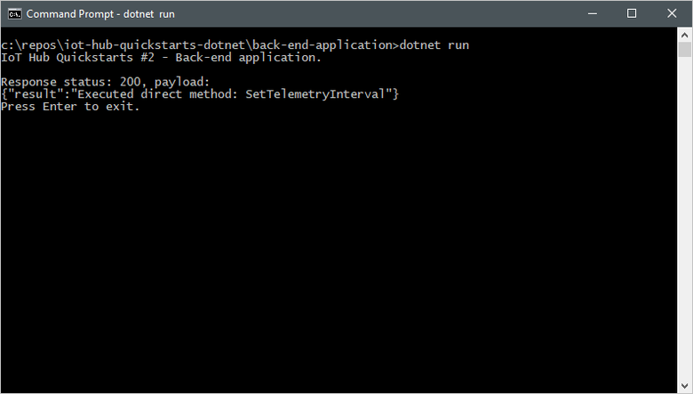
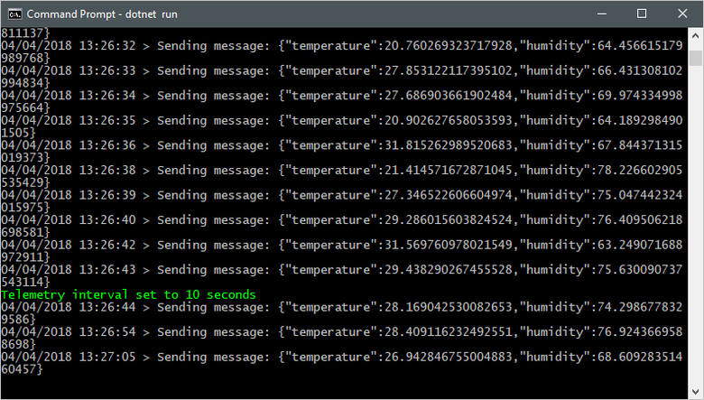

The quickstart uses two pre-written .NET applications:

* A simulated device application that responds to direct methods called from a service application. To receive the direct method calls, this application connects to a device-specific endpoint on your IoT hub.

* A service application that calls the direct methods on the simulated device. To call a direct method on a device, this application connects to service-side endpoint on your IoT hub.

## Prerequisites

* An Azure account with an active subscription. [Create one for free](https://azure.microsoft.com/free/?ref=microsoft.com&utm_source=microsoft.com&utm_medium=docs&utm_campaign=visualstudio).

* The two sample applications you run in this quickstart are written using C#. You need the .NET Core SDK 3.1 or greater on your development machine.

    You can download the .NET Core SDK for multiple platforms from [.NET](https://dotnet.microsoft.com/download).

    You can verify the current version of C# on your development machine using the following command:

    ```cmd/sh
    dotnet --version
    ```
* If you haven't already done so, download the Azure IoT C# samples from https://github.com/Azure-Samples/azure-iot-samples-csharp/archive/master.zip and extract the ZIP archive.

* Make sure that port 8883 is open in your firewall. The device sample in this quickstart uses MQTT protocol, which communicates over port 8883. This port may be blocked in some corporate and educational network environments. For more information and ways to work around this issue, see [Connecting to IoT Hub (MQTT)](../articles/iot-hub/iot-hub-mqtt-support.md#connecting-to-iot-hub).

[!INCLUDE [azure-cli-prepare-your-environment.md](azure-cli-prepare-your-environment-no-header.md)]

[!INCLUDE [iot-hub-cli-version-info](iot-hub-cli-version-info.md)]

## Create an IoT hub

If you completed the previous [Quickstart: Send telemetry from a device to an IoT hub](../articles/iot-develop/quickstart-send-telemetry-iot-hub.md?pivots=programming-language-csharp), you can skip this step.

[!INCLUDE [iot-hub-include-create-hub](iot-hub-include-create-hub.md)]

## Register a device

If you completed the previous [Quickstart: Send telemetry from a device to an IoT hub](../articles/iot-develop/quickstart-send-telemetry-iot-hub.md?pivots=programming-language-csharp), you can skip this step.

A device must be registered with your IoT hub before it can connect. In this quickstart, you use the Azure Cloud Shell to register a simulated device.

1. Run the following command in Azure Cloud Shell to create the device identity.

   **YourIoTHubName**: Replace this placeholder below with the name you chose for your IoT hub.

   **MyDotnetDevice**: This is the name of the device you're registering. It's recommended to use **MyDotnetDevice** as shown. If you choose a different name for your device, you also need to use that name throughout this article, and update the device name in the sample applications before you run them.

    ```azurecli-interactive
    az iot hub device-identity create \
      --hub-name {YourIoTHubName} --device-id MyDotnetDevice
    ```

2. Run the following commands in Azure Cloud Shell to get the _device connection string_ for the device you just registered:

   **YourIoTHubName**: Replace this placeholder below with the name you chose for your IoT hub.

    ```azurecli-interactive
    az iot hub device-identity connection-string show \
      --hub-name {YourIoTHubName} \
      --device-id MyDotnetDevice \
      --output table
    ```

    Make a note of the device connection string, which looks like:

   `HostName={YourIoTHubName}.azure-devices.net;DeviceId=MyNodeDevice;SharedAccessKey={YourSharedAccessKey}`

    You use this value later in the quickstart.

## Retrieve the service connection string

You also need your IoT hub _service connection string_ to enable the service application to connect to the hub and retrieve the messages. The following command retrieves the service connection string for your IoT hub:

```azurecli-interactive
az iot hub connection-string show --policy-name service --hub-name {YourIoTHubName} --output table
```

Make a note of the service connection string, which looks like:

   `HostName={YourIoTHubName}.azure-devices.net;SharedAccessKeyName=service;SharedAccessKey={YourSharedAccessKey}`

You use this value later in the quickstart. This service connection string is different from the device connection string you noted in the previous step.

## Listen for direct method calls

The simulated device application connects to a device-specific endpoint on your IoT hub, sends simulated telemetry, and listens for direct method calls from your hub. In this quickstart, the direct method call from the hub tells the device to change the interval at which it sends telemetry. The simulated device sends an acknowledgment back to your hub after it executes the direct method.

1. In a local terminal window, navigate to the root folder of the sample C# project. Then navigate to the **iot-hub\Quickstarts\SimulatedDeviceWithCommand** folder.

2. In the local terminal window, run the following commands to install the required packages for simulated device application:

    ```cmd/sh
    dotnet restore
    ```

3. In the local terminal window, run the following command to build and run the simulated device application, replacing `{DeviceConnectionString}` with the device connection string you noted previously:

    ```cmd/sh
    dotnet run -- {DeviceConnectionString}
    ```

    The following screenshot shows the output as the simulated device application sends telemetry to your IoT hub:

    

## Call the direct method

The service application connects to a service-side endpoint on your IoT Hub. The application makes direct method calls to a device through your IoT hub and listens for acknowledgments. An IoT Hub service application typically runs in the cloud.

1. In another local terminal window, navigate to the root folder of the sample C# project. Then navigate to the **iot-hub\Quickstarts\InvokeDeviceMethod** folder.

2. In the local terminal window, run the following commands to install the required libraries for the service application:

    ```cmd/sh
    dotnet restore
    ```

3. In the local terminal window, run the following commands to build and run the service application, replacing `{ServiceConnectionString}` with the service connection string you noted previously:

    ```cmd/sh
    dotnet run -- {ServiceConnectionString}
    ```

    The following screenshot shows the output as the application makes a direct method call to the device and receives an acknowledgment:

    

    After you run the service application, you see a message in the console window running the simulated device, and the rate at which it sends messages changes:

    
